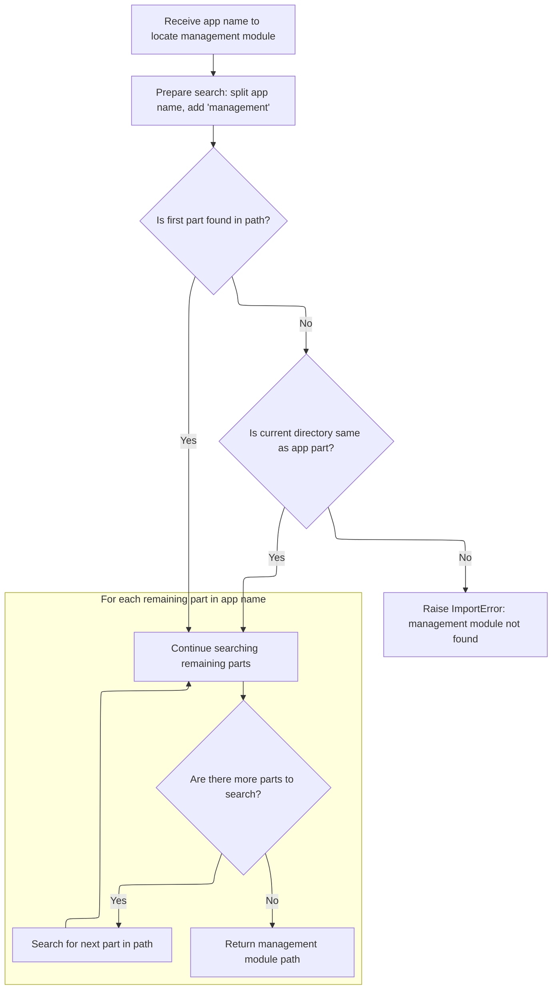

This document explains how a registry of management commands is constructed by gathering core commands and discovering custom commands from installed applications. The resulting registry is tailored to the current project settings, mapping command names to their corresponding applications.

# Discovering and Preparing Command Registry

<SwmSnippet path="/django/core/management/__init__.py" line="70">

---

In `get_commands` we kick things off by checking if the command cache is empty. If it is, we build the initial command registry from core commands. Next, we grab Django settings to figure out which apps are installed and where the project directory lives. We call setup_environ to get the project directory, which lets us later tweak commands like 'startapp' to use the right location. This setup is needed because the commands available and their behavior depend on the current environment and settings.

```python
def get_commands():
    """
    Returns a dictionary mapping command names to their callback applications.

    This works by looking for a management.commands package in django.core, and
    in each installed application -- if a commands package exists, all commands
    in that package are registered.

    Core commands are always included. If a settings module has been
    specified, user-defined commands will also be included, the
    startproject command will be disabled, and the startapp command
    will be modified to use the directory in which the settings module appears.

    The dictionary is in the format {command_name: app_name}. Key-value
    pairs from this dictionary can then be used in calls to
    load_command_class(app_name, command_name)

    If a specific version of a command must be loaded (e.g., with the
    startapp command), the instantiated module can be placed in the
    dictionary in place of the application name.

    The dictionary is cached on the first call and reused on subsequent
    calls.
    """
    global _commands
    if _commands is None:
        _commands = dict([(name, 'django.core') for name in find_commands(__path__[0])])

        # Find the installed apps
        try:
            from django.conf import settings
            apps = settings.INSTALLED_APPS
        except (AttributeError, EnvironmentError, ImportError):
            apps = []

        # Find the project directory
        try:
            from django.conf import settings
            module = import_module(settings.SETTINGS_MODULE)
            project_directory = setup_environ(module, settings.SETTINGS_MODULE)
        except (AttributeError, EnvironmentError, ImportError, KeyError):
            project_directory = None

```

---

</SwmSnippet>

<SwmSnippet path="/django/core/management/__init__.py" line="381">

---

`setup_environ` figures out the project directory by looking at the **file** attribute of the settings module, then going up one level. It sets the DJANGO_SETTINGS_MODULE environment variable so Django knows where to find settings, and temporarily adds the parent directory to sys.path to make sure the project module can be imported cleanly.

```python
def setup_environ(settings_mod, original_settings_path=None):
    """
    Configures the runtime environment. This can also be used by external
    scripts wanting to set up a similar environment to manage.py.
    Returns the project directory (assuming the passed settings module is
    directly in the project directory).

    The "original_settings_path" parameter is optional, but recommended, since
    trying to work out the original path from the module can be problematic.
    """
    # Add this project to sys.path so that it's importable in the conventional
    # way. For example, if this file (manage.py) lives in a directory
    # "myproject", this code would add "/path/to/myproject" to sys.path.
    if '__init__.py' in settings_mod.__file__:
        p = os.path.dirname(settings_mod.__file__)
    else:
        p = settings_mod.__file__
    project_directory, settings_filename = os.path.split(p)
    if project_directory == os.curdir or not project_directory:
        project_directory = os.getcwd()
    project_name = os.path.basename(project_directory)

    # Strip filename suffix to get the module name.
    settings_name = os.path.splitext(settings_filename)[0]

    # Strip $py for Jython compiled files (like settings$py.class)
    if settings_name.endswith("$py"):
        settings_name = settings_name[:-3]

    # Set DJANGO_SETTINGS_MODULE appropriately.
    if original_settings_path:
        os.environ['DJANGO_SETTINGS_MODULE'] = original_settings_path
    else:
        os.environ['DJANGO_SETTINGS_MODULE'] = '%s.%s' % (project_name, settings_name)

    # Import the project module. We add the parent directory to PYTHONPATH to
    # avoid some of the path errors new users can have.
    sys.path.append(os.path.join(project_directory, os.pardir))
    project_module = import_module(project_name)
    sys.path.pop()

    return project_directory
```

---

</SwmSnippet>

<SwmSnippet path="/django/core/management/__init__.py" line="113">

---

Back in `get_commands`, after getting the project directory from setup_environ, we loop through installed apps and call find_management_module for each one. This lets us locate and register any custom management commands those apps provide, expanding the command registry beyond just the core commands.

```python
        # Find and load the management module for each installed app.
        for app_name in apps:
            try:
                path = find_management_module(app_name)
                _commands.update(dict([(name, app_name)
                                       for name in find_commands(path)]))
            except ImportError:
                pass # No management module - ignore this app

```

---

</SwmSnippet>

## Locating App Management Modules



<SwmSnippet path="/django/core/management/__init__.py" line="31">

---

In `find_management_module`, we break down the app name, append 'management', and walk through the module path using imp.find_module, but without importing anything. If the project directory isn't on sys.path, we check the current working directory to handle that edge case. This lets us reliably locate the management module's path for any app.

```python
def find_management_module(app_name):
    """
    Determines the path to the management module for the given app_name,
    without actually importing the application or the management module.

    Raises ImportError if the management module cannot be found for any reason.
    """
    parts = app_name.split('.')
    parts.append('management')
    parts.reverse()
    part = parts.pop()
    path = None

    # When using manage.py, the project module is added to the path,
    # loaded, then removed from the path. This means that
    # testproject.testapp.models can be loaded in future, even if
    # testproject isn't in the path. When looking for the management
    # module, we need look for the case where the project name is part
    # of the app_name but the project directory itself isn't on the path.
    try:
        f, path, descr = imp.find_module(part,path)
    except ImportError,e:
        if os.path.basename(os.getcwd()) != part:
            raise e

    while parts:
        part = parts.pop()
        f, path, descr = imp.find_module(part, path and [path] or None)
```

---

</SwmSnippet>

<SwmSnippet path="/django/core/management/__init__.py" line="58">

---

After walking the module path, `find_management_module` hands back the filesystem path to the management module, so we can scan for commands without actually importing anything.

```python
        f, path, descr = imp.find_module(part, path and [path] or None)
    return path
```

---

</SwmSnippet>

## Finalizing and Customizing Command Registry

<SwmSnippet path="/django/core/management/__init__.py" line="122">

---

After returning from find_management_module, `get_commands` checks if we have a project directory. If we do, it drops 'startproject' (since it's not needed in [manage.py](http://manage.py)) and swaps out 'startapp' for a version that always uses the project directory. This makes sure the command registry matches the current project setup before caching and returning it.

```python
        if project_directory:
            # Remove the "startproject" command from self.commands, because
            # that's a django-admin.py command, not a manage.py command.
            del _commands['startproject']

            # Override the startapp command so that it always uses the
            # project_directory, not the current working directory
            # (which is default).
            from django.core.management.commands.startapp import ProjectCommand
            _commands['startapp'] = ProjectCommand(project_directory)

    return _commands
```

---

</SwmSnippet>

&nbsp;

*This is an auto-generated document by Swimm 🌊 and has not yet been verified by a human*

<SwmMeta version="3.0.0" repo-id="Z2l0aHViJTNBJTNBUHl0aG9uRGphbmdvJTNBJTNBR29waW5hdGhyZWRkeTY2" repo-name="PythonDjango"><sup>Powered by [Swimm](https://app.swimm.io/)</sup></SwmMeta>
