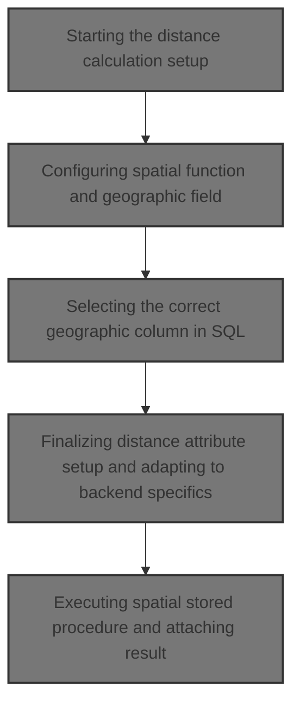
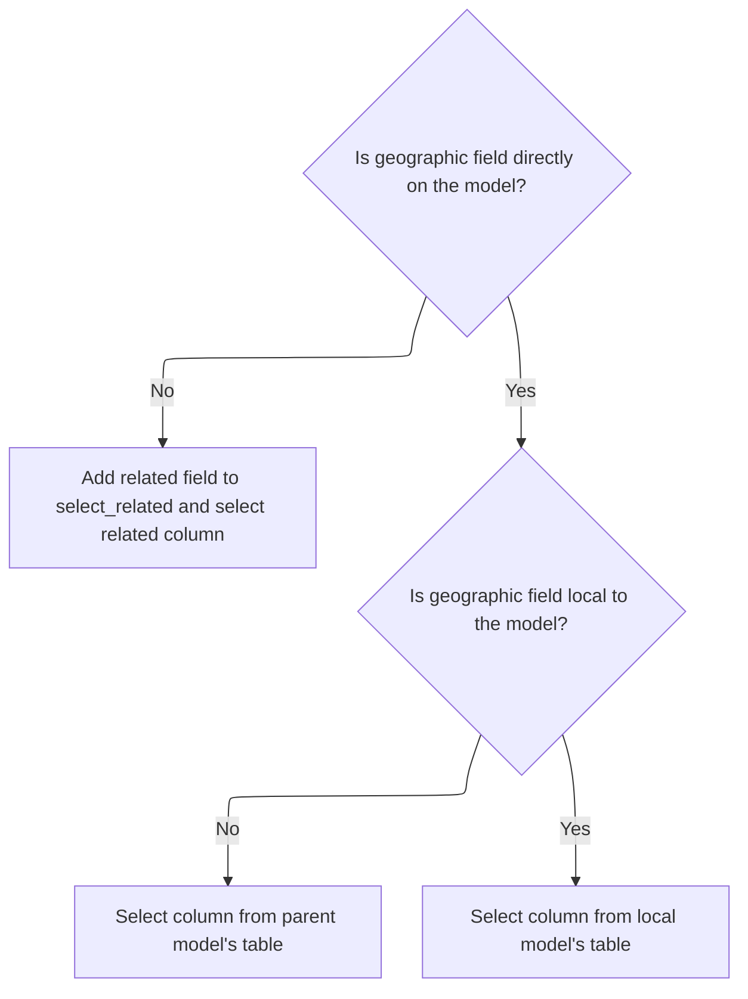
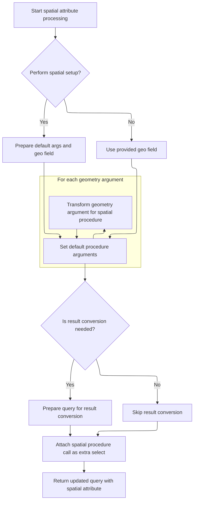

This document describes the flow for calculating spatial distance or length attributes on geographic fields in Django model queries. The flow receives a spatial function name and optional geometry parameters as input and returns a queryset with an extra attribute representing the calculated spatial value. It ensures the spatial function is supported, selects the correct geographic column considering model relations, prepares the SQL query with necessary joins, adapts parameters based on the spatial backend and coordinate system, and executes the spatial stored procedure to attach the result to the model.



# Where is this flow used?

This flow is used multiple times in the codebase as represented in the following diagram:

```mermaid
graph TD;
      28f9c8059007a2399118421e0066250deb8cc660ad31487ec1dad3490c2fd4dd(django/…/models/query.py::length) --> 36c51e977261ed20d339ea98c4b741f493d87ac70f95acec66b741271f33fe02(django/…/models/query.py::_distance_attribute):::mainFlowStyle

e06c55264200120a27d2ef84ceebf09488d0ec4cdac2b864b12edd05b8964ede(django/…/models/query.py::perimeter) --> 36c51e977261ed20d339ea98c4b741f493d87ac70f95acec66b741271f33fe02(django/…/models/query.py::_distance_attribute):::mainFlowStyle

3c7d50cbd2291b43c24df3202054b02077393c2db2cce8b194a53985f583bb04(django/…/models/query.py::distance) --> 36c51e977261ed20d339ea98c4b741f493d87ac70f95acec66b741271f33fe02(django/…/models/query.py::_distance_attribute):::mainFlowStyle


classDef mainFlowStyle color:#000000,fill:#7CB9F4
classDef rootsStyle color:#000000,fill:#00FFF4
classDef Style1 color:#000000,fill:#00FFAA
classDef Style2 color:#000000,fill:#FFFF00
classDef Style3 color:#000000,fill:#AA7CB9

%% Swimm:
%% graph TD;
%%       28f9c8059007a2399118421e0066250deb8cc660ad31487ec1dad3490c2fd4dd(<SwmPath>[django/…/models/query.py](django/contrib/gis/db/models/query.py)</SwmPath>::length) --> 36c51e977261ed20d339ea98c4b741f493d87ac70f95acec66b741271f33fe02(<SwmPath>[django/…/models/query.py](django/contrib/gis/db/models/query.py)</SwmPath>::<SwmToken path="django/contrib/gis/db/models/query.py" pos="571:3:3" line-data="    def _distance_attribute(self, func, geom=None, tolerance=0.05, spheroid=False, **kwargs):">`_distance_attribute`</SwmToken>):::mainFlowStyle
%% 
%% e06c55264200120a27d2ef84ceebf09488d0ec4cdac2b864b12edd05b8964ede(<SwmPath>[django/…/models/query.py](django/contrib/gis/db/models/query.py)</SwmPath>::perimeter) --> 36c51e977261ed20d339ea98c4b741f493d87ac70f95acec66b741271f33fe02(<SwmPath>[django/…/models/query.py](django/contrib/gis/db/models/query.py)</SwmPath>::<SwmToken path="django/contrib/gis/db/models/query.py" pos="571:3:3" line-data="    def _distance_attribute(self, func, geom=None, tolerance=0.05, spheroid=False, **kwargs):">`_distance_attribute`</SwmToken>):::mainFlowStyle
%% 
%% 3c7d50cbd2291b43c24df3202054b02077393c2db2cce8b194a53985f583bb04(<SwmPath>[django/…/models/query.py](django/contrib/gis/db/models/query.py)</SwmPath>::distance) --> 36c51e977261ed20d339ea98c4b741f493d87ac70f95acec66b741271f33fe02(<SwmPath>[django/…/models/query.py](django/contrib/gis/db/models/query.py)</SwmPath>::<SwmToken path="django/contrib/gis/db/models/query.py" pos="571:3:3" line-data="    def _distance_attribute(self, func, geom=None, tolerance=0.05, spheroid=False, **kwargs):">`_distance_attribute`</SwmToken>):::mainFlowStyle
%% 
%% 
%% classDef mainFlowStyle color:#000000,fill:#7CB9F4
%% classDef rootsStyle color:#000000,fill:#00FFF4
%% classDef Style1 color:#000000,fill:#00FFAA
%% classDef Style2 color:#000000,fill:#FFFF00
%% classDef Style3 color:#000000,fill:#AA7CB9
```



# Starting the distance calculation setup

```mermaid
%%{init: {"flowchart": {"defaultRenderer": "elk"}} }%%
flowchart TD
    node1["Start spatial distance setup"] --> node2["Configuring spatial function and geographic field"]
    click node1 openCode "django/contrib/gis/db/models/query.py:571:575"
    node2 --> node3{"Is spatial field geodetic?"}
    
    node3 -->|"Yes"| node4["Set distance unit to meters"]
    click node4 openCode "django/contrib/gis/db/models/query.py:583:588"
    node3 -->|"No"| node5["Set distance unit based on geometry field units"]
    click node5 openCode "django/contrib/gis/db/models/query.py:583:588"
    node4 --> node6{"Is function distance, length, or perimeter?"}
    node5 --> node6
    click node6 openCode "django/contrib/gis/db/models/query.py:592:596"
    node6 -->|"No"| node7["Invalid distance function"]
    click node7 openCode "django/contrib/gis/db/models/query.py:596:597"
    node6 -->|"Yes"| node8{"Is spheroid calculation needed?"}
    click node8 openCode "django/contrib/gis/db/models/query.py:607:613"
    node8 -->|"Yes"| node9["Add spheroid parameter for accuracy"]
    click node9 openCode "django/contrib/gis/db/models/query.py:613:615"
    node8 -->|"No"| node10["Proceed without spheroid"]
    node9 --> node11["Handle backend-specific formatting and transformations"]
    node10 --> node11
    click node11 openCode "django/contrib/gis/db/models/query.py:616:664"
    node11 --> node12{"Is geometry parameter provided?"}
    click node12 openCode "django/contrib/gis/db/models/query.py:619:620"
    node12 -->|"Yes"| node13["Prepare geometry arguments"]
    click node13 openCode "django/contrib/gis/db/models/query.py:707:713"
    node12 -->|"No"| node14["Use default geometry"]
    click node14 openCode "django/contrib/gis/db/models/query.py:602:603"
    node13 --> node15["Prepare settings for spatial attribute call"]
    click node15 openCode "django/contrib/gis/db/models/query.py:700:714"
    node14 --> node15
    node15 --> node16["Execute spatial calculation"]
    click node16 openCode "django/contrib/gis/db/models/query.py:714:715"
classDef HeadingStyle fill:#777777,stroke:#333,stroke-width:2px;
click node2 goToHeading "Configuring spatial function and geographic field"
node2:::HeadingStyle

%% Swimm:
%% %%{init: {"flowchart": {"defaultRenderer": "elk"}} }%%
%% flowchart TD
%%     node1["Start spatial distance setup"] --> node2["Configuring spatial function and geographic field"]
%%     click node1 openCode "<SwmPath>[django/…/models/query.py](django/contrib/gis/db/models/query.py)</SwmPath>:571:575"
%%     node2 --> node3{"Is spatial field geodetic?"}
%%     
%%     node3 -->|"Yes"| node4["Set distance unit to meters"]
%%     click node4 openCode "<SwmPath>[django/…/models/query.py](django/contrib/gis/db/models/query.py)</SwmPath>:583:588"
%%     node3 -->|"No"| node5["Set distance unit based on geometry field units"]
%%     click node5 openCode "<SwmPath>[django/…/models/query.py](django/contrib/gis/db/models/query.py)</SwmPath>:583:588"
%%     node4 --> node6{"Is function distance, length, or perimeter?"}
%%     node5 --> node6
%%     click node6 openCode "<SwmPath>[django/…/models/query.py](django/contrib/gis/db/models/query.py)</SwmPath>:592:596"
%%     node6 -->|"No"| node7["Invalid distance function"]
%%     click node7 openCode "<SwmPath>[django/…/models/query.py](django/contrib/gis/db/models/query.py)</SwmPath>:596:597"
%%     node6 -->|"Yes"| node8{"Is spheroid calculation needed?"}
%%     click node8 openCode "<SwmPath>[django/…/models/query.py](django/contrib/gis/db/models/query.py)</SwmPath>:607:613"
%%     node8 -->|"Yes"| node9["Add spheroid parameter for accuracy"]
%%     click node9 openCode "<SwmPath>[django/…/models/query.py](django/contrib/gis/db/models/query.py)</SwmPath>:613:615"
%%     node8 -->|"No"| node10["Proceed without spheroid"]
%%     node9 --> node11["Handle backend-specific formatting and transformations"]
%%     node10 --> node11
%%     click node11 openCode "<SwmPath>[django/…/models/query.py](django/contrib/gis/db/models/query.py)</SwmPath>:616:664"
%%     node11 --> node12{"Is geometry parameter provided?"}
%%     click node12 openCode "<SwmPath>[django/…/models/query.py](django/contrib/gis/db/models/query.py)</SwmPath>:619:620"
%%     node12 -->|"Yes"| node13["Prepare geometry arguments"]
%%     click node13 openCode "<SwmPath>[django/…/models/query.py](django/contrib/gis/db/models/query.py)</SwmPath>:707:713"
%%     node12 -->|"No"| node14["Use default geometry"]
%%     click node14 openCode "<SwmPath>[django/…/models/query.py](django/contrib/gis/db/models/query.py)</SwmPath>:602:603"
%%     node13 --> node15["Prepare settings for spatial attribute call"]
%%     click node15 openCode "<SwmPath>[django/…/models/query.py](django/contrib/gis/db/models/query.py)</SwmPath>:700:714"
%%     node14 --> node15
%%     node15 --> node16["Execute spatial calculation"]
%%     click node16 openCode "<SwmPath>[django/…/models/query.py](django/contrib/gis/db/models/query.py)</SwmPath>:714:715"
%% classDef HeadingStyle fill:#777777,stroke:#333,stroke-width:2px;
%% click node2 goToHeading "Configuring spatial function and geographic field"
%% node2:::HeadingStyle
```



This section initiates the setup for spatial distance calculation by configuring the spatial function and geographic field, determining units, validating function types, and preparing parameters for accurate spatial queries.

<SwmSnippet path="/django/contrib/gis/db/models/query.py" line="571">

---

Here we start the distance calculation by setting up the spatial function and geographic field. We call <SwmToken path="django/contrib/gis/db/models/query.py" pos="576:10:10" line-data="        procedure_args, geo_field = self._spatial_setup(func, field_name=kwargs.get(&#39;field_name&#39;, None))">`_spatial_setup`</SwmToken> to get the procedure arguments and the geographic field, which configures the spatial backend for the requested distance operation. This setup uses parameters like 'spheroid' and 'tolerance' to tailor the spatial query behavior.

```python
    def _distance_attribute(self, func, geom=None, tolerance=0.05, spheroid=False, **kwargs):
        """
        DRY routine for GeoQuerySet distance attribute routines.
        """
        # Setting up the distance procedure arguments.
        procedure_args, geo_field = self._spatial_setup(func, field_name=kwargs.get('field_name', None))

```

---

</SwmSnippet>

## Configuring spatial function and geographic field

```mermaid
%%{init: {"flowchart": {"defaultRenderer": "elk"}} }%%
flowchart TD
    node1{"Is the spatial function supported by the backend?"}
    click node1 openCode "django/contrib/gis/db/models/query.py:437:439"
    node1 -->|"No"| node2["Raise error: function not available on backend"]
    click node2 openCode "django/contrib/gis/db/models/query.py:440:443"
    node1 -->|"Yes"| node3{"Is there a geographic field in the model?"}
    click node3 openCode "django/contrib/gis/db/models/query.py:450:452"
    node3 -->|"No"| node4["Raise error: only GeometryFields supported"]
    click node4 openCode "django/contrib/gis/db/models/query.py:451:452"
    node3 -->|"Yes"| node5{"Does the geographic field match the required type?"}
    click node5 openCode "django/contrib/gis/db/models/query.py:456:458"
    node5 -->|"No"| node6["Raise error: geographic field type mismatch"]
    click node6 openCode "django/contrib/gis/db/models/query.py:457:458"
    node5 -->|"Yes"| node7["Prepare procedure arguments"]
    click node7 openCode "django/contrib/gis/db/models/query.py:460:462"
    node7 --> node8["Return procedure arguments and geographic field"]
    click node8 openCode "django/contrib/gis/db/models/query.py:462:463"
classDef HeadingStyle fill:#777777,stroke:#333,stroke-width:2px;

%% Swimm:
%% %%{init: {"flowchart": {"defaultRenderer": "elk"}} }%%
%% flowchart TD
%%     node1{"Is the spatial function supported by the backend?"}
%%     click node1 openCode "<SwmPath>[django/…/models/query.py](django/contrib/gis/db/models/query.py)</SwmPath>:437:439"
%%     node1 -->|"No"| node2["Raise error: function not available on backend"]
%%     click node2 openCode "<SwmPath>[django/…/models/query.py](django/contrib/gis/db/models/query.py)</SwmPath>:440:443"
%%     node1 -->|"Yes"| node3{"Is there a geographic field in the model?"}
%%     click node3 openCode "<SwmPath>[django/…/models/query.py](django/contrib/gis/db/models/query.py)</SwmPath>:450:452"
%%     node3 -->|"No"| node4["Raise error: only <SwmToken path="django/contrib/gis/db/models/query.py" pos="452:17:17" line-data="            raise TypeError(&#39;%s output only available on GeometryFields.&#39; % func)">`GeometryFields`</SwmToken> supported"]
%%     click node4 openCode "<SwmPath>[django/…/models/query.py](django/contrib/gis/db/models/query.py)</SwmPath>:451:452"
%%     node3 -->|"Yes"| node5{"Does the geographic field match the required type?"}
%%     click node5 openCode "<SwmPath>[django/…/models/query.py](django/contrib/gis/db/models/query.py)</SwmPath>:456:458"
%%     node5 -->|"No"| node6["Raise error: geographic field type mismatch"]
%%     click node6 openCode "<SwmPath>[django/…/models/query.py](django/contrib/gis/db/models/query.py)</SwmPath>:457:458"
%%     node5 -->|"Yes"| node7["Prepare procedure arguments"]
%%     click node7 openCode "<SwmPath>[django/…/models/query.py](django/contrib/gis/db/models/query.py)</SwmPath>:460:462"
%%     node7 --> node8["Return procedure arguments and geographic field"]
%%     click node8 openCode "<SwmPath>[django/…/models/query.py](django/contrib/gis/db/models/query.py)</SwmPath>:462:463"
%% classDef HeadingStyle fill:#777777,stroke:#333,stroke-width:2px;
```



This section configures spatial functions and geographic fields for spatial operations in Django's GIS framework.

<SwmSnippet path="/django/contrib/gis/db/models/query.py" line="432">

---

<SwmToken path="django/contrib/gis/db/models/query.py" pos="432:3:3" line-data="    def _spatial_setup(self, att, desc=None, field_name=None, geo_field_type=None):">`_spatial_setup`</SwmToken> checks if the spatial function is supported by the backend and finds the geographic field to operate on. It then calls <SwmToken path="django/contrib/gis/db/models/query.py" pos="460:12:12" line-data="        procedure_args[&#39;geo_col&#39;] = self._geocol_select(geo_field, field_name)">`_geocol_select`</SwmToken> to get the correct SQL column for that field, handling related and inherited fields properly. This sets up the procedure arguments for the spatial function.

```python
    def _spatial_setup(self, att, desc=None, field_name=None, geo_field_type=None):
        """
        Performs set up for executing the spatial function.
        """
        # Does the spatial backend support this?
        connection = connections[self.db]
        func = getattr(connection.ops, att, False)
        if desc is None: desc = att
        if not func:
            raise NotImplementedError('%s stored procedure not available on '
                                      'the %s backend.' %
                                      (desc, connection.ops.name))

        # Initializing the procedure arguments.
        procedure_args = {'function' : func}

        # Is there a geographic field in the model to perform this
        # operation on?
        geo_field = self.query._geo_field(field_name)
        if not geo_field:
            raise TypeError('%s output only available on GeometryFields.' % func)

        # If the `geo_field_type` keyword was used, then enforce that
        # type limitation.
        if not geo_field_type is None and not isinstance(geo_field, geo_field_type):
            raise TypeError('"%s" stored procedures may only be called on %ss.' % (func, geo_field_type.__name__))

        # Setting the procedure args.
        procedure_args['geo_col'] = self._geocol_select(geo_field, field_name)

        return procedure_args, geo_field
```

---

</SwmSnippet>

## Selecting the correct geographic column in SQL



This section explains how the system selects the correct geographic column in SQL queries for Django models, considering whether the geographic field is directly on the model, related via <SwmToken path="django/contrib/gis/db/models/query.py" pos="748:1:1" line-data="        ForeignKey relation to the current model.">`ForeignKey`</SwmToken>, or inherited from a parent model.

| Category       | Rule Name             | Description                                                                                                             |
| -------------- | --------------------- | ----------------------------------------------------------------------------------------------------------------------- |
| Business logic | Local field selection | If the geographic field is local to the model, the SQL column is selected directly from the model's own database table. |

<SwmSnippet path="/django/contrib/gis/db/models/query.py" line="744">

---

<SwmToken path="django/contrib/gis/db/models/query.py" pos="744:3:3" line-data="    def _geocol_select(self, geo_field, field_name):">`_geocol_select`</SwmToken> figures out the exact SQL column for the geographic field. If the field is related via <SwmToken path="django/contrib/gis/db/models/query.py" pos="748:1:1" line-data="        ForeignKey relation to the current model.">`ForeignKey`</SwmToken>, it adds it to <SwmToken path="django/db/models/sql/compiler.py" pos="28:7:7" line-data="        if self.query.select_related and not self.query.related_select_cols:">`select_related`</SwmToken> and uses the query compiler to get the right column. If the field is inherited, it fetches the parent model's table and gets the column from there. Otherwise, it just gets the column from the current model's table.

```python
    def _geocol_select(self, geo_field, field_name):
        """
        Helper routine for constructing the SQL to select the geographic
        column.  Takes into account if the geographic field is in a
        ForeignKey relation to the current model.
        """
        opts = self.model._meta
        if not geo_field in opts.fields:
            # Is this operation going to be on a related geographic field?
            # If so, it'll have to be added to the select related information
            # (e.g., if 'location__point' was given as the field name).
            self.query.add_select_related([field_name])
            compiler = self.query.get_compiler(self.db)
            compiler.pre_sql_setup()
            rel_table, rel_col = self.query.related_select_cols[self.query.related_select_fields.index(geo_field)]
            return compiler._field_column(geo_field, rel_table)
        elif not geo_field in opts.local_fields:
            # This geographic field is inherited from another model, so we have to
            # use the db table for the _parent_ model instead.
            tmp_fld, parent_model, direct, m2m = opts.get_field_by_name(geo_field.name)
            return self.query.get_compiler(self.db)._field_column(geo_field, parent_model._meta.db_table)
        else:
            return self.query.get_compiler(self.db)._field_column(geo_field)
```

---

</SwmSnippet>

## Preparing SQL compiler before query generation

```mermaid
%%{init: {"flowchart": {"defaultRenderer": "elk"}} }%%
flowchart TD
    node1{"Are there any tables in the query?"}
    click node1 openCode "django/db/models/sql/compiler.py:23:24"
    node1 -->|"No"| node2["Add main model's database table"]
    click node2 openCode "django/db/models/sql/compiler.py:24:25"
    node1 -->|"Yes"| node3["Proceed without adding table"]
    click node3 openCode "django/db/models/sql/compiler.py:23:25"
    node2 --> node4{"No selected columns, default columns requested, and no inherited models included?"}
    node3 --> node4
    click node4 openCode "django/db/models/sql/compiler.py:25:27"
    node4 -->|"Yes"| node5["Set up inherited models"]
    click node5 openCode "django/db/models/sql/compiler.py:26:27"
    node4 -->|"No"| node6["Skip inherited models setup"]
    click node6 openCode "django/db/models/sql/compiler.py:25:27"
    node5 --> node7{"Is select_related enabled and related select columns empty?"}
    node6 --> node7
    click node7 openCode "django/db/models/sql/compiler.py:28:29"
    node7 -->|"Yes"| node8["Fill related selections"]
    click node8 openCode "django/db/models/sql/compiler.py:29:30"
    node7 -->|"No"| node9["Skip filling related selections"]
    click node9 openCode "django/db/models/sql/compiler.py:28:30"
    node8 --> node10["End of pre_sql_setup"]
    node9 --> node10
    node10["End of pre_sql_setup"]
    click node10 openCode "django/db/models/sql/compiler.py:30:31"
classDef HeadingStyle fill:#777777,stroke:#333,stroke-width:2px;

%% Swimm:
%% %%{init: {"flowchart": {"defaultRenderer": "elk"}} }%%
%% flowchart TD
%%     node1{"Are there any tables in the query?"}
%%     click node1 openCode "<SwmPath>[django/…/sql/compiler.py](django/db/models/sql/compiler.py)</SwmPath>:23:24"
%%     node1 -->|"No"| node2["Add main model's database table"]
%%     click node2 openCode "<SwmPath>[django/…/sql/compiler.py](django/db/models/sql/compiler.py)</SwmPath>:24:25"
%%     node1 -->|"Yes"| node3["Proceed without adding table"]
%%     click node3 openCode "<SwmPath>[django/…/sql/compiler.py](django/db/models/sql/compiler.py)</SwmPath>:23:25"
%%     node2 --> node4{"No selected columns, default columns requested, and no inherited models included?"}
%%     node3 --> node4
%%     click node4 openCode "<SwmPath>[django/…/sql/compiler.py](django/db/models/sql/compiler.py)</SwmPath>:25:27"
%%     node4 -->|"Yes"| node5["Set up inherited models"]
%%     click node5 openCode "<SwmPath>[django/…/sql/compiler.py](django/db/models/sql/compiler.py)</SwmPath>:26:27"
%%     node4 -->|"No"| node6["Skip inherited models setup"]
%%     click node6 openCode "<SwmPath>[django/…/sql/compiler.py](django/db/models/sql/compiler.py)</SwmPath>:25:27"
%%     node5 --> node7{"Is <SwmToken path="django/db/models/sql/compiler.py" pos="28:7:7" line-data="        if self.query.select_related and not self.query.related_select_cols:">`select_related`</SwmToken> enabled and related select columns empty?"}
%%     node6 --> node7
%%     click node7 openCode "<SwmPath>[django/…/sql/compiler.py](django/db/models/sql/compiler.py)</SwmPath>:28:29"
%%     node7 -->|"Yes"| node8["Fill related selections"]
%%     click node8 openCode "<SwmPath>[django/…/sql/compiler.py](django/db/models/sql/compiler.py)</SwmPath>:29:30"
%%     node7 -->|"No"| node9["Skip filling related selections"]
%%     click node9 openCode "<SwmPath>[django/…/sql/compiler.py](django/db/models/sql/compiler.py)</SwmPath>:28:30"
%%     node8 --> node10["End of <SwmToken path="django/contrib/gis/db/models/query.py" pos="757:3:3" line-data="            compiler.pre_sql_setup()">`pre_sql_setup`</SwmToken>"]
%%     node9 --> node10
%%     node10["End of <SwmToken path="django/contrib/gis/db/models/query.py" pos="757:3:3" line-data="            compiler.pre_sql_setup()">`pre_sql_setup`</SwmToken>"]
%%     click node10 openCode "<SwmPath>[django/…/sql/compiler.py](django/db/models/sql/compiler.py)</SwmPath>:30:31"
%% classDef HeadingStyle fill:#777777,stroke:#333,stroke-width:2px;
```



This section ensures that the SQL compiler prepares the query with all necessary tables and columns before generating the SQL statement.

<SwmSnippet path="/django/db/models/sql/compiler.py" line="17">

---

Pre_sql_setup makes sure the query has all the tables and columns it needs before generating SQL. It adds the base table if missing, sets up inherited models if needed, and calls <SwmToken path="django/db/models/sql/compiler.py" pos="29:3:3" line-data="            self.fill_related_selections()">`fill_related_selections`</SwmToken> to handle related models for <SwmToken path="django/db/models/sql/compiler.py" pos="28:7:7" line-data="        if self.query.select_related and not self.query.related_select_cols:">`select_related`</SwmToken> queries.

```python
    def pre_sql_setup(self):
        """
        Does any necessary class setup immediately prior to producing SQL. This
        is for things that can't necessarily be done in __init__ because we
        might not have all the pieces in place at that time.
        """
        if not self.query.tables:
            self.query.join((None, self.query.model._meta.db_table, None, None))
        if (not self.query.select and self.query.default_cols and not
                self.query.included_inherited_models):
            self.query.setup_inherited_models()
        if self.query.select_related and not self.query.related_select_cols:
            self.fill_related_selections()
```

---

</SwmSnippet>

## Recursively joining related models for <SwmToken path="django/db/models/sql/compiler.py" pos="28:7:7" line-data="        if self.query.select_related and not self.query.related_select_cols:">`select_related`</SwmToken>

This section handles recursively joining related models for <SwmToken path="django/db/models/sql/compiler.py" pos="28:7:7" line-data="        if self.query.select_related and not self.query.related_select_cols:">`select_related`</SwmToken> queries in Django ORM, managing alias conflicts, recursion depth, nullable relationships, and restricted fields to prepare the query for execution.

| Category       | Rule Name                            | Description                                                                                                                                                                                                                                                                                                                                             |
| -------------- | ------------------------------------ | ------------------------------------------------------------------------------------------------------------------------------------------------------------------------------------------------------------------------------------------------------------------------------------------------------------------------------------------------------- |
| Business logic | Restricted field inclusion           | Only related fields specified in the <SwmToken path="django/db/models/sql/compiler.py" pos="28:7:7" line-data="        if self.query.select_related and not self.query.related_select_cols:">`select_related`</SwmToken> configuration should be included when restrictions are applied, ensuring precise control over which related models are joined. |
| Business logic | Nullable relationship join promotion | Nullable relationships should promote joins to outer joins to correctly include related data that may be missing.                                                                                                                                                                                                                                       |

<SwmSnippet path="/django/db/models/sql/compiler.py" line="495">

---

In <SwmToken path="django/db/models/sql/compiler.py" pos="495:3:3" line-data="    def fill_related_selections(self, opts=None, root_alias=None, cur_depth=1,">`fill_related_selections`</SwmToken> we recursively join related models for <SwmToken path="django/db/models/sql/compiler.py" pos="499:15:15" line-data="        Fill in the information needed for a select_related query. The current">`select_related`</SwmToken> queries. It tracks used aliases and duplicates to avoid conflicts, respects recursion depth limits, and handles nullable relationships by promoting joins when needed. It also supports restricting which related fields to include.

```python
    def fill_related_selections(self, opts=None, root_alias=None, cur_depth=1,
            used=None, requested=None, restricted=None, nullable=None,
            dupe_set=None, avoid_set=None):
        """
        Fill in the information needed for a select_related query. The current
        depth is measured as the number of connections away from the root model
        (for example, cur_depth=1 means we are looking at models with direct
        connections to the root model).
        """
        if not restricted and self.query.max_depth and cur_depth > self.query.max_depth:
            # We've recursed far enough; bail out.
            return

        if not opts:
            opts = self.query.get_meta()
            root_alias = self.query.get_initial_alias()
            self.query.related_select_cols = []
            self.query.related_select_fields = []
        if not used:
            used = set()
        if dupe_set is None:
            dupe_set = set()
        if avoid_set is None:
            avoid_set = set()
        orig_dupe_set = dupe_set

        # Setup for the case when only particular related fields should be
        # included in the related selection.
        if requested is None:
            if isinstance(self.query.select_related, dict):
                requested = self.query.select_related
                restricted = True
            else:
                restricted = False

        for f, model in opts.get_fields_with_model():
            if not select_related_descend(f, restricted, requested):
                continue
            # The "avoid" set is aliases we want to avoid just for this
            # particular branch of the recursion. They aren't permanently
            # forbidden from reuse in the related selection tables (which is
            # what "used" specifies).
            avoid = avoid_set.copy()
            dupe_set = orig_dupe_set.copy()
            table = f.rel.to._meta.db_table
            promote = nullable or f.null
            if model:
                int_opts = opts
                alias = root_alias
                alias_chain = []
                for int_model in opts.get_base_chain(model):
                    # Proxy model have elements in base chain
                    # with no parents, assign the new options
                    # object and skip to the next base in that
                    # case
                    if not int_opts.parents[int_model]:
                        int_opts = int_model._meta
                        continue
                    lhs_col = int_opts.parents[int_model].column
                    dedupe = lhs_col in opts.duplicate_targets
                    if dedupe:
                        avoid.update(self.query.dupe_avoidance.get((id(opts), lhs_col),
                                ()))
                        dupe_set.add((opts, lhs_col))
                    int_opts = int_model._meta
                    alias = self.query.join((alias, int_opts.db_table, lhs_col,
                            int_opts.pk.column), exclusions=used,
                            promote=promote)
                    alias_chain.append(alias)
                    for (dupe_opts, dupe_col) in dupe_set:
                        self.query.update_dupe_avoidance(dupe_opts, dupe_col, alias)
                if self.query.alias_map[root_alias][JOIN_TYPE] == self.query.LOUTER:
                    self.query.promote_alias_chain(alias_chain, True)
            else:
                alias = root_alias

            dedupe = f.column in opts.duplicate_targets
            if dupe_set or dedupe:
                avoid.update(self.query.dupe_avoidance.get((id(opts), f.column), ()))
                if dedupe:
                    dupe_set.add((opts, f.column))

            alias = self.query.join((alias, table, f.column,
                    f.rel.get_related_field().column),
                    exclusions=used.union(avoid), promote=promote)
            used.add(alias)
            columns, aliases = self.get_default_columns(start_alias=alias,
                    opts=f.rel.to._meta, as_pairs=True)
            self.query.related_select_cols.extend(columns)
            if self.query.alias_map[alias][JOIN_TYPE] == self.query.LOUTER:
                self.query.promote_alias_chain(aliases, True)
            self.query.related_select_fields.extend(f.rel.to._meta.fields)
            if restricted:
                next = requested.get(f.name, {})
            else:
                next = False
            new_nullable = f.null or promote
            for dupe_opts, dupe_col in dupe_set:
                self.query.update_dupe_avoidance(dupe_opts, dupe_col, alias)
            self.fill_related_selections(f.rel.to._meta, alias, cur_depth + 1,
                    used, next, restricted, new_nullable, dupe_set, avoid)
```

---

</SwmSnippet>

<SwmSnippet path="/django/db/models/sql/compiler.py" line="597">

---

Fill_related_selections doesn't return a value but updates the query with all necessary joins and columns for related models. It handles restricted fields, manages alias conflicts, and tracks duplicates to prepare the query for execution.

```python
        if restricted:
            related_fields = [
                (o.field, o.model)
                for o in opts.get_all_related_objects()
                if o.field.unique
            ]
            for f, model in related_fields:
                if not select_related_descend(f, restricted, requested, reverse=True):
                    continue
                # The "avoid" set is aliases we want to avoid just for this
                # particular branch of the recursion. They aren't permanently
                # forbidden from reuse in the related selection tables (which is
                # what "used" specifies).
                avoid = avoid_set.copy()
                dupe_set = orig_dupe_set.copy()
                table = model._meta.db_table

                int_opts = opts
                alias = root_alias
                alias_chain = []
                chain = opts.get_base_chain(f.rel.to)
                if chain is not None:
                    for int_model in chain:
                        # Proxy model have elements in base chain
                        # with no parents, assign the new options
                        # object and skip to the next base in that
                        # case
                        if not int_opts.parents[int_model]:
                            int_opts = int_model._meta
                            continue
                        lhs_col = int_opts.parents[int_model].column
                        dedupe = lhs_col in opts.duplicate_targets
                        if dedupe:
                            avoid.update((self.query.dupe_avoidance.get(id(opts), lhs_col),
                                ()))
                            dupe_set.add((opts, lhs_col))
                        int_opts = int_model._meta
                        alias = self.query.join(
                            (alias, int_opts.db_table, lhs_col, int_opts.pk.column),
                            exclusions=used, promote=True, reuse=used
                        )
                        alias_chain.append(alias)
                        for dupe_opts, dupe_col in dupe_set:
                            self.query.update_dupe_avoidance(dupe_opts, dupe_col, alias)
                    dedupe = f.column in opts.duplicate_targets
                    if dupe_set or dedupe:
                        avoid.update(self.query.dupe_avoidance.get((id(opts), f.column), ()))
                        if dedupe:
                            dupe_set.add((opts, f.column))
                alias = self.query.join(
                    (alias, table, f.rel.get_related_field().column, f.column),
                    exclusions=used.union(avoid),
                    promote=True
                )
                used.add(alias)
                columns, aliases = self.get_default_columns(start_alias=alias,
                    opts=model._meta, as_pairs=True, local_only=True)
                self.query.related_select_cols.extend(columns)
                self.query.related_select_fields.extend(model._meta.fields)

                next = requested.get(f.related_query_name(), {})
                new_nullable = f.null or None

                self.fill_related_selections(model._meta, table, cur_depth+1,
                    used, next, restricted, new_nullable)
```

---

</SwmSnippet>

## Finalizing distance attribute setup and adapting to backend specifics

```mermaid
%%{init: {"flowchart": {"defaultRenderer": "elk"}} }%%
flowchart TD
    node1["Start distance attribute calculation"] --> node2{"Is geographic field geodetic?"}
    click node1 openCode "django/contrib/gis/db/models/query.py:578:580"
    node2 -->|"Yes"| node3["Use meters as distance unit"]
    click node2 openCode "django/contrib/gis/db/models/query.py:581:583"
    node2 -->|"No"| node4["Use geometry field units as distance unit"]
    click node3 openCode "django/contrib/gis/db/models/query.py:585:588"
    click node4 openCode "django/contrib/gis/db/models/query.py:588:590"
    node3 --> node5{"Is function distance, length, or perimeter?"}
    node4 --> node5
    click node5 openCode "django/contrib/gis/db/models/query.py:591:596"
    node5 -->|"No"| node6["Invalid function requested"]
    click node6 openCode "django/contrib/gis/db/models/query.py:595:596"
    node5 -->|"Yes"| node7{"Is backend Oracle?"}
    click node7 openCode "django/contrib/gis/db/models/query.py:621:627"
    node7 -->|"Yes"| node8["Configure Oracle-specific parameters"]
    click node8 openCode "django/contrib/gis/db/models/query.py:621:627"
    node7 -->|"No"| node9{"Is backend SpatiaLite with geodetic coordinates?"}
    click node9 openCode "django/contrib/gis/db/models/query.py:628:636"
    node9 -->|"Yes"| node10["Unsupported backend error"]
    click node10 openCode "django/contrib/gis/db/models/query.py:635:636"
    node9 -->|"No"| node11["Configure parameters for other backends"]
    click node11 openCode "django/contrib/gis/db/models/query.py:637:699"
    node11 --> node12{"Is function distance?"}
    click node12 openCode "django/contrib/gis/db/models/query.py:637:666"
    node12 -->|"Yes"| node13{"Is query transformed?"}
    click node13 openCode "django/contrib/gis/db/models/query.py:638:664"
    node13 -->|"Yes"| node14["Adjust parameters for transformed query"]
    click node14 openCode "django/contrib/gis/db/models/query.py:638:664"
    node13 -->|"No"| node15["Use default parameters"]
    click node15 openCode "django/contrib/gis/db/models/query.py:664:666"
    node12 -->|"No"| node16["Handle length or perimeter functions"]
    click node16 openCode "django/contrib/gis/db/models/query.py:686:699"
    node8 --> node17["Prepare settings for spatial attribute"]
    click node17 openCode "django/contrib/gis/db/models/query.py:700:706"
    node14 --> node17
    node15 --> node17
    node16 --> node17
    node17 --> node18{"Is geometry argument passed?"}
    click node18 openCode "django/contrib/gis/db/models/query.py:619:620"
    node18 -->|"Yes"| node19["Include geometry argument in settings"]
    click node19 openCode "django/contrib/gis/db/models/query.py:707:709"
    node18 -->|"No"| node20{"Is geometry provided?"}
    click node20 openCode "django/contrib/gis/db/models/query.py:710:713"
    node20 -->|"Yes"| node21["Add geometry parameter to settings"]
    click node21 openCode "django/contrib/gis/db/models/query.py:710:713"
    node20 -->|"No"| node22["Proceed without geometry parameter"]
    click node22 openCode "django/contrib/gis/db/models/query.py:713:715"
    node19 --> node23["Call spatial attribute function"]
    click node23 openCode "django/contrib/gis/db/models/query.py:714:715"
    node21 --> node23
    node22 --> node23
    node23["Return calculated distance attribute"]
classDef HeadingStyle fill:#777777,stroke:#333,stroke-width:2px;

%% Swimm:
%% %%{init: {"flowchart": {"defaultRenderer": "elk"}} }%%
%% flowchart TD
%%     node1["Start distance attribute calculation"] --> node2{"Is geographic field geodetic?"}
%%     click node1 openCode "<SwmPath>[django/…/models/query.py](django/contrib/gis/db/models/query.py)</SwmPath>:578:580"
%%     node2 -->|"Yes"| node3["Use meters as distance unit"]
%%     click node2 openCode "<SwmPath>[django/…/models/query.py](django/contrib/gis/db/models/query.py)</SwmPath>:581:583"
%%     node2 -->|"No"| node4["Use geometry field units as distance unit"]
%%     click node3 openCode "<SwmPath>[django/…/models/query.py](django/contrib/gis/db/models/query.py)</SwmPath>:585:588"
%%     click node4 openCode "<SwmPath>[django/…/models/query.py](django/contrib/gis/db/models/query.py)</SwmPath>:588:590"
%%     node3 --> node5{"Is function distance, length, or perimeter?"}
%%     node4 --> node5
%%     click node5 openCode "<SwmPath>[django/…/models/query.py](django/contrib/gis/db/models/query.py)</SwmPath>:591:596"
%%     node5 -->|"No"| node6["Invalid function requested"]
%%     click node6 openCode "<SwmPath>[django/…/models/query.py](django/contrib/gis/db/models/query.py)</SwmPath>:595:596"
%%     node5 -->|"Yes"| node7{"Is backend Oracle?"}
%%     click node7 openCode "<SwmPath>[django/…/models/query.py](django/contrib/gis/db/models/query.py)</SwmPath>:621:627"
%%     node7 -->|"Yes"| node8["Configure Oracle-specific parameters"]
%%     click node8 openCode "<SwmPath>[django/…/models/query.py](django/contrib/gis/db/models/query.py)</SwmPath>:621:627"
%%     node7 -->|"No"| node9{"Is backend <SwmToken path="django/contrib/gis/db/models/query.py" pos="649:13:13" line-data="                        # to wrap geom placeholder for SpatiaLite.">`SpatiaLite`</SwmToken> with geodetic coordinates?"}
%%     click node9 openCode "<SwmPath>[django/…/models/query.py](django/contrib/gis/db/models/query.py)</SwmPath>:628:636"
%%     node9 -->|"Yes"| node10["Unsupported backend error"]
%%     click node10 openCode "<SwmPath>[django/…/models/query.py](django/contrib/gis/db/models/query.py)</SwmPath>:635:636"
%%     node9 -->|"No"| node11["Configure parameters for other backends"]
%%     click node11 openCode "<SwmPath>[django/…/models/query.py](django/contrib/gis/db/models/query.py)</SwmPath>:637:699"
%%     node11 --> node12{"Is function distance?"}
%%     click node12 openCode "<SwmPath>[django/…/models/query.py](django/contrib/gis/db/models/query.py)</SwmPath>:637:666"
%%     node12 -->|"Yes"| node13{"Is query transformed?"}
%%     click node13 openCode "<SwmPath>[django/…/models/query.py](django/contrib/gis/db/models/query.py)</SwmPath>:638:664"
%%     node13 -->|"Yes"| node14["Adjust parameters for transformed query"]
%%     click node14 openCode "<SwmPath>[django/…/models/query.py](django/contrib/gis/db/models/query.py)</SwmPath>:638:664"
%%     node13 -->|"No"| node15["Use default parameters"]
%%     click node15 openCode "<SwmPath>[django/…/models/query.py](django/contrib/gis/db/models/query.py)</SwmPath>:664:666"
%%     node12 -->|"No"| node16["Handle length or perimeter functions"]
%%     click node16 openCode "<SwmPath>[django/…/models/query.py](django/contrib/gis/db/models/query.py)</SwmPath>:686:699"
%%     node8 --> node17["Prepare settings for spatial attribute"]
%%     click node17 openCode "<SwmPath>[django/…/models/query.py](django/contrib/gis/db/models/query.py)</SwmPath>:700:706"
%%     node14 --> node17
%%     node15 --> node17
%%     node16 --> node17
%%     node17 --> node18{"Is geometry argument passed?"}
%%     click node18 openCode "<SwmPath>[django/…/models/query.py](django/contrib/gis/db/models/query.py)</SwmPath>:619:620"
%%     node18 -->|"Yes"| node19["Include geometry argument in settings"]
%%     click node19 openCode "<SwmPath>[django/…/models/query.py](django/contrib/gis/db/models/query.py)</SwmPath>:707:709"
%%     node18 -->|"No"| node20{"Is geometry provided?"}
%%     click node20 openCode "<SwmPath>[django/…/models/query.py](django/contrib/gis/db/models/query.py)</SwmPath>:710:713"
%%     node20 -->|"Yes"| node21["Add geometry parameter to settings"]
%%     click node21 openCode "<SwmPath>[django/…/models/query.py](django/contrib/gis/db/models/query.py)</SwmPath>:710:713"
%%     node20 -->|"No"| node22["Proceed without geometry parameter"]
%%     click node22 openCode "<SwmPath>[django/…/models/query.py](django/contrib/gis/db/models/query.py)</SwmPath>:713:715"
%%     node19 --> node23["Call spatial attribute function"]
%%     click node23 openCode "<SwmPath>[django/…/models/query.py](django/contrib/gis/db/models/query.py)</SwmPath>:714:715"
%%     node21 --> node23
%%     node22 --> node23
%%     node23["Return calculated distance attribute"]
%% classDef HeadingStyle fill:#777777,stroke:#333,stroke-width:2px;
```



<SwmSnippet path="/django/contrib/gis/db/models/query.py" line="578">

---

After returning from <SwmToken path="django/contrib/gis/db/models/query.py" pos="432:3:3" line-data="    def _spatial_setup(self, att, desc=None, field_name=None, geo_field_type=None):">`_spatial_setup`</SwmToken>, <SwmToken path="django/contrib/gis/db/models/query.py" pos="571:3:3" line-data="    def _distance_attribute(self, func, geom=None, tolerance=0.05, spheroid=False, **kwargs):">`_distance_attribute`</SwmToken> adapts the SQL procedure and parameters based on the spatial backend and coordinate system. It supports distance, length, and perimeter calculations, handles geometry transformations for transformed SRIDs, and sets up parameters like 'spheroid' and 'tolerance'. Finally, it calls <SwmToken path="django/contrib/gis/db/models/query.py" pos="700:14:14" line-data="        # Setting up the settings for `_spatial_attribute`.">`_spatial_attribute`</SwmToken> to execute the spatial query.

```python
        # If geodetic defaulting distance attribute to meters (Oracle and
        # PostGIS spherical distances return meters).  Otherwise, use the
        # units of the geometry field.
        connection = connections[self.db]
        geodetic = geo_field.geodetic(connection)
        geography = geo_field.geography

        if geodetic:
            dist_att = 'm'
        else:
            dist_att = Distance.unit_attname(geo_field.units_name(connection))

        # Shortcut booleans for what distance function we're using and
        # whether the geometry field is 3D.
        distance = func == 'distance'
        length = func == 'length'
        perimeter = func == 'perimeter'
        if not (distance or length or perimeter):
            raise ValueError('Unknown distance function: %s' % func)
        geom_3d = geo_field.dim == 3

        # The field's get_db_prep_lookup() is used to get any
        # extra distance parameters.  Here we set up the
        # parameters that will be passed in to field's function.
        lookup_params = [geom or 'POINT (0 0)', 0]

        # Getting the spatial backend operations.
        backend = connection.ops

        # If the spheroid calculation is desired, either by the `spheroid`
        # keyword or when calculating the length of geodetic field, make
        # sure the 'spheroid' distance setting string is passed in so we
        # get the correct spatial stored procedure.
        if spheroid or (backend.postgis and geodetic and
                        (not geography) and length):
            lookup_params.append('spheroid')
        lookup_params = geo_field.get_prep_value(lookup_params)
        params = geo_field.get_db_prep_lookup('distance_lte', lookup_params, connection=connection)

        # The `geom_args` flag is set to true if a geometry parameter was
        # passed in.
        geom_args = bool(geom)

        if backend.oracle:
            if distance:
                procedure_fmt = '%(geo_col)s,%(geom)s,%(tolerance)s'
            elif length or perimeter:
                procedure_fmt = '%(geo_col)s,%(tolerance)s'
            procedure_args['tolerance'] = tolerance
        else:
            # Getting whether this field is in units of degrees since the field may have
            # been transformed via the `transform` GeoQuerySet method.
            if self.query.transformed_srid:
                u, unit_name, s = get_srid_info(self.query.transformed_srid, connection)
                geodetic = unit_name in geo_field.geodetic_units

            if backend.spatialite and geodetic:
                raise ValueError('SQLite does not support linear distance calculations on geodetic coordinate systems.')

            if distance:
                if self.query.transformed_srid:
                    # Setting the `geom_args` flag to false because we want to handle
                    # transformation SQL here, rather than the way done by default
                    # (which will transform to the original SRID of the field rather
                    #  than to what was transformed to).
                    geom_args = False
                    procedure_fmt = '%s(%%(geo_col)s, %s)' % (backend.transform, self.query.transformed_srid)
                    if geom.srid is None or geom.srid == self.query.transformed_srid:
                        # If the geom parameter srid is None, it is assumed the coordinates
                        # are in the transformed units.  A placeholder is used for the
                        # geometry parameter.  `GeomFromText` constructor is also needed
                        # to wrap geom placeholder for SpatiaLite.
                        if backend.spatialite:
                            procedure_fmt += ', %s(%%%%s, %s)' % (backend.from_text, self.query.transformed_srid)
                        else:
                            procedure_fmt += ', %%s'
                    else:
                        # We need to transform the geom to the srid specified in `transform()`,
                        # so wrapping the geometry placeholder in transformation SQL.
                        # SpatiaLite also needs geometry placeholder wrapped in `GeomFromText`
                        # constructor.
                        if backend.spatialite:
                            procedure_fmt += ', %s(%s(%%%%s, %s), %s)' % (backend.transform, backend.from_text,
                                                                          geom.srid, self.query.transformed_srid)
                        else:
                            procedure_fmt += ', %s(%%%%s, %s)' % (backend.transform, self.query.transformed_srid)
                else:
                    # `transform()` was not used on this GeoQuerySet.
                    procedure_fmt  = '%(geo_col)s,%(geom)s'

                if not geography and geodetic:
                    # Spherical distance calculation is needed (because the geographic
                    # field is geodetic). However, the PostGIS ST_distance_sphere/spheroid()
                    # procedures may only do queries from point columns to point geometries
                    # some error checking is required.
                    if not backend.geography:
                        if not isinstance(geo_field, PointField):
                            raise ValueError('Spherical distance calculation only supported on PointFields.')
                        if not str(Geometry(buffer(params[0].ewkb)).geom_type) == 'Point':
                            raise ValueError('Spherical distance calculation only supported with Point Geometry parameters')
                    # The `function` procedure argument needs to be set differently for
                    # geodetic distance calculations.
                    if spheroid:
                        # Call to distance_spheroid() requires spheroid param as well.
                        procedure_fmt += ",'%(spheroid)s'"
                        procedure_args.update({'function' : backend.distance_spheroid, 'spheroid' : params[1]})
                    else:
                        procedure_args.update({'function' : backend.distance_sphere})
            elif length or perimeter:
                procedure_fmt = '%(geo_col)s'
                if not geography and geodetic and length:
                    # There's no `length_sphere`, and `length_spheroid` also
                    # works on 3D geometries.
                    procedure_fmt += ",'%(spheroid)s'"
                    procedure_args.update({'function' : backend.length_spheroid, 'spheroid' : params[1]})
                elif geom_3d and backend.postgis:
                    # Use 3D variants of perimeter and length routines on PostGIS.
                    if perimeter:
                        procedure_args.update({'function' : backend.perimeter3d})
                    elif length:
                        procedure_args.update({'function' : backend.length3d})

        # Setting up the settings for `_spatial_attribute`.
        s = {'select_field' : DistanceField(dist_att),
             'setup' : False,
             'geo_field' : geo_field,
             'procedure_args' : procedure_args,
             'procedure_fmt' : procedure_fmt,
             }
        if geom_args:
            s['geom_args'] = ('geom',)
            s['procedure_args']['geom'] = geom
        elif geom:
            # The geometry is passed in as a parameter because we handled
            # transformation conditions in this routine.
            s['select_params'] = [backend.Adapter(geom)]
        return self._spatial_attribute(func, s, **kwargs)
```

---

</SwmSnippet>

# Executing spatial stored procedure and attaching result



This section describes the process of executing a spatial stored procedure on a geometry column and attaching the result as an attribute to a model in Django's GIS framework.

<SwmSnippet path="/django/contrib/gis/db/models/query.py" line="492">

---

<SwmToken path="django/contrib/gis/db/models/query.py" pos="492:3:3" line-data="    def _spatial_attribute(self, att, settings, field_name=None, model_att=None):">`_spatial_attribute`</SwmToken> sets defaults and calls <SwmToken path="django/contrib/gis/db/models/query.py" pos="529:10:10" line-data="            default_args, geo_field = self._spatial_setup(att, desc=settings[&#39;desc&#39;], field_name=field_name,">`_spatial_setup`</SwmToken> to prepare the spatial function call with correct arguments.

```python
    def _spatial_attribute(self, att, settings, field_name=None, model_att=None):
        """
        DRY routine for calling a spatial stored procedure on a geometry column
        and attaching its output as an attribute of the model.

        Arguments:
         att:
          The name of the spatial attribute that holds the spatial
          SQL function to call.

         settings:
          Dictonary of internal settings to customize for the spatial procedure.

        Public Keyword Arguments:

         field_name:
          The name of the geographic field to call the spatial
          function on.  May also be a lookup to a geometry field
          as part of a foreign key relation.

         model_att:
          The name of the model attribute to attach the output of
          the spatial function to.
        """
        # Default settings.
        settings.setdefault('desc', None)
        settings.setdefault('geom_args', ())
        settings.setdefault('geom_field', None)
        settings.setdefault('procedure_args', {})
        settings.setdefault('procedure_fmt', '%(geo_col)s')
        settings.setdefault('select_params', [])

        connection = connections[self.db]
        backend = connection.ops

        # Performing setup for the spatial column, unless told not to.
        if settings.get('setup', True):
            default_args, geo_field = self._spatial_setup(att, desc=settings['desc'], field_name=field_name,
                                                          geo_field_type=settings.get('geo_field_type', None))
            for k, v in default_args.iteritems(): settings['procedure_args'].setdefault(k, v)
        else:
```

---

</SwmSnippet>

<SwmSnippet path="/django/contrib/gis/db/models/query.py" line="533">

---

After <SwmToken path="django/contrib/gis/db/models/query.py" pos="432:3:3" line-data="    def _spatial_setup(self, att, desc=None, field_name=None, geo_field_type=None):">`_spatial_setup`</SwmToken> returns in <SwmToken path="django/contrib/gis/db/models/query.py" pos="492:3:3" line-data="    def _spatial_attribute(self, att, settings, field_name=None, model_att=None):">`_spatial_attribute`</SwmToken>, we handle geometry arguments by replacing the procedure format with transformation SQL and extending the select parameters. This embeds geometry transformations into the SQL call.

```python
            geo_field = settings['geo_field']

        # The attribute to attach to the model.
        if not isinstance(model_att, basestring): model_att = att

        # Special handling for any argument that is a geometry.
        for name in settings['geom_args']:
            # Using the field's get_placeholder() routine to get any needed
            # transformation SQL.
            geom = geo_field.get_prep_value(settings['procedure_args'][name])
            params = geo_field.get_db_prep_lookup('contains', geom, connection=connection)
            geom_placeholder = geo_field.get_placeholder(geom, connection)

            # Replacing the procedure format with that of any needed
            # transformation SQL.
            old_fmt = '%%(%s)s' % name
            new_fmt = geom_placeholder % '%%s'
            settings['procedure_fmt'] = settings['procedure_fmt'].replace(old_fmt, new_fmt)
            settings['select_params'].extend(params)
```

---

</SwmSnippet>

<SwmSnippet path="/django/contrib/gis/db/models/query.py" line="551">

---

<SwmToken path="django/contrib/gis/db/models/query.py" pos="492:3:3" line-data="    def _spatial_attribute(self, att, settings, field_name=None, model_att=None):">`_spatial_attribute`</SwmToken> returns a queryset with an extra select that calls the spatial stored procedure using the formatted SQL and parameters. It updates the query to handle the result field type properly.

```python
            settings['select_params'].extend(params)

        # Getting the format for the stored procedure.
        fmt = '%%(function)s(%s)' % settings['procedure_fmt']

        # If the result of this function needs to be converted.
        if settings.get('select_field', False):
            sel_fld = settings['select_field']
            if isinstance(sel_fld, GeomField) and backend.select:
                self.query.custom_select[model_att] = backend.select
            if connection.ops.oracle:
                sel_fld.empty_strings_allowed = False
            self.query.extra_select_fields[model_att] = sel_fld

        # Finally, setting the extra selection attribute with
        # the format string expanded with the stored procedure
        # arguments.
        return self.extra(select={model_att : fmt % settings['procedure_args']},
                          select_params=settings['select_params'])
```

---

</SwmSnippet>

&nbsp;

*This is an auto-generated document by Swimm 🌊 and has not yet been verified by a human*

<SwmMeta version="3.0.0" repo-id="Z2l0aHViJTNBJTNBUHl0aG9uRGphbmdvJTNBJTNBR29waW5hdGhyZWRkeTY2" repo-name="PythonDjango"><sup>Powered by [Swimm](https://app.swimm.io/)</sup></SwmMeta>
