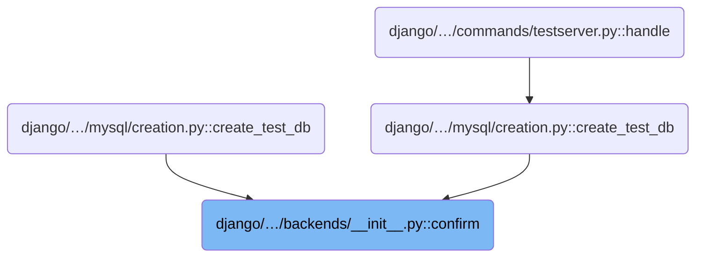
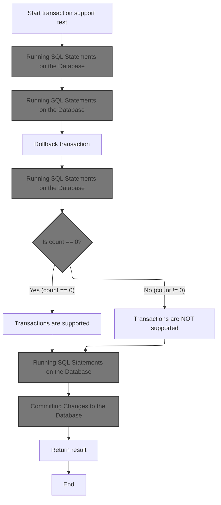
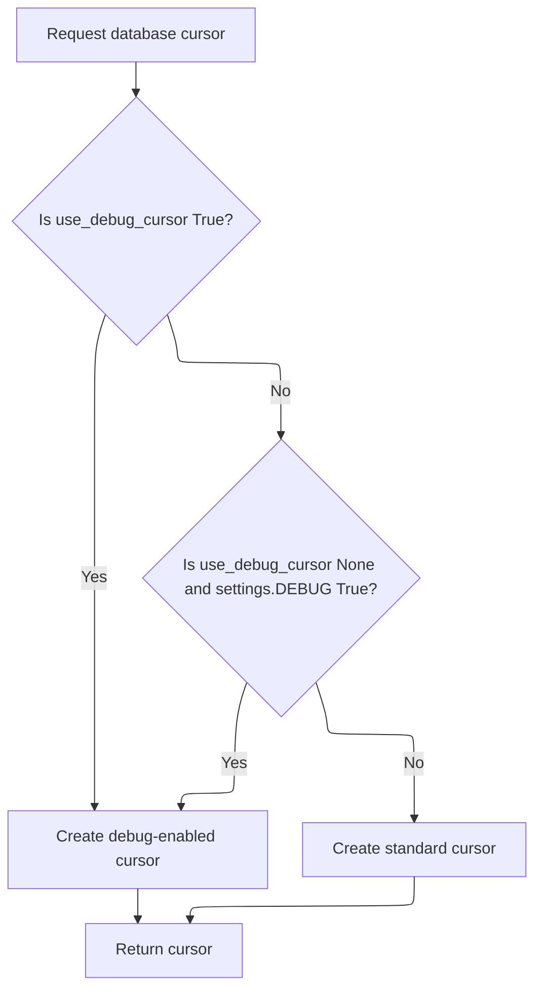
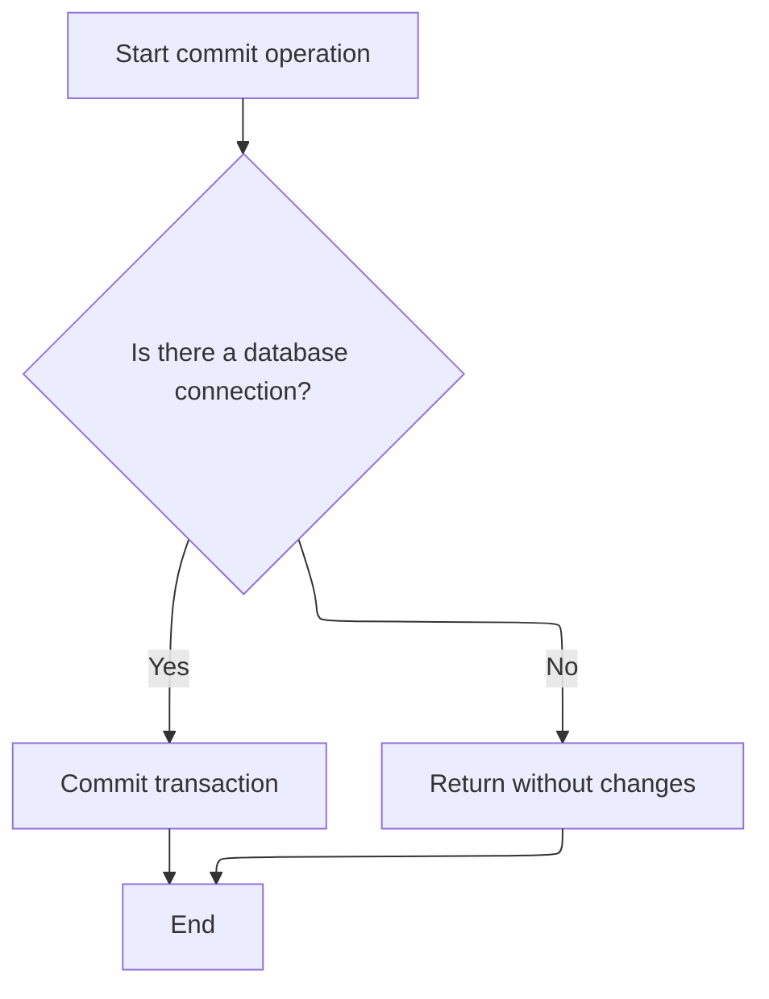
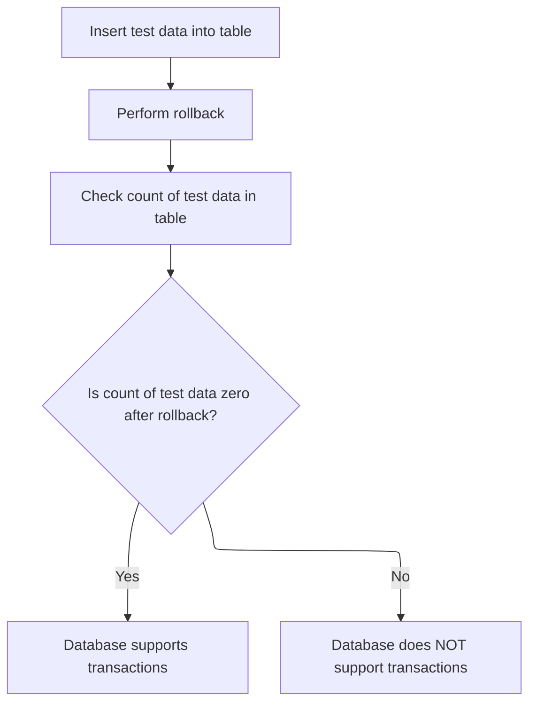
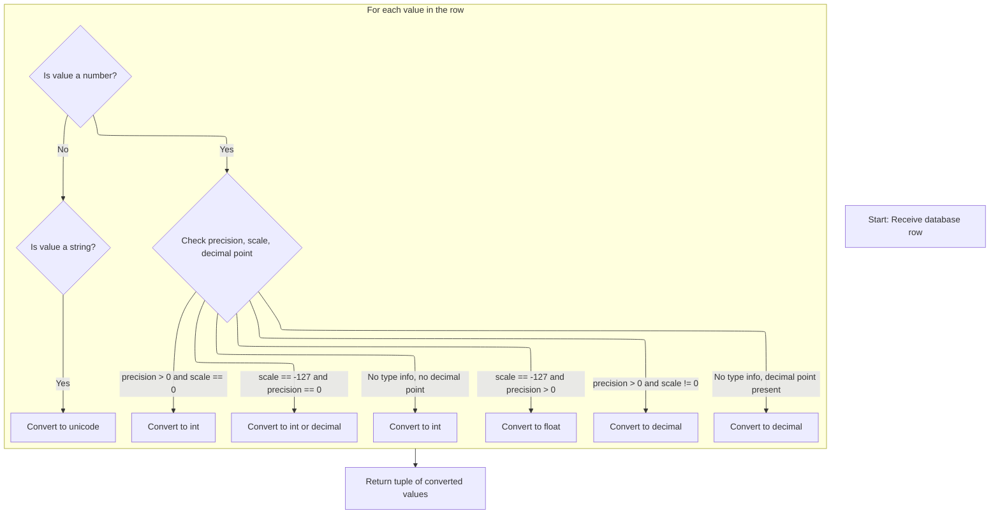

This document describes how Django confirms a database backend connection and determines which features are supported. The backend is flagged as confirmed, transaction support is tested, and additional capabilities are checked. The result is a backend connection with its feature support identified, enabling Django to use the appropriate ORM features.

# Where is this flow used?

This flow is used multiple times in the codebase as represented in the following diagram:



# Manual Feature Checks and Transaction Support

<SwmSnippet path="/django/db/backends/__init__.py" line="346">

---

In <SwmToken path="django/db/backends/__init__.py" pos="346:3:3" line-data="    def confirm(self):">`confirm`</SwmToken>, we flag the backend as confirmed and check transaction support so we know how to handle database operations going forward.

```python
    def confirm(self):
        "Perform manual checks of any database features that might vary between installs"
        self._confirmed = True
        self.supports_transactions = self._supports_transactions()
```

---

</SwmSnippet>

## Checking Transaction Capability



<SwmSnippet path="/django/db/backends/__init__.py" line="353">

---

In <SwmToken path="django/db/backends/__init__.py" pos="353:3:3" line-data="    def _supports_transactions(self):">`_supports_transactions`</SwmToken>, we grab a cursor from the connection. This lets us run SQL statements to probe if the database can handle transactions, since we need to actually interact with the backend to verify its capabilities.

```python
    def _supports_transactions(self):
        "Confirm support for transactions"
        cursor = self.connection.cursor()
```

---

</SwmSnippet>

### Choosing the Right Cursor Type



<SwmSnippet path="/django/db/backends/__init__.py" line="247">

---

<SwmToken path="django/db/backends/__init__.py" pos="247:3:3" line-data="    def cursor(self):">`cursor`</SwmToken> picks between a debug cursor and a standard wrapped cursor depending on whether debugging is enabled. This lets us get more info during development, but keeps things lean in production. The next step is to use the cursor to interact with the database backend, like <SwmPath>[django/…/sqlite3/base.py](django/db/backends/sqlite3/base.py)</SwmPath>, depending on which backend is in use.

```python
    def cursor(self):
        if (self.use_debug_cursor or
            (self.use_debug_cursor is None and settings.DEBUG)):
            cursor = self.make_debug_cursor(self._cursor())
        else:
            cursor = util.CursorWrapper(self._cursor(), self)
        return cursor
```

---

</SwmSnippet>

### Getting a Backend-Specific Cursor

See <SwmLink doc-title="Preparing the Database Cursor with Moderation and Signal Handling">[Preparing the Database Cursor with Moderation and Signal Handling](.swm%5Cpreparing-the-database-cursor-with-moderation-and-signal-handling.nkjdc1kf.sw.md)</SwmLink>

### Setting Up Transaction Test Table

<SwmSnippet path="/django/db/backends/__init__.py" line="356">

---

After getting the cursor in <SwmToken path="django/db/backends/__init__.py" pos="349:9:9" line-data="        self.supports_transactions = self._supports_transactions()">`_supports_transactions`</SwmToken>, we create a table called <SwmToken path="django/db/backends/__init__.py" pos="356:10:10" line-data="        cursor.execute(&#39;CREATE TABLE ROLLBACK_TEST (X INT)&#39;)">`ROLLBACK_TEST`</SwmToken>. This sets up a controlled environment to check if the database can handle rollbacks and commits as expected. Next, we use management logic to interact with the database for further checks.

```python
        cursor.execute('CREATE TABLE ROLLBACK_TEST (X INT)')
```

---

</SwmSnippet>

### Running SQL Statements on the Database

See <SwmLink doc-title="Executing management commands">[Executing management commands](.swm%5Cexecuting-management-commands.8gqaaj6i.sw.md)</SwmLink>

### Committing Test Changes

<SwmSnippet path="/django/db/backends/__init__.py" line="357">

---

After executing the SQL to create the test table in <SwmToken path="django/db/backends/__init__.py" pos="349:9:9" line-data="        self.supports_transactions = self._supports_transactions()">`_supports_transactions`</SwmToken>, we commit the change. This makes sure the table exists before we run the actual transaction tests.

```python
        self.connection._commit()
```

---

</SwmSnippet>

### Committing Changes to the Database



<SwmSnippet path="/django/db/backends/__init__.py" line="44">

---

<SwmToken path="django/db/backends/__init__.py" pos="44:3:3" line-data="    def _commit(self):">`_commit`</SwmToken> just calls commit on the underlying connection if it's available. This makes sure any changes are saved, which is needed before we check rollback behavior in transaction tests.

```python
    def _commit(self):
        if self.connection is not None:
            return self.connection.commit()
```

---

</SwmSnippet>

### Finalizing and Resetting State After Commit

<SwmSnippet path="/django/db/backends/__init__.py" line="197">

---

In <SwmToken path="django/db/backends/__init__.py" pos="197:3:3" line-data="    def commit(self):">`commit`</SwmToken>, we delegate the actual commit to <SwmToken path="django/db/backends/__init__.py" pos="201:3:3" line-data="        self._commit()">`_commit`</SwmToken>, then handle any extra cleanup like resetting the dirty flag. This keeps the commit logic focused and reusable.

```python
    def commit(self):
        """
        Does the commit itself and resets the dirty flag.
        """
        self._commit()
```

---

</SwmSnippet>

<SwmSnippet path="/django/db/backends/__init__.py" line="202">

---

After <SwmToken path="django/db/backends/__init__.py" pos="44:3:3" line-data="    def _commit(self):">`_commit`</SwmToken> finishes in <SwmToken path="django/db/backends/__init__.py" pos="46:7:7" line-data="            return self.connection.commit()">`commit`</SwmToken>, we reset the dirty flag with <SwmToken path="django/db/backends/__init__.py" pos="202:3:3" line-data="        self.set_clean()">`set_clean`</SwmToken>. This tells the system there are no unsaved changes left, so we're ready for new operations.

```python
        self.set_clean()
```

---

</SwmSnippet>

### Testing Rollback and Data Integrity



<SwmSnippet path="/django/db/backends/__init__.py" line="358">

---

After committing in <SwmToken path="django/db/backends/__init__.py" pos="349:9:9" line-data="        self.supports_transactions = self._supports_transactions()">`_supports_transactions`</SwmToken>, we insert a row, roll back, and then check the row count. This sequence tests if the database really undoes changes when rolling back, which is what we care about for transaction support.

```python
        cursor.execute('INSERT INTO ROLLBACK_TEST (X) VALUES (8)')
        self.connection._rollback()
        cursor.execute('SELECT COUNT(X) FROM ROLLBACK_TEST')
```

---

</SwmSnippet>

<SwmSnippet path="/django/db/backends/__init__.py" line="361">

---

After rolling back in <SwmToken path="django/db/backends/__init__.py" pos="349:9:9" line-data="        self.supports_transactions = self._supports_transactions()">`_supports_transactions`</SwmToken>, we fetch the count from the test table. This tells us if the rollback worked—if the count is zero, the database supports transactions as expected.

```python
        count, = cursor.fetchone()
```

---

</SwmSnippet>

### Fetching and Processing Query Results

<SwmSnippet path="/django/db/backends/oracle/base.py" line="666">

---

<SwmToken path="django/db/backends/oracle/base.py" pos="666:3:3" line-data="    def fetchone(self):">`fetchone`</SwmToken> gets a row and hands it off for type conversion so Django gets the right Python types.

```python
    def fetchone(self):
        row = self.cursor.fetchone()
        if row is None:
            return row
        return _rowfactory(row, self.cursor)
```

---

</SwmSnippet>

### Type Casting Database Results



<SwmSnippet path="/django/db/backends/oracle/base.py" line="713">

---

In <SwmToken path="django/db/backends/oracle/base.py" pos="713:2:2" line-data="def _rowfactory(row, cursor):">`_rowfactory`</SwmToken>, we loop through each value and its description, converting database types to Python types using metadata like precision and scale. This is <SwmToken path="django/db/backends/__init__.py" pos="54:7:9" line-data="        A hook for backend-specific changes required when entering manual">`backend-specific`</SwmToken> and makes sure Django gets the right types for its ORM.

```python
def _rowfactory(row, cursor):
    # Cast numeric values as the appropriate Python type based upon the
    # cursor description, and convert strings to unicode.
    casted = []
    for value, desc in zip(row, cursor.description):
        if value is not None and desc[1] is Database.NUMBER:
            precision, scale = desc[4:6]
            if scale == -127:
                if precision == 0:
                    # NUMBER column: decimal-precision floating point
                    # This will normally be an integer from a sequence,
                    # but it could be a decimal value.
                    if '.' in value:
                        value = Decimal(value)
                    else:
                        value = int(value)
                else:
                    # FLOAT column: binary-precision floating point.
                    # This comes from FloatField columns.
                    value = float(value)
            elif precision > 0:
                # NUMBER(p,s) column: decimal-precision fixed point.
                # This comes from IntField and DecimalField columns.
                if scale == 0:
                    value = int(value)
                else:
                    value = Decimal(value)
            elif '.' in value:
                # No type information. This normally comes from a
                # mathematical expression in the SELECT list. Guess int
                # or Decimal based on whether it has a decimal point.
                value = Decimal(value)
            else:
                value = int(value)
        elif desc[1] in (Database.STRING, Database.FIXED_CHAR,
                         Database.LONG_STRING):
            value = to_unicode(value)
        casted.append(value)
```

---

</SwmSnippet>

<SwmSnippet path="/django/db/backends/oracle/base.py" line="750">

---

After casting all the values in <SwmToken path="django/db/backends/oracle/base.py" pos="670:3:3" line-data="        return _rowfactory(row, self.cursor)">`_rowfactory`</SwmToken>, we return them as a tuple. This gives Django a set of Python-typed values ready for use, assuming the cursor description matches expectations.

```python
        casted.append(value)
    return tuple(casted)
```

---

</SwmSnippet>

### Cleaning Up After Transaction Test

<SwmSnippet path="/django/db/backends/__init__.py" line="362">

---

After checking the row count in <SwmToken path="django/db/backends/__init__.py" pos="349:9:9" line-data="        self.supports_transactions = self._supports_transactions()">`_supports_transactions`</SwmToken>, we drop the test table to clean up. This avoids cluttering the database with temporary tables used for capability checks.

```python
        cursor.execute('DROP TABLE ROLLBACK_TEST')
```

---

</SwmSnippet>

<SwmSnippet path="/django/db/backends/__init__.py" line="363">

---

After dropping the test table in <SwmToken path="django/db/backends/__init__.py" pos="349:9:9" line-data="        self.supports_transactions = self._supports_transactions()">`_supports_transactions`</SwmToken>, we commit to finalize the cleanup. Then we return whether the rollback actually removed the inserted row, which tells us if transactions are supported.

```python
        self.connection._commit()
        return count == 0
```

---

</SwmSnippet>

## Checking Additional Database Capabilities

<SwmSnippet path="/django/db/backends/__init__.py" line="350">

---

After checking transaction support in <SwmToken path="django/db/backends/__init__.py" pos="346:3:3" line-data="    def confirm(self):">`confirm`</SwmToken>, we check if the backend supports standard deviation and foreign key introspection. This tells Django what ORM features are available for this connection.

```python
        self.supports_stddev = self._supports_stddev()
        self.can_introspect_foreign_keys = self._can_introspect_foreign_keys()
```

---

</SwmSnippet>

<SwmSnippet path="/django/db/backends/__init__.py" line="376">

---

<SwmToken path="django/db/backends/__init__.py" pos="376:3:3" line-data="    def _can_introspect_foreign_keys(self):">`_can_introspect_foreign_keys`</SwmToken> just returns True, meaning Django assumes all backends can introspect foreign keys except for <SwmToken path="django/db/backends/__init__.py" pos="378:18:18" line-data="        # Every database can do this reliably, except MySQL,">`MySQL`</SwmToken>'s <SwmToken path="django/db/backends/__init__.py" pos="379:15:15" line-data="        # which can&#39;t do it for MyISAM tables">`MyISAM`</SwmToken> tables, as noted in the comment.

```python
    def _can_introspect_foreign_keys(self):
        "Confirm support for introspected foreign keys"
        # Every database can do this reliably, except MySQL,
        # which can't do it for MyISAM tables
        return True
```

---

</SwmSnippet>

&nbsp;

*This is an auto-generated document by Swimm 🌊 and has not yet been verified by a human*

<SwmMeta version="3.0.0" repo-id="Z2l0aHViJTNBJTNBUHl0aG9uRGphbmdvJTNBJTNBR29waW5hdGhyZWRkeTY2" repo-name="PythonDjango"><sup>Powered by [Swimm](https://app.swimm.io/)</sup></SwmMeta>
