This document describes how errors are reported to administrators. When an exception occurs, the system collects details about the error and the associated request, builds a comprehensive error report with context from template loaders, and sends both plain text and HTML versions to administrators via email.

# Triggering Error Reporting

<SwmSnippet path="/django/utils/log.py" line="60">

---

In <SwmToken path="django/utils/log.py" pos="60:3:3" line-data="    def emit(self, record):">`emit`</SwmToken>, we start by extracting the request and formatting the subject and message for the error report. We then use <SwmToken path="django/utils/log.py" pos="63:11:11" line-data="        from django.views.debug import ExceptionReporter">`ExceptionReporter`</SwmToken> from <SwmPath>[tests/…/templates/debug/](tests/regressiontests/views/templates/debug/)</SwmPath> to prepare a detailed HTML traceback, which is needed for the next step where we generate the actual error report content.

```python
    def emit(self, record):
        import traceback
        from django.conf import settings
        from django.views.debug import ExceptionReporter

        try:
            if sys.version_info < (2,5):
                # A nasty workaround required because Python 2.4's logging
                # module doesn't support passing in extra context.
                # For this handler, the only extra data we need is the
                # request, and that's in the top stack frame.
                request = record.exc_info[2].tb_frame.f_locals['request']
            else:
                request = record.request

            subject = '%s (%s IP): %s' % (
                record.levelname,
                (request.META.get('REMOTE_ADDR') in settings.INTERNAL_IPS and 'internal' or 'EXTERNAL'),
                record.msg
            )
            request_repr = repr(request)
        except:
            subject = '%s: %s' % (
                record.levelname,
                record.msg
            )

            request = None
            request_repr = "Request repr() unavailable"

        if record.exc_info:
            exc_info = record.exc_info
            stack_trace = '\n'.join(traceback.format_exception(*record.exc_info))
        else:
            exc_info = (None, record.msg, None)
            stack_trace = 'No stack trace available'

        message = "%s\n\n%s" % (stack_trace, request_repr)
        reporter = ExceptionReporter(request, is_email=True, *exc_info)
        html_message = self.include_html and reporter.get_traceback_html() or None
```

---

</SwmSnippet>

## Building the Traceback HTML

```mermaid
%%{init: {"flowchart": {"defaultRenderer": "elk"}} }%%
flowchart TD
    node1["Detect error type"] --> node2{"Is error a missing template?"}
    click node1 openCode "django/views/debug.py:85:85"
    node2 -->|"Yes"| node3["Collect loader debug info"]
    click node2 openCode "django/views/debug.py:85:89"
    subgraph loop1["For each template loader"]
        node3 --> node4["Gather attempted template sources"]
        click node4 openCode "django/views/debug.py:89:109"
        node4 --> node3
    end
    node2 -->|"No"| node5{"Is error a template syntax error with debug info?"}
    click node5 openCode "django/views/debug.py:110:112"
    node5 -->|"Yes"| node6["Collect template exception info"]
    click node6 openCode "django/views/debug.py:112:112"
    node5 -->|"No"| node7["Collect traceback frames"]
    click node7 openCode "django/views/debug.py:114:118"
    node3 --> node8["Collect traceback frames"]
    node6 --> node8
    node7 --> node8
    subgraph loop2["For each traceback frame"]
        node8 --> node9["Format variables for display"]
        click node9 openCode "django/views/debug.py:115:118"
        node9 --> node8
    end
    node8 --> node10{"Is error a Unicode error?"}
    click node10 openCode "django/views/debug.py:121:126"
    node10 -->|"Yes"| node11["Extract unicode context"]
    click node11 openCode "django/views/debug.py:124:126"
    node10 -->|"No"| node12["Prepare context for report"]
    node11 --> node13["Prepare context for report"]
    click node12 openCode "django/views/debug.py:127:150"
    click node13 openCode "django/views/debug.py:127:150"
    node12 --> node14["Render HTML error report"]
    node13 --> node14
    click node14 openCode "django/views/debug.py:151:151"

classDef HeadingStyle fill:#777777,stroke:#333,stroke-width:2px;

%% Swimm:
%% %%{init: {"flowchart": {"defaultRenderer": "elk"}} }%%
%% flowchart TD
%%     node1["Detect error type"] --> node2{"Is error a missing template?"}
%%     click node1 openCode "<SwmPath>[django/views/debug.py](django/views/debug.py)</SwmPath>:85:85"
%%     node2 -->|"Yes"| node3["Collect loader debug info"]
%%     click node2 openCode "<SwmPath>[django/views/debug.py](django/views/debug.py)</SwmPath>:85:89"
%%     subgraph loop1["For each template loader"]
%%         node3 --> node4["Gather attempted template sources"]
%%         click node4 openCode "<SwmPath>[django/views/debug.py](django/views/debug.py)</SwmPath>:89:109"
%%         node4 --> node3
%%     end
%%     node2 -->|"No"| node5{"Is error a template syntax error with debug info?"}
%%     click node5 openCode "<SwmPath>[django/views/debug.py](django/views/debug.py)</SwmPath>:110:112"
%%     node5 -->|"Yes"| node6["Collect template exception info"]
%%     click node6 openCode "<SwmPath>[django/views/debug.py](django/views/debug.py)</SwmPath>:112:112"
%%     node5 -->|"No"| node7["Collect traceback frames"]
%%     click node7 openCode "<SwmPath>[django/views/debug.py](django/views/debug.py)</SwmPath>:114:118"
%%     node3 --> node8["Collect traceback frames"]
%%     node6 --> node8
%%     node7 --> node8
%%     subgraph loop2["For each traceback frame"]
%%         node8 --> node9["Format variables for display"]
%%         click node9 openCode "<SwmPath>[django/views/debug.py](django/views/debug.py)</SwmPath>:115:118"
%%         node9 --> node8
%%     end
%%     node8 --> node10{"Is error a Unicode error?"}
%%     click node10 openCode "<SwmPath>[django/views/debug.py](django/views/debug.py)</SwmPath>:121:126"
%%     node10 -->|"Yes"| node11["Extract unicode context"]
%%     click node11 openCode "<SwmPath>[django/views/debug.py](django/views/debug.py)</SwmPath>:124:126"
%%     node10 -->|"No"| node12["Prepare context for report"]
%%     node11 --> node13["Prepare context for report"]
%%     click node12 openCode "<SwmPath>[django/views/debug.py](django/views/debug.py)</SwmPath>:127:150"
%%     click node13 openCode "<SwmPath>[django/views/debug.py](django/views/debug.py)</SwmPath>:127:150"
%%     node12 --> node14["Render HTML error report"]
%%     node13 --> node14
%%     click node14 openCode "<SwmPath>[django/views/debug.py](django/views/debug.py)</SwmPath>:151:151"
%% 
%% classDef HeadingStyle fill:#777777,stroke:#333,stroke-width:<SwmToken path="django/views/debug.py" pos="333:21:21" line-data="    tbody td, tbody th { vertical-align:top; padding:2px 3px; }">`2px`</SwmToken>;
```



<SwmSnippet path="/django/views/debug.py" line="82">

---

In <SwmToken path="django/views/debug.py" pos="82:3:3" line-data="    def get_traceback_html(self):">`get_traceback_html`</SwmToken>, we check if the error is <SwmToken path="django/views/debug.py" pos="85:16:16" line-data="        if self.exc_type and issubclass(self.exc_type, TemplateDoesNotExist):">`TemplateDoesNotExist`</SwmToken> and then collect info from each template loader about which files were searched and whether they exist. This gives context for template errors.

```python
    def get_traceback_html(self):
        "Return HTML code for traceback."

        if self.exc_type and issubclass(self.exc_type, TemplateDoesNotExist):
            from django.template.loader import template_source_loaders
            self.template_does_not_exist = True
            self.loader_debug_info = []
            for loader in template_source_loaders:
                try:
                    module = import_module(loader.__module__)
                    if hasattr(loader, '__class__'):
                        source_list_func = loader.get_template_sources
                    else: # NOTE: Remember to remove this branch when we deprecate old template loaders in 1.4
                        source_list_func = module.get_template_sources
                    # NOTE: This assumes exc_value is the name of the template that
                    # the loader attempted to load.
                    template_list = [{'name': t, 'exists': os.path.exists(t)} \
                        for t in source_list_func(str(self.exc_value))]
                except (ImportError, AttributeError):
                    template_list = []
                if hasattr(loader, '__class__'):
                    loader_name = loader.__module__ + '.' + loader.__class__.__name__
                else: # NOTE: Remember to remove this branch when we deprecate old template loaders in 1.4
                    loader_name = loader.__module__ + '.' + loader.__name__
                self.loader_debug_info.append({
                    'loader': loader_name,
                    'templates': template_list,
                })
```

---

</SwmSnippet>

<SwmSnippet path="/django/views/debug.py" line="110">

---

After collecting loader info, we process each traceback frame, pretty-print and escape variable values for safe HTML output. This keeps the error page readable and secure.

```python
        if (settings.TEMPLATE_DEBUG and hasattr(self.exc_value, 'source') and
            isinstance(self.exc_value, TemplateSyntaxError)):
            self.get_template_exception_info()

        frames = self.get_traceback_frames()
        for i, frame in enumerate(frames):
            if 'vars' in frame:
                frame['vars'] = [(k, force_escape(pprint(v))) for k, v in frame['vars']]
            frames[i] = frame
```

---

</SwmSnippet>

<SwmSnippet path="/django/views/debug.py" line="118">

---

We build the HTML error report with all the debug info, including a unicode hint if needed, and render it for sending.

```python
            frames[i] = frame

        unicode_hint = ''
        if self.exc_type and issubclass(self.exc_type, UnicodeError):
            start = getattr(self.exc_value, 'start', None)
            end = getattr(self.exc_value, 'end', None)
            if start is not None and end is not None:
                unicode_str = self.exc_value.args[1]
                unicode_hint = smart_unicode(unicode_str[max(start-5, 0):min(end+5, len(unicode_str))], 'ascii', errors='replace')
        from django import get_version
        t = Template(TECHNICAL_500_TEMPLATE, name='Technical 500 template')
        c = Context({
            'is_email': self.is_email,
            'unicode_hint': unicode_hint,
            'frames': frames,
            'request': self.request,
            'settings': get_safe_settings(),
            'sys_executable': sys.executable,
            'sys_version_info': '%d.%d.%d' % sys.version_info[0:3],
            'server_time': datetime.datetime.now(),
            'django_version_info': get_version(),
            'sys_path' : sys.path,
            'template_info': self.template_info,
            'template_does_not_exist': self.template_does_not_exist,
            'loader_debug_info': self.loader_debug_info,
        })
        # Check whether exception info is available
        if self.exc_type:
            c['exception_type'] = self.exc_type.__name__
        if self.exc_value:
            c['exception_value'] = smart_unicode(self.exc_value, errors='replace')
        if frames:
            c['lastframe'] = frames[-1]
        return t.render(c)
```

---

</SwmSnippet>

## Sending the Error Notification

<SwmSnippet path="/django/utils/log.py" line="100">

---

We just got the HTML traceback from <SwmPath>[django/views/debug.py](django/views/debug.py)</SwmPath>, and now in emit, we call <SwmToken path="django/utils/log.py" pos="100:1:3" line-data="        mail.mail_admins(subject, message, fail_silently=True,">`mail.mail_admins`</SwmToken> to send both the plain and HTML error report to the admins. This hands off the actual notification to the mail system.

```python
        mail.mail_admins(subject, message, fail_silently=True,
                         html_message=html_message)
```

---

</SwmSnippet>

<SwmSnippet path="/django/core/mail/__init__.py" line="86">

---

<SwmToken path="django/core/mail/__init__.py" pos="86:2:2" line-data="def mail_admins(subject, message, fail_silently=False, connection=None,">`mail_admins`</SwmToken> grabs admin emails from <SwmToken path="django/core/mail/__init__.py" pos="89:5:7" line-data="    if not settings.ADMINS:">`settings.ADMINS`</SwmToken>, builds a multipart email with both plain and HTML content using <SwmToken path="django/core/mail/__init__.py" pos="91:5:5" line-data="    mail = EmailMultiAlternatives(u&#39;%s%s&#39; % (settings.EMAIL_SUBJECT_PREFIX, subject),">`EmailMultiAlternatives`</SwmToken>, and sends it out. If ADMINS isn't set, nothing is sent.

```python
def mail_admins(subject, message, fail_silently=False, connection=None,
                html_message=None):
    """Sends a message to the admins, as defined by the ADMINS setting."""
    if not settings.ADMINS:
        return
    mail = EmailMultiAlternatives(u'%s%s' % (settings.EMAIL_SUBJECT_PREFIX, subject),
                message, settings.SERVER_EMAIL, [a[1] for a in settings.ADMINS],
                connection=connection)
    if html_message:
        mail.attach_alternative(html_message, 'text/html')
    mail.send(fail_silently=fail_silently)
```

---

</SwmSnippet>

&nbsp;

*This is an auto-generated document by Swimm 🌊 and has not yet been verified by a human*

<SwmMeta version="3.0.0" repo-id="Z2l0aHViJTNBJTNBUHl0aG9uRGphbmdvJTNBJTNBR29waW5hdGhyZWRkeTY2" repo-name="PythonDjango"><sup>Powered by [Swimm](https://app.swimm.io/)</sup></SwmMeta>
