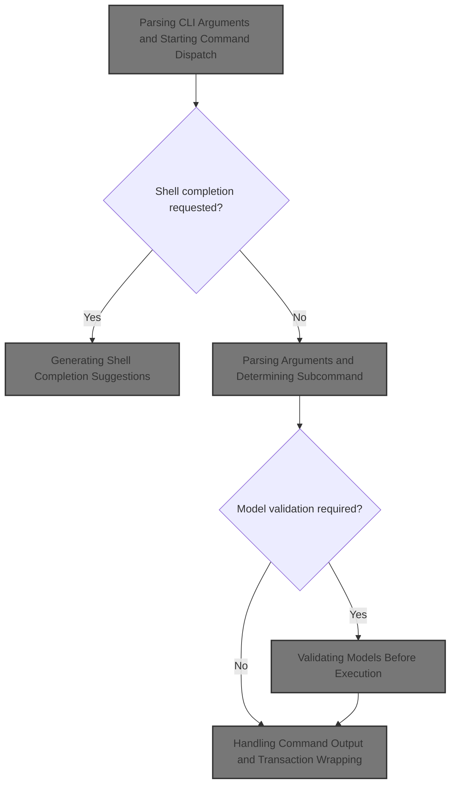
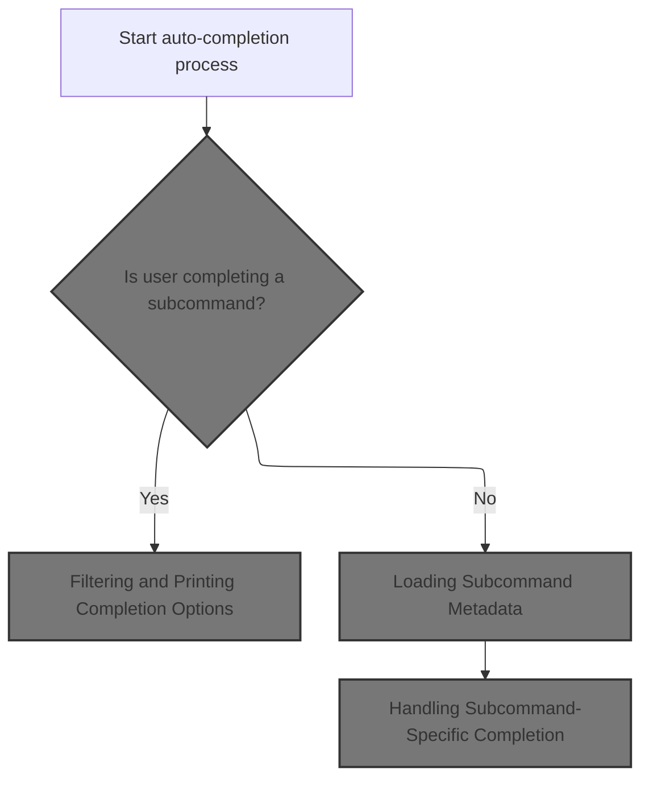
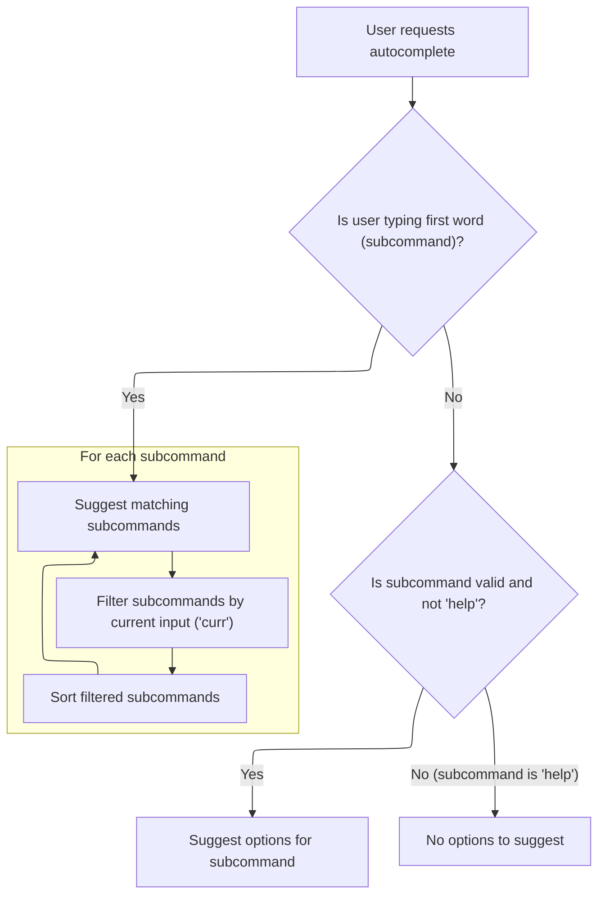
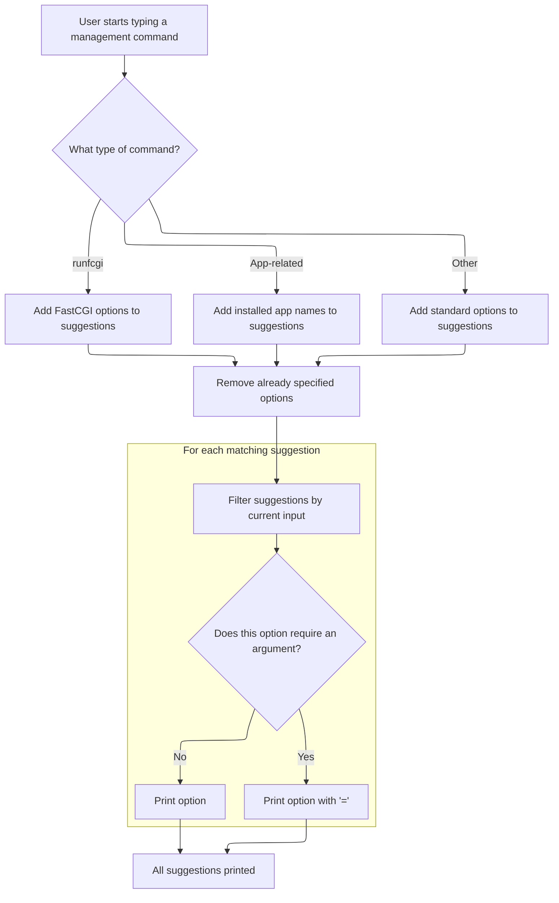
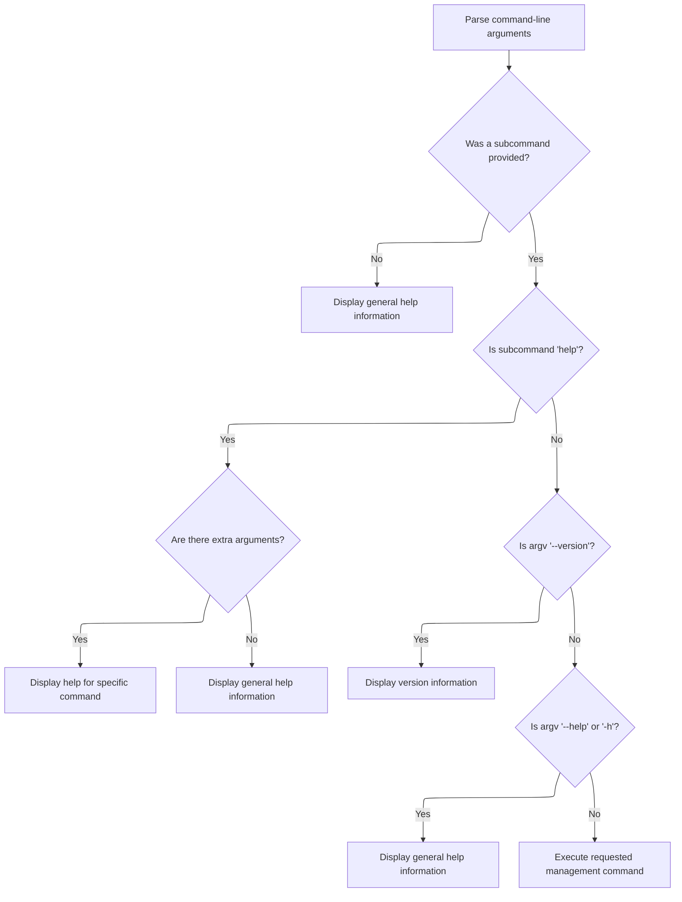
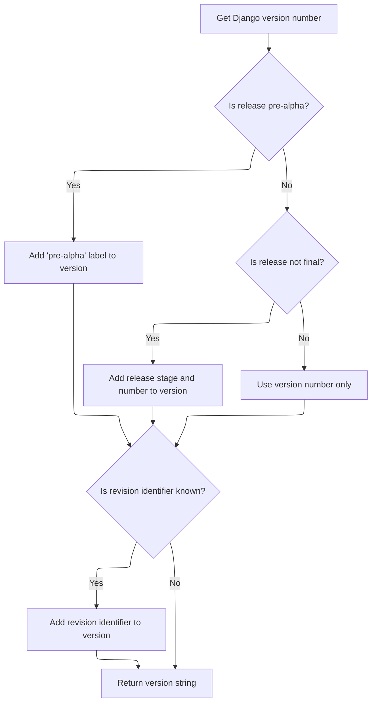
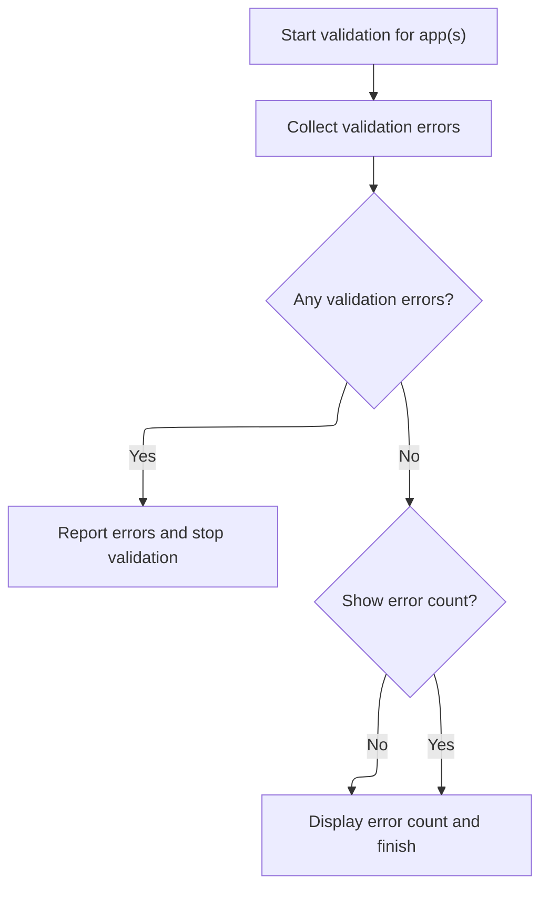
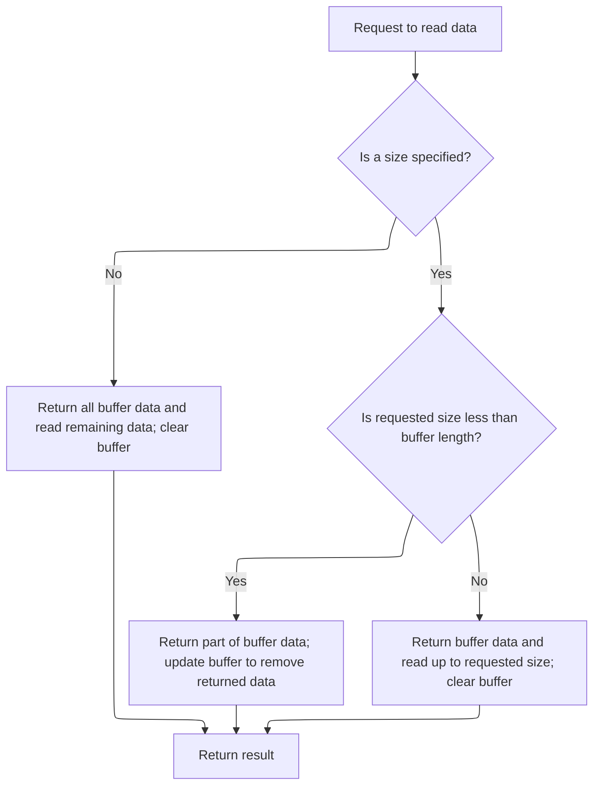
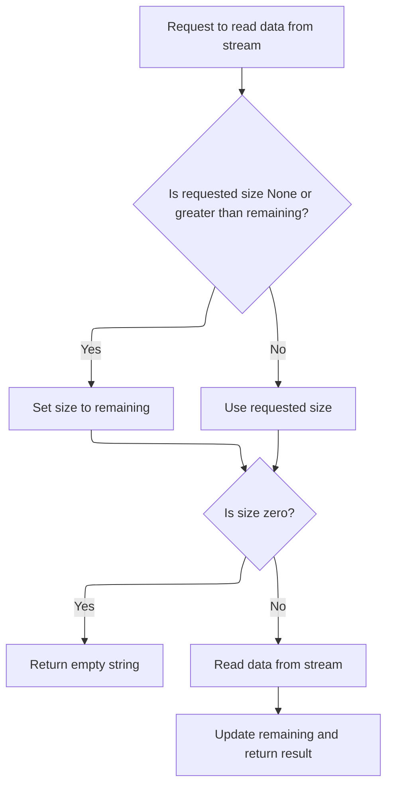
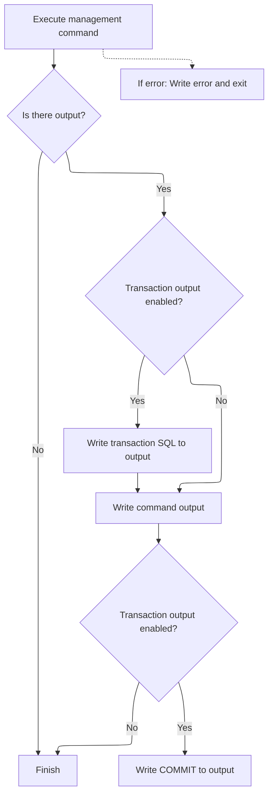

This document describes how users interact with Django's administrative features through the command-line interface. Users provide command-line arguments to request shell completion suggestions or execute management commands. The flow covers generating completion options, validating models, running the requested command, and displaying results or help information.



# Parsing CLI Arguments and Starting Command Dispatch

<SwmSnippet path="/django/core/management/__init__.py" line="340">

---

We start by prepping the parser and jump straight to autocomplete so users get shell completion hints before anything else happens.

```python
    def execute(self):
        """
        Given the command-line arguments, this figures out which subcommand is
        being run, creates a parser appropriate to that command, and runs it.
        """
        # Preprocess options to extract --settings and --pythonpath.
        # These options could affect the commands that are available, so they
        # must be processed early.
        parser = LaxOptionParser(usage="%prog subcommand [options] [args]",
                                 version=get_version(),
                                 option_list=BaseCommand.option_list)
        self.autocomplete()
```

---

</SwmSnippet>

## Generating Shell Completion Suggestions



<SwmSnippet path="/django/core/management/__init__.py" line="264">

---

In `autocomplete`, we grab the current CLI input and cursor position from BASH environment variables, then prep to list subcommands and options. We need to call `get_commands` next to know which subcommands are available for completion.

```python
    def autocomplete(self):
        """
        Output completion suggestions for BASH.

        The output of this function is passed to BASH's `COMREPLY` variable and
        treated as completion suggestions. `COMREPLY` expects a space
        separated string as the result.

        The `COMP_WORDS` and `COMP_CWORD` BASH environment variables are used
        to get information about the cli input. Please refer to the BASH
        man-page for more information about this variables.

        Subcommand options are saved as pairs. A pair consists of
        the long option string (e.g. '--exclude') and a boolean
        value indicating if the option requires arguments. When printing to
        stdout, a equal sign is appended to options which require arguments.

        Note: If debugging this function, it is recommended to write the debug
        output in a separate file. Otherwise the debug output will be treated
        and formatted as potential completion suggestions.
        """
        # Don't complete if user hasn't sourced bash_completion file.
        if not os.environ.has_key('DJANGO_AUTO_COMPLETE'):
            return

        cwords = os.environ['COMP_WORDS'].split()[1:]
        cword = int(os.environ['COMP_CWORD'])

        try:
            curr = cwords[cword-1]
        except IndexError:
            curr = ''

        subcommands = get_commands().keys() + ['help']
```

---

</SwmSnippet>

### Discovering Available Subcommands

See <SwmLink doc-title="Building the Management Command Registry">[Building the Management Command Registry](\.swm\building-the-management-command-registry.kyby51ah.sw.md)</SwmLink>

### Filtering and Printing Completion Options



<SwmSnippet path="/django/core/management/__init__.py" line="298">

---

Back in `autocomplete`, after getting subcommands, we filter and print suggestions based on the current input. If we're completing options for a subcommand, we call `fetch_command` to get its specific options and handle special cases before printing the final list for BASH.

```python
        options = [('--help', None)]

        # subcommand
        if cword == 1:
            print ' '.join(sorted(filter(lambda x: x.startswith(curr), subcommands)))
        # subcommand options
        # special case: the 'help' subcommand has no options
        elif cwords[0] in subcommands and cwords[0] != 'help':
            subcommand_cls = self.fetch_command(cwords[0])
```

---

</SwmSnippet>

### Loading Subcommand Metadata

See <SwmLink doc-title="Processing Management Command Requests">[Processing Management Command Requests](\.swm\processing-management-command-requests.40wavhek.sw.md)</SwmLink>

### Handling Subcommand-Specific Completion



<SwmSnippet path="/django/core/management/__init__.py" line="307">

---

After returning from `fetch_command` in `autocomplete`, we add extra options for special subcommands and installed apps, filter out already used options, and print the final list with '=' for options needing arguments. This gives BASH the right suggestions for the current context.

```python
            # special case: 'runfcgi' stores additional options as
            # 'key=value' pairs
            if cwords[0] == 'runfcgi':
                from django.core.servers.fastcgi import FASTCGI_OPTIONS
                options += [(k, 1) for k in FASTCGI_OPTIONS]
            # special case: add the names of installed apps to options
            elif cwords[0] in ('dumpdata', 'reset', 'sql', 'sqlall',
                               'sqlclear', 'sqlcustom', 'sqlindexes',
                               'sqlreset', 'sqlsequencereset', 'test'):
                try:
                    from django.conf import settings
                    # Get the last part of the dotted path as the app name.
                    options += [(a.split('.')[-1], 0) for a in settings.INSTALLED_APPS]
                except ImportError:
                    # Fail silently if DJANGO_SETTINGS_MODULE isn't set. The
                    # user will find out once they execute the command.
                    pass
            options += [(s_opt.get_opt_string(), s_opt.nargs) for s_opt in
                        subcommand_cls.option_list]
            # filter out previously specified options from available options
            prev_opts = [x.split('=')[0] for x in cwords[1:cword-1]]
            options = filter(lambda (x, v): x not in prev_opts, options)

            # filter options by current input
            options = sorted([(k, v) for k, v in options if k.startswith(curr)])
            for option in options:
                opt_label = option[0]
                # append '=' to options which require args
                if option[1]:
                    opt_label += '='
                print opt_label
```

---

</SwmSnippet>

<SwmSnippet path="/django/core/management/__init__.py" line="338">

---

Autocomplete prints the completion suggestions and then exits, so nothing is returned to the caller—it's just for shell completion.

```python
        sys.exit(1)
```

---

</SwmSnippet>

## Parsing Arguments and Determining Subcommand



<SwmSnippet path="/django/core/management/__init__.py" line="352">

---

After autocomplete, `execute` parses the CLI arguments, handles default options, and figures out which subcommand to run next by calling fetch_command if needed.

```python
        try:
            options, args = parser.parse_args(self.argv)
            handle_default_options(options)
        except:
            pass # Ignore any option errors at this point.

        try:
            subcommand = self.argv[1]
        except IndexError:
            subcommand = 'help' # Display help if no arguments were given.

        if subcommand == 'help':
            if len(args) > 2:
                self.fetch_command(args[2]).print_help(self.prog_name, args[2])
            else:
```

---

</SwmSnippet>

<SwmSnippet path="/django/core/management/__init__.py" line="367">

---

After fetch_command, `execute` checks for help/version flags and prints info if needed. If not, we move on to running the actual subcommand, which may involve server logic next.

```python
                parser.print_lax_help()
                sys.stderr.write(self.main_help_text() + '\n')
                sys.exit(1)
        # Special-cases: We want 'django-admin.py --version' and
        # 'django-admin.py --help' to work, for backwards compatibility.
        elif self.argv[1:] == ['--version']:
            # LaxOptionParser already takes care of printing the version.
            pass
        elif self.argv[1:] in (['--help'], ['-h']):
            parser.print_lax_help()
            sys.stderr.write(self.main_help_text() + '\n')
        else:
```

---

</SwmSnippet>

<SwmSnippet path="/django/core/management/__init__.py" line="379">

---

After any server logic, `execute` calls fetch_command again and runs the subcommand using run_from_argv, passing the CLI args for actual execution.

```python
            self.fetch_command(subcommand).run_from_argv(self.argv)
```

---

</SwmSnippet>

<SwmSnippet path="/django/core/management/__init__.py" line="379">

---

After fetching the command, `execute` hands off to run_from_argv, which takes care of parsing and running the command logic.

```python
            self.fetch_command(subcommand).run_from_argv(self.argv)
```

---

</SwmSnippet>

# Parsing Arguments and Running Command Logic

<SwmSnippet path="/django/core/management/base.py" line="182">

---

In `run_from_argv`, we use argv\[0\] and argv\[1\] to set up the parser for the command, prepping to parse the rest of the arguments and options.

```python
    def run_from_argv(self, argv):
        """
        Set up any environment changes requested (e.g., Python path
        and Django settings), then run this command.

        """
        parser = self.create_parser(argv[0], argv[1])
```

---

</SwmSnippet>

## Building the Command-Line Parser

<SwmSnippet path="/django/core/management/base.py" line="162">

---

`create_parser` builds a new OptionParser for the command, setting usage, version, and options specific to the subcommand.

```python
    def create_parser(self, prog_name, subcommand):
        """
        Create and return the ``OptionParser`` which will be used to
        parse the arguments to this command.

        """
        return OptionParser(prog=prog_name,
                            usage=self.usage(subcommand),
                            version=self.get_version(),
                            option_list=self.option_list)
```

---

</SwmSnippet>

## Formatting the Django Version String



<SwmSnippet path="/django/core/management/base.py" line="141">

---

`get_version` returns the Django version string, pulling info from the global VERSION tuple and calling django.get_version for the final format.

```python
    def get_version(self):
        """
        Return the Django version, which should be correct for all
        built-in Django commands. User-supplied commands should
        override this method.

        """
        return django.get_version()
```

---

</SwmSnippet>

<SwmSnippet path="/django/__init__.py" line="3">

---

`get_version` builds the version string using the VERSION tuple, conditionally adding patch, release level, serial, and SVN revision for a detailed output.

```python
def get_version():
    version = '%s.%s' % (VERSION[0], VERSION[1])
    if VERSION[2]:
        version = '%s.%s' % (version, VERSION[2])
    if VERSION[3:] == ('alpha', 0):
        version = '%s pre-alpha' % version
    else:
        if VERSION[3] != 'final':
            version = '%s %s %s' % (version, VERSION[3], VERSION[4])
    from django.utils.version import get_svn_revision
    svn_rev = get_svn_revision()
    if svn_rev != u'SVN-unknown':
        version = "%s %s" % (version, svn_rev)
    return version
```

---

</SwmSnippet>

## Parsing Arguments and Dispatching Execution

<SwmSnippet path="/django/core/management/base.py" line="189">

---

After creating the parser in `run_from_argv`, we parse the CLI arguments, handle any default options, and then call execute with all the parsed args and options unpacked. This hands off control to the main command logic.

```python
        options, args = parser.parse_args(argv[2:])
        handle_default_options(options)
        self.execute(*args, **options.__dict__)
```

---

</SwmSnippet>

# Running the Command and Handling Validation

<SwmSnippet path="/django/core/management/base.py" line="193">

---

In `execute`, we switch to English for DB content if settings are available, and bail out with an error if settings can't be imported. This sets up the environment before running the command.

```python
    def execute(self, *args, **options):
        """
        Try to execute this command, performing model validation if
        needed (as controlled by the attribute
        ``self.requires_model_validation``). If the command raises a
        ``CommandError``, intercept it and print it sensibly to
        stderr.

        """
        # Switch to English, because django-admin.py creates database content
        # like permissions, and those shouldn't contain any translations.
        # But only do this if we can assume we have a working settings file,
        # because django.utils.translation requires settings.
        if self.can_import_settings:
            try:
                from django.utils import translation
                translation.activate('en-us')
            except ImportError, e:
                # If settings should be available, but aren't,
                # raise the error and quit.
                sys.stderr.write(smart_str(self.style.ERROR('Error: %s\n' % e)))
                sys.exit(1)
```

---

</SwmSnippet>

<SwmSnippet path="/django/core/management/base.py" line="215">

---

After setting up output streams, we check if model validation is needed and call validate to catch any model errors before running the command logic.

```python
        try:
            self.stdout = options.get('stdout', sys.stdout)
            self.stderr = options.get('stderr', sys.stderr)
            if self.requires_model_validation:
                self.validate()
```

---

</SwmSnippet>

## Validating Models Before Execution



<SwmSnippet path="/django/core/management/base.py" line="236">

---

In `validate`, we use StringIO to collect validation errors, call get_validation_errors, and raise CommandError if any issues are found. Next, we may need to load data if validation passes.

```python
    def validate(self, app=None, display_num_errors=False):
        """
        Validates the given app, raising CommandError for any errors.

        If app is None, then this will validate all installed apps.

        """
        from django.core.management.validation import get_validation_errors
        try:
            from cStringIO import StringIO
        except ImportError:
            from StringIO import StringIO
        s = StringIO()
        num_errors = get_validation_errors(s, app)
        if num_errors:
            s.seek(0)
            error_text = s.read()
            raise CommandError("One or more models did not validate:\n%s" % error_text)
```

---

</SwmSnippet>

### Reading Data from Zip Archives

<SwmSnippet path="/django/core/management/commands/loaddata.py" line="73">

---

`read` grabs the content of the first file in the zip archive, assuming that's the data we need to process next.

```python
            def read(self):
                return zipfile.ZipFile.read(self, self.namelist()[0])
```

---

</SwmSnippet>

### Buffered Reading from WSGI Streams



<SwmSnippet path="/django/core/handlers/wsgi.py" line="86">

---

`read` manages buffered reads from the WSGI stream, handling full or partial reads and calling \_read_limited when more data is needed.

```python
    def read(self, size=None):
        if size is None:
            result = self.buffer + self._read_limited()
            self.buffer = ''
        elif size < len(self.buffer):
            result = self.buffer[:size]
            self.buffer = self.buffer[size:]
        else: # size >= len(self.buffer)
            result = self.buffer + self._read_limited(size - len(self.buffer))
            self.buffer = ''
        return result
```

---

</SwmSnippet>

### Reading a Limited Amount from the Stream



<SwmSnippet path="/django/core/handlers/wsgi.py" line="77">

---

In `_read_limited`, we read up to self.remaining bytes from the stream, making sure not to go past the allowed limit.

```python
    def _read_limited(self, size=None):
        if size is None or size > self.remaining:
            size = self.remaining
        if size == 0:
            return ''
        result = self.stream.read(size)
```

---

</SwmSnippet>

<SwmSnippet path="/django/core/handlers/wsgi.py" line="83">

---

After reading from the stream in `_read_limited`, we update self.remaining and return the data, so future reads know how much is left.

```python
        self.remaining -= len(result)
        return result
```

---

</SwmSnippet>

### Reporting Validation Results

<SwmSnippet path="/django/core/management/base.py" line="254">

---

After validation in `validate`, we print the number of errors found if requested, giving the user a quick summary before moving on to the next step.

```python
        if display_num_errors:
            self.stdout.write("%s error%s found\n" % (num_errors, num_errors != 1 and 's' or ''))
```

---

</SwmSnippet>

## Handling Command Output and Transaction Wrapping



<SwmSnippet path="/django/core/management/base.py" line="220">

---

Back in django/core/management/base.py, after validating models, we run the command's handle method, print its output, and wrap it in a transaction if needed. If output_transaction is set, we print the transaction SQL and COMMIT statements. We also catch CommandError and print it to stderr. Once this is done, if we're running a server command, we need to call django/core/servers/basehttp.py next to actually start the HTTP server and handle requests, since that's not handled here.

```python
            output = self.handle(*args, **options)
            if output:
                if self.output_transaction:
                    # This needs to be imported here, because it relies on
                    # settings.
                    from django.db import connections, DEFAULT_DB_ALIAS
                    connection = connections[options.get('database', DEFAULT_DB_ALIAS)]
                    if connection.ops.start_transaction_sql():
                        self.stdout.write(self.style.SQL_KEYWORD(connection.ops.start_transaction_sql()) + '\n')
                self.stdout.write(output)
                if self.output_transaction:
                    self.stdout.write('\n' + self.style.SQL_KEYWORD("COMMIT;") + '\n')
        except CommandError, e:
            self.stderr.write(smart_str(self.style.ERROR('Error: %s\n' % e)))
            sys.exit(1)
```

---

</SwmSnippet>

&nbsp;

*This is an auto-generated document by Swimm 🌊 and has not yet been verified by a human*

<SwmMeta version="3.0.0" repo-id="Z2l0aHViJTNBJTNBUHl0aG9uRGphbmdvJTNBJTNBR29waW5hdGhyZWRkeTY2" repo-name="PythonDjango"><sup>Powered by [Swimm](https://app.swimm.io/)</sup></SwmMeta>
