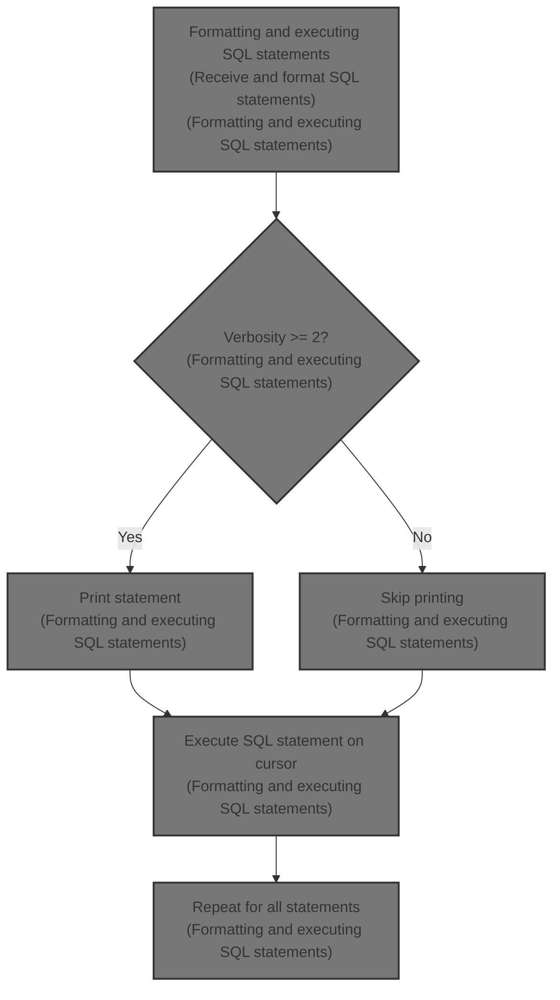
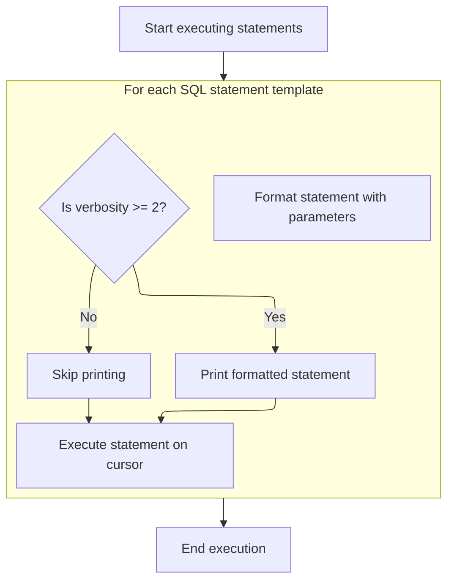
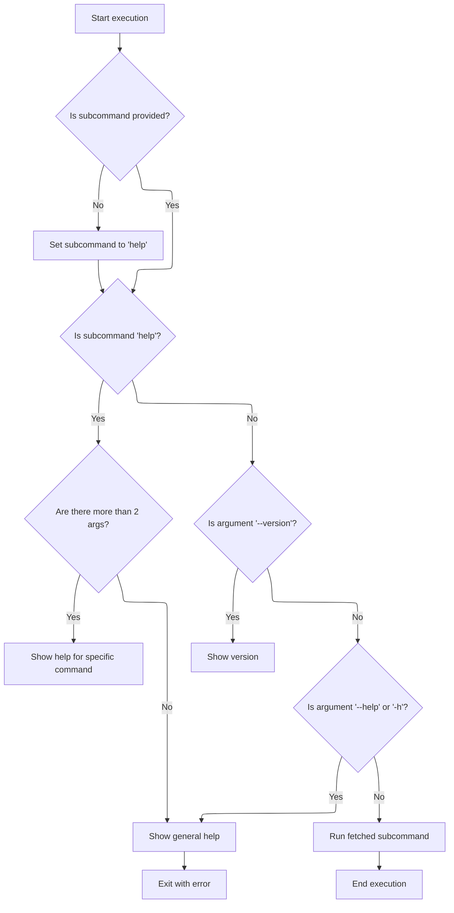

This document describes the flow of formatting and executing SQL statements within the database backend. It receives SQL statement templates and parameters, formats each statement, optionally logs the statements based on verbosity, and executes them sequentially on a database cursor. This flow supports database creation and destruction operations by ensuring SQL commands are properly executed.



# Where is this flow used?

This flow is used multiple times in the codebase as represented in the following diagram:

```mermaid
graph TD;
      f9666806180348d545fddf0653f79558216d8db672db432b6cbf1ec324f83f39(django/…/oracle/creation.py::_execute_test_db_creation) --> c5e97bbb3fd4e45a45bda1a41fe29c2c588c0cd932d875456ea7ce28795eb21c(django/…/oracle/creation.py::_execute_statements):::mainFlowStyle

4fd6ae038cde24b032fa8aabefeedac2483374c8038692c185b5437dcbc08bfa(django/…/oracle/creation.py::_create_test_db) --> f9666806180348d545fddf0653f79558216d8db672db432b6cbf1ec324f83f39(django/…/oracle/creation.py::_execute_test_db_creation)

4fd6ae038cde24b032fa8aabefeedac2483374c8038692c185b5437dcbc08bfa(django/…/oracle/creation.py::_create_test_db) --> 9d6100b1645a137a6305b5cfd04bb937fc102cfc82ed474686e2f9314205bffa(django/…/oracle/creation.py::_create_test_user)

4fd6ae038cde24b032fa8aabefeedac2483374c8038692c185b5437dcbc08bfa(django/…/oracle/creation.py::_create_test_db) --> 3b2c3bffc7d408557d292f4131617db3d38ace385c1139ce9383a4baa748551c(django/…/oracle/creation.py::_execute_test_db_destruction)

4fd6ae038cde24b032fa8aabefeedac2483374c8038692c185b5437dcbc08bfa(django/…/oracle/creation.py::_create_test_db) --> 09723cffb623dad310c477a989ee1b8aaf48208fba5271f81a033f0d81827e45(django/…/oracle/creation.py::_destroy_test_user)

70d7fc49a62a8c2014a8228e3afcd410bf8120ea74f1912a9a102a05ce780efa(django/…/oracle/creation.py::create_test_db) --> 4fd6ae038cde24b032fa8aabefeedac2483374c8038692c185b5437dcbc08bfa(django/…/oracle/creation.py::_create_test_db)

9d6100b1645a137a6305b5cfd04bb937fc102cfc82ed474686e2f9314205bffa(django/…/oracle/creation.py::_create_test_user) --> c5e97bbb3fd4e45a45bda1a41fe29c2c588c0cd932d875456ea7ce28795eb21c(django/…/oracle/creation.py::_execute_statements):::mainFlowStyle

3b2c3bffc7d408557d292f4131617db3d38ace385c1139ce9383a4baa748551c(django/…/oracle/creation.py::_execute_test_db_destruction) --> c5e97bbb3fd4e45a45bda1a41fe29c2c588c0cd932d875456ea7ce28795eb21c(django/…/oracle/creation.py::_execute_statements):::mainFlowStyle

f61f95591f5503792cce13f7ebaeda05764f8ae0ca25da7884a0dc64464baa30(django/…/oracle/creation.py::_destroy_test_db) --> 3b2c3bffc7d408557d292f4131617db3d38ace385c1139ce9383a4baa748551c(django/…/oracle/creation.py::_execute_test_db_destruction)

f61f95591f5503792cce13f7ebaeda05764f8ae0ca25da7884a0dc64464baa30(django/…/oracle/creation.py::_destroy_test_db) --> 09723cffb623dad310c477a989ee1b8aaf48208fba5271f81a033f0d81827e45(django/…/oracle/creation.py::_destroy_test_user)

09723cffb623dad310c477a989ee1b8aaf48208fba5271f81a033f0d81827e45(django/…/oracle/creation.py::_destroy_test_user) --> c5e97bbb3fd4e45a45bda1a41fe29c2c588c0cd932d875456ea7ce28795eb21c(django/…/oracle/creation.py::_execute_statements):::mainFlowStyle


classDef mainFlowStyle color:#000000,fill:#7CB9F4
classDef rootsStyle color:#000000,fill:#00FFF4
classDef Style1 color:#000000,fill:#00FFAA
classDef Style2 color:#000000,fill:#FFFF00
classDef Style3 color:#000000,fill:#AA7CB9

%% Swimm:
%% graph TD;
%%       f9666806180348d545fddf0653f79558216d8db672db432b6cbf1ec324f83f39(<SwmPath>[django/…/oracle/creation.py](django/db/backends/oracle/creation.py)</SwmPath>::<SwmToken path="django/db/backends/oracle/creation.py" pos="66:3:3" line-data="                self._execute_test_db_creation(cursor, parameters, verbosity)">`_execute_test_db_creation`</SwmToken>) --> c5e97bbb3fd4e45a45bda1a41fe29c2c588c0cd932d875456ea7ce28795eb21c(<SwmPath>[django/…/oracle/creation.py](django/db/backends/oracle/creation.py)</SwmPath>::<SwmToken path="django/db/backends/oracle/creation.py" pos="193:3:3" line-data="    def _execute_statements(self, cursor, statements, parameters, verbosity):">`_execute_statements`</SwmToken>):::mainFlowStyle
%% 
%% 4fd6ae038cde24b032fa8aabefeedac2483374c8038692c185b5437dcbc08bfa(<SwmPath>[django/…/oracle/creation.py](django/db/backends/oracle/creation.py)</SwmPath>::<SwmToken path="django/db/backends/oracle/creation.py" pos="45:3:3" line-data="    def _create_test_db(self, verbosity=1, autoclobber=False):">`_create_test_db`</SwmToken>) --> f9666806180348d545fddf0653f79558216d8db672db432b6cbf1ec324f83f39(<SwmPath>[django/…/oracle/creation.py](django/db/backends/oracle/creation.py)</SwmPath>::<SwmToken path="django/db/backends/oracle/creation.py" pos="66:3:3" line-data="                self._execute_test_db_creation(cursor, parameters, verbosity)">`_execute_test_db_creation`</SwmToken>)
%% 
%% 4fd6ae038cde24b032fa8aabefeedac2483374c8038692c185b5437dcbc08bfa(<SwmPath>[django/…/oracle/creation.py](django/db/backends/oracle/creation.py)</SwmPath>::<SwmToken path="django/db/backends/oracle/creation.py" pos="45:3:3" line-data="    def _create_test_db(self, verbosity=1, autoclobber=False):">`_create_test_db`</SwmToken>) --> 9d6100b1645a137a6305b5cfd04bb937fc102cfc82ed474686e2f9314205bffa(<SwmPath>[django/…/oracle/creation.py](django/db/backends/oracle/creation.py)</SwmPath>::<SwmToken path="django/db/backends/oracle/creation.py" pos="88:3:3" line-data="                self._create_test_user(cursor, parameters, verbosity)">`_create_test_user`</SwmToken>)
%% 
%% 4fd6ae038cde24b032fa8aabefeedac2483374c8038692c185b5437dcbc08bfa(<SwmPath>[django/…/oracle/creation.py](django/db/backends/oracle/creation.py)</SwmPath>::<SwmToken path="django/db/backends/oracle/creation.py" pos="45:3:3" line-data="    def _create_test_db(self, verbosity=1, autoclobber=False):">`_create_test_db`</SwmToken>) --> 3b2c3bffc7d408557d292f4131617db3d38ace385c1139ce9383a4baa748551c(<SwmPath>[django/…/oracle/creation.py](django/db/backends/oracle/creation.py)</SwmPath>::<SwmToken path="django/db/backends/oracle/creation.py" pos="75:3:3" line-data="                        self._execute_test_db_destruction(cursor, parameters, verbosity)">`_execute_test_db_destruction`</SwmToken>)
%% 
%% 4fd6ae038cde24b032fa8aabefeedac2483374c8038692c185b5437dcbc08bfa(<SwmPath>[django/…/oracle/creation.py](django/db/backends/oracle/creation.py)</SwmPath>::<SwmToken path="django/db/backends/oracle/creation.py" pos="45:3:3" line-data="    def _create_test_db(self, verbosity=1, autoclobber=False):">`_create_test_db`</SwmToken>) --> 09723cffb623dad310c477a989ee1b8aaf48208fba5271f81a033f0d81827e45(<SwmPath>[django/…/oracle/creation.py](django/db/backends/oracle/creation.py)</SwmPath>::<SwmToken path="django/db/backends/oracle/creation.py" pos="97:3:3" line-data="                        self._destroy_test_user(cursor, parameters, verbosity)">`_destroy_test_user`</SwmToken>)
%% 
%% 70d7fc49a62a8c2014a8228e3afcd410bf8120ea74f1912a9a102a05ce780efa(<SwmPath>[django/…/oracle/creation.py](django/db/backends/oracle/creation.py)</SwmPath>::create_test_db) --> 4fd6ae038cde24b032fa8aabefeedac2483374c8038692c185b5437dcbc08bfa(<SwmPath>[django/…/oracle/creation.py](django/db/backends/oracle/creation.py)</SwmPath>::<SwmToken path="django/db/backends/oracle/creation.py" pos="45:3:3" line-data="    def _create_test_db(self, verbosity=1, autoclobber=False):">`_create_test_db`</SwmToken>)
%% 
%% 9d6100b1645a137a6305b5cfd04bb937fc102cfc82ed474686e2f9314205bffa(<SwmPath>[django/…/oracle/creation.py](django/db/backends/oracle/creation.py)</SwmPath>::<SwmToken path="django/db/backends/oracle/creation.py" pos="88:3:3" line-data="                self._create_test_user(cursor, parameters, verbosity)">`_create_test_user`</SwmToken>) --> c5e97bbb3fd4e45a45bda1a41fe29c2c588c0cd932d875456ea7ce28795eb21c(<SwmPath>[django/…/oracle/creation.py](django/db/backends/oracle/creation.py)</SwmPath>::<SwmToken path="django/db/backends/oracle/creation.py" pos="193:3:3" line-data="    def _execute_statements(self, cursor, statements, parameters, verbosity):">`_execute_statements`</SwmToken>):::mainFlowStyle
%% 
%% 3b2c3bffc7d408557d292f4131617db3d38ace385c1139ce9383a4baa748551c(<SwmPath>[django/…/oracle/creation.py](django/db/backends/oracle/creation.py)</SwmPath>::<SwmToken path="django/db/backends/oracle/creation.py" pos="75:3:3" line-data="                        self._execute_test_db_destruction(cursor, parameters, verbosity)">`_execute_test_db_destruction`</SwmToken>) --> c5e97bbb3fd4e45a45bda1a41fe29c2c588c0cd932d875456ea7ce28795eb21c(<SwmPath>[django/…/oracle/creation.py](django/db/backends/oracle/creation.py)</SwmPath>::<SwmToken path="django/db/backends/oracle/creation.py" pos="193:3:3" line-data="    def _execute_statements(self, cursor, statements, parameters, verbosity):">`_execute_statements`</SwmToken>):::mainFlowStyle
%% 
%% f61f95591f5503792cce13f7ebaeda05764f8ae0ca25da7884a0dc64464baa30(<SwmPath>[django/…/oracle/creation.py](django/db/backends/oracle/creation.py)</SwmPath>::<SwmToken path="django/db/backends/oracle/creation.py" pos="113:3:3" line-data="    def _destroy_test_db(self, test_database_name, verbosity=1):">`_destroy_test_db`</SwmToken>) --> 3b2c3bffc7d408557d292f4131617db3d38ace385c1139ce9383a4baa748551c(<SwmPath>[django/…/oracle/creation.py](django/db/backends/oracle/creation.py)</SwmPath>::<SwmToken path="django/db/backends/oracle/creation.py" pos="75:3:3" line-data="                        self._execute_test_db_destruction(cursor, parameters, verbosity)">`_execute_test_db_destruction`</SwmToken>)
%% 
%% f61f95591f5503792cce13f7ebaeda05764f8ae0ca25da7884a0dc64464baa30(<SwmPath>[django/…/oracle/creation.py](django/db/backends/oracle/creation.py)</SwmPath>::<SwmToken path="django/db/backends/oracle/creation.py" pos="113:3:3" line-data="    def _destroy_test_db(self, test_database_name, verbosity=1):">`_destroy_test_db`</SwmToken>) --> 09723cffb623dad310c477a989ee1b8aaf48208fba5271f81a033f0d81827e45(<SwmPath>[django/…/oracle/creation.py](django/db/backends/oracle/creation.py)</SwmPath>::<SwmToken path="django/db/backends/oracle/creation.py" pos="97:3:3" line-data="                        self._destroy_test_user(cursor, parameters, verbosity)">`_destroy_test_user`</SwmToken>)
%% 
%% 09723cffb623dad310c477a989ee1b8aaf48208fba5271f81a033f0d81827e45(<SwmPath>[django/…/oracle/creation.py](django/db/backends/oracle/creation.py)</SwmPath>::<SwmToken path="django/db/backends/oracle/creation.py" pos="97:3:3" line-data="                        self._destroy_test_user(cursor, parameters, verbosity)">`_destroy_test_user`</SwmToken>) --> c5e97bbb3fd4e45a45bda1a41fe29c2c588c0cd932d875456ea7ce28795eb21c(<SwmPath>[django/…/oracle/creation.py](django/db/backends/oracle/creation.py)</SwmPath>::<SwmToken path="django/db/backends/oracle/creation.py" pos="193:3:3" line-data="    def _execute_statements(self, cursor, statements, parameters, verbosity):">`_execute_statements`</SwmToken>):::mainFlowStyle
%% 
%% 
%% classDef mainFlowStyle color:#000000,fill:#7CB9F4
%% classDef rootsStyle color:#000000,fill:#00FFF4
%% classDef Style1 color:#000000,fill:#00FFAA
%% classDef Style2 color:#000000,fill:#FFFF00
%% classDef Style3 color:#000000,fill:#AA7CB9
```



# Formatting and executing SQL statements



This section describes the process of formatting and executing SQL statements within the Django Oracle backend, including conditional logging based on verbosity levels and error handling during execution.

| Category       | Rule Name                     | Description                                                                                     |
| -------------- | ----------------------------- | ----------------------------------------------------------------------------------------------- |
| Business logic | Statement formatting          | Each SQL statement template must be formatted with the provided parameters before execution.    |
| Business logic | Conditional verbosity logging | SQL statements should only be printed if the verbosity level is 2 or higher.                    |
| Business logic | Sequential execution          | All SQL statement templates provided must be executed sequentially in the order they are given. |

<SwmSnippet path="/django/db/backends/oracle/creation.py" line="193">

---

Here, <SwmToken path="django/db/backends/oracle/creation.py" pos="193:3:3" line-data="    def _execute_statements(self, cursor, statements, parameters, verbosity):">`_execute_statements`</SwmToken> formats each SQL statement template with the given parameters using the % operator, then executes them via the cursor. It prints statements if verbosity is high. After this, the flow moves to management command execution in <SwmPath>[django/core/management/](django/core/management/)</SwmPath>**init**.py to handle higher-level command logic.

```python
    def _execute_statements(self, cursor, statements, parameters, verbosity):
        for template in statements:
            stmt = template % parameters
            if verbosity >= 2:
                print stmt
            try:
                cursor.execute(stmt)
            except Exception, err:
                sys.stderr.write("Failed (%s)\n" % (err))
                raise
```

---

</SwmSnippet>

# Parsing and dispatching management commands

This section handles parsing <SwmToken path="django/core/management/__init__.py" pos="342:5:7" line-data="        Given the command-line arguments, this figures out which subcommand is">`command-line`</SwmToken> arguments to determine which management subcommand to execute in Django, setting up the environment accordingly.

| Category       | Rule Name            | Description                                                                                                     |
| -------------- | -------------------- | --------------------------------------------------------------------------------------------------------------- |
| Business logic | Autocomplete support | The system should provide autocomplete functionality to assist users in entering valid subcommands and options. |

<SwmSnippet path="/django/core/management/__init__.py" line="340">

---

In <SwmToken path="django/core/management/__init__.py" pos="340:3:3" line-data="    def execute(self):">`execute`</SwmToken>, the function parses <SwmToken path="django/core/management/__init__.py" pos="342:5:7" line-data="        Given the command-line arguments, this figures out which subcommand is">`command-line`</SwmToken> arguments to figure out which subcommand to run. It sets up a parser that understands options like --settings and --pythonpath early, because these can change which commands are available. This prepares the environment for running the chosen command.

```python
    def execute(self):
        """
        Given the command-line arguments, this figures out which subcommand is
        being run, creates a parser appropriate to that command, and runs it.
        """
        # Preprocess options to extract --settings and --pythonpath.
        # These options could affect the commands that are available, so they
        # must be processed early.
        parser = LaxOptionParser(usage="%prog subcommand [options] [args]",
                                 version=get_version(),
                                 option_list=BaseCommand.option_list)
        self.autocomplete()
```

---

</SwmSnippet>

## Generating <SwmToken path="django/core/management/__init__.py" pos="342:5:7" line-data="        Given the command-line arguments, this figures out which subcommand is">`command-line`</SwmToken> autocomplete suggestions



This section generates <SwmToken path="django/core/management/__init__.py" pos="342:5:7" line-data="        Given the command-line arguments, this figures out which subcommand is">`command-line`</SwmToken> autocomplete suggestions for Django management commands, providing users with possible subcommands and options based on their current input in a BASH shell environment.

```mermaid
%%{init: {"flowchart": {"defaultRenderer": "elk"}} }%%
flowchart TD
    node1{"Is autocomplete enabled?"}
    click node1 openCode "django/core/management/__init__.py:286:287"
    node1 -->|"No"| node2["Exit without suggestions"]
    click node2 openCode "django/core/management/__init__.py:287:287"
    node1 -->|"Yes"| node3{"Is completing subcommand?"}
    click node3 openCode "django/core/management/__init__.py:289:301"
    node3 -->|"Yes"| node4["Print matching subcommands"]
    click node4 openCode "django/core/management/__init__.py:301:303"
    node3 -->|"No"| node5{"Is first word a recognized subcommand other than 'help'?"}
    click node5 openCode "django/core/management/__init__.py:304:305"
    node5 -->|"No"| node2
    node5 -->|"Yes"| node6["Get subcommand options"]
    click node6 openCode "django/core/management/__init__.py:306:326"
    node6 --> node7{"Is subcommand a special case?"}
    click node7 openCode "django/core/management/__init__.py:309:324"
    node7 -->|"Yes"| node8["Add special options"]
    click node8 openCode "django/core/management/__init__.py:309:324"
    node7 -->|"No"| node9["Add standard options"]
    click node9 openCode "django/core/management/__init__.py:324:326"
    node8 --> node10["Filter out previously specified options"]
    click node10 openCode "django/core/management/__init__.py:327:329"
    node9 --> node10
    node10 --> node15["Filter options by current input prefix"]
    click node15 openCode "django/core/management/__init__.py:330:332"
    subgraph loop1["For each filtered option"]
        node15 --> node11{"Does option require argument?"}
        click node11 openCode "django/core/management/__init__.py:333:336"
        node11 -->|"Yes"| node12["Append '=' to option"]
        click node12 openCode "django/core/management/__init__.py:335:337"
        node11 -->|"No"| node13["Keep option as is"]
        click node13 openCode "django/core/management/__init__.py:335:337"
        node12 --> node14["Print option"]
        click node14 openCode "django/core/management/__init__.py:332:337"
        node13 --> node14
        node14 --> node15
    end

classDef HeadingStyle fill:#777777,stroke:#333,stroke-width:2px;

%% Swimm:
%% %%{init: {"flowchart": {"defaultRenderer": "elk"}} }%%
%% flowchart TD
%%     node1{"Is autocomplete enabled?"}
%%     click node1 openCode "<SwmPath>[django/…/management/\__init_\_.py](django/core/management/__init__.py)</SwmPath>:286:287"
%%     node1 -->|"No"| node2["Exit without suggestions"]
%%     click node2 openCode "<SwmPath>[django/…/management/\__init_\_.py](django/core/management/__init__.py)</SwmPath>:287:287"
%%     node1 -->|"Yes"| node3{"Is completing subcommand?"}
%%     click node3 openCode "<SwmPath>[django/…/management/\__init_\_.py](django/core/management/__init__.py)</SwmPath>:289:301"
%%     node3 -->|"Yes"| node4["Print matching subcommands"]
%%     click node4 openCode "<SwmPath>[django/…/management/\__init_\_.py](django/core/management/__init__.py)</SwmPath>:301:303"
%%     node3 -->|"No"| node5{"Is first word a recognized subcommand other than 'help'?"}
%%     click node5 openCode "<SwmPath>[django/…/management/\__init_\_.py](django/core/management/__init__.py)</SwmPath>:304:305"
%%     node5 -->|"No"| node2
%%     node5 -->|"Yes"| node6["Get subcommand options"]
%%     click node6 openCode "<SwmPath>[django/…/management/\__init_\_.py](django/core/management/__init__.py)</SwmPath>:306:326"
%%     node6 --> node7{"Is subcommand a special case?"}
%%     click node7 openCode "<SwmPath>[django/…/management/\__init_\_.py](django/core/management/__init__.py)</SwmPath>:309:324"
%%     node7 -->|"Yes"| node8["Add special options"]
%%     click node8 openCode "<SwmPath>[django/…/management/\__init_\_.py](django/core/management/__init__.py)</SwmPath>:309:324"
%%     node7 -->|"No"| node9["Add standard options"]
%%     click node9 openCode "<SwmPath>[django/…/management/\__init_\_.py](django/core/management/__init__.py)</SwmPath>:324:326"
%%     node8 --> node10["Filter out previously specified options"]
%%     click node10 openCode "<SwmPath>[django/…/management/\__init_\_.py](django/core/management/__init__.py)</SwmPath>:327:329"
%%     node9 --> node10
%%     node10 --> node15["Filter options by current input prefix"]
%%     click node15 openCode "<SwmPath>[django/…/management/\__init_\_.py](django/core/management/__init__.py)</SwmPath>:330:332"
%%     subgraph loop1["For each filtered option"]
%%         node15 --> node11{"Does option require argument?"}
%%         click node11 openCode "<SwmPath>[django/…/management/\__init_\_.py](django/core/management/__init__.py)</SwmPath>:333:336"
%%         node11 -->|"Yes"| node12["Append '=' to option"]
%%         click node12 openCode "<SwmPath>[django/…/management/\__init_\_.py](django/core/management/__init__.py)</SwmPath>:335:337"
%%         node11 -->|"No"| node13["Keep option as is"]
%%         click node13 openCode "<SwmPath>[django/…/management/\__init_\_.py](django/core/management/__init__.py)</SwmPath>:335:337"
%%         node12 --> node14["Print option"]
%%         click node14 openCode "<SwmPath>[django/…/management/\__init_\_.py](django/core/management/__init__.py)</SwmPath>:332:337"
%%         node13 --> node14
%%         node14 --> node15
%%     end
%% 
%% classDef HeadingStyle fill:#777777,stroke:#333,stroke-width:2px;
```

| Category       | Rule Name                      | Description                                                                                                                                                            |
| -------------- | ------------------------------ | ---------------------------------------------------------------------------------------------------------------------------------------------------------------------- |
| Business logic | Subcommand prefix filtering    | If the user is typing the first word after the command, only subcommands that start with the current input prefix are suggested.                                       |
| Business logic | Subcommand-specific options    | If the first word is a recognized subcommand other than 'help', the system suggests options specific to that subcommand, including special cases for certain commands. |
| Business logic | Special subcommand options     | Special subcommands like 'runfcgi' and those involving installed apps have additional options included in their autocomplete suggestions.                              |
| Business logic | Exclude used options           | Options that have already been specified in the current command line input are excluded from the autocomplete suggestions to avoid redundancy.                         |
| Business logic | Option prefix filtering        | Options are filtered to only include those starting with the current input prefix, ensuring suggestions are relevant to what the user is typing.                       |
| Business logic | Argument indicator for options | Options that require arguments have an '=' appended to their autocomplete suggestion to indicate that an argument is expected.                                         |

<SwmSnippet path="/django/core/management/__init__.py" line="264">

---

In <SwmToken path="django/core/management/__init__.py" pos="264:3:3" line-data="    def autocomplete(self):">`autocomplete`</SwmToken>, the function reads BASH environment variables to understand what the user has typed so far and where the cursor is. It then gathers all possible subcommands and options, including special cases for commands like 'runfcgi' and those listing installed apps. It filters out options already used and formats the remaining ones, printing them in a way BASH expects for autocomplete.

```python
    def autocomplete(self):
        """
        Output completion suggestions for BASH.

        The output of this function is passed to BASH's `COMREPLY` variable and
        treated as completion suggestions. `COMREPLY` expects a space
        separated string as the result.

        The `COMP_WORDS` and `COMP_CWORD` BASH environment variables are used
        to get information about the cli input. Please refer to the BASH
        man-page for more information about this variables.

        Subcommand options are saved as pairs. A pair consists of
        the long option string (e.g. '--exclude') and a boolean
        value indicating if the option requires arguments. When printing to
        stdout, a equal sign is appended to options which require arguments.

        Note: If debugging this function, it is recommended to write the debug
        output in a separate file. Otherwise the debug output will be treated
        and formatted as potential completion suggestions.
        """
        # Don't complete if user hasn't sourced bash_completion file.
        if not os.environ.has_key('DJANGO_AUTO_COMPLETE'):
            return

        cwords = os.environ['COMP_WORDS'].split()[1:]
        cword = int(os.environ['COMP_CWORD'])

        try:
            curr = cwords[cword-1]
        except IndexError:
            curr = ''

        subcommands = get_commands().keys() + ['help']
        options = [('--help', None)]

        # subcommand
        if cword == 1:
            print ' '.join(sorted(filter(lambda x: x.startswith(curr), subcommands)))
        # subcommand options
        # special case: the 'help' subcommand has no options
        elif cwords[0] in subcommands and cwords[0] != 'help':
            subcommand_cls = self.fetch_command(cwords[0])
            # special case: 'runfcgi' stores additional options as
            # 'key=value' pairs
            if cwords[0] == 'runfcgi':
                from django.core.servers.fastcgi import FASTCGI_OPTIONS
                options += [(k, 1) for k in FASTCGI_OPTIONS]
            # special case: add the names of installed apps to options
            elif cwords[0] in ('dumpdata', 'reset', 'sql', 'sqlall',
                               'sqlclear', 'sqlcustom', 'sqlindexes',
                               'sqlreset', 'sqlsequencereset', 'test'):
                try:
                    from django.conf import settings
                    # Get the last part of the dotted path as the app name.
                    options += [(a.split('.')[-1], 0) for a in settings.INSTALLED_APPS]
                except ImportError:
                    # Fail silently if DJANGO_SETTINGS_MODULE isn't set. The
                    # user will find out once they execute the command.
                    pass
            options += [(s_opt.get_opt_string(), s_opt.nargs) for s_opt in
                        subcommand_cls.option_list]
            # filter out previously specified options from available options
            prev_opts = [x.split('=')[0] for x in cwords[1:cword-1]]
            options = filter(lambda (x, v): x not in prev_opts, options)

            # filter options by current input
            options = sorted([(k, v) for k, v in options if k.startswith(curr)])
            for option in options:
                opt_label = option[0]
                # append '=' to options which require args
                if option[1]:
                    opt_label += '='
                print opt_label
```

---

</SwmSnippet>

<SwmSnippet path="/django/core/management/__init__.py" line="338">

---

Here, the code calls <SwmToken path="django/core/management/__init__.py" pos="338:1:3" line-data="        sys.exit(1)">`sys.exit`</SwmToken>(1) to stop execution with an error status, usually after showing help or when something goes wrong.

```python
        sys.exit(1)
```

---

</SwmSnippet>

## Handling parsed options and dispatching commands



<SwmSnippet path="/django/core/management/__init__.py" line="352">

---

After returning from <SwmToken path="django/core/management/__init__.py" pos="264:3:3" line-data="    def autocomplete(self):">`autocomplete`</SwmToken> in <SwmToken path="django/db/backends/oracle/creation.py" pos="199:3:3" line-data="                cursor.execute(stmt)">`execute`</SwmToken>, the code parses <SwmToken path="django/core/management/__init__.py" pos="342:5:7" line-data="        Given the command-line arguments, this figures out which subcommand is">`command-line`</SwmToken> options and arguments, handles defaults, picks the subcommand (or help if none), and either shows help, handles special cases like --version, or runs the subcommand.

```python
        try:
            options, args = parser.parse_args(self.argv)
            handle_default_options(options)
        except:
            pass # Ignore any option errors at this point.

        try:
            subcommand = self.argv[1]
        except IndexError:
            subcommand = 'help' # Display help if no arguments were given.

        if subcommand == 'help':
            if len(args) > 2:
                self.fetch_command(args[2]).print_help(self.prog_name, args[2])
            else:
                parser.print_lax_help()
                sys.stderr.write(self.main_help_text() + '\n')
                sys.exit(1)
        # Special-cases: We want 'django-admin.py --version' and
        # 'django-admin.py --help' to work, for backwards compatibility.
        elif self.argv[1:] == ['--version']:
            # LaxOptionParser already takes care of printing the version.
            pass
        elif self.argv[1:] in (['--help'], ['-h']):
            parser.print_lax_help()
            sys.stderr.write(self.main_help_text() + '\n')
        else:
            self.fetch_command(subcommand).run_from_argv(self.argv)
```

---

</SwmSnippet>

&nbsp;

*This is an auto-generated document by Swimm 🌊 and has not yet been verified by a human*

<SwmMeta version="3.0.0" repo-id="Z2l0aHViJTNBJTNBUHl0aG9uRGphbmdvJTNBJTNBR29waW5hdGhyZWRkeTY2" repo-name="PythonDjango"><sup>Powered by [Swimm](https://app.swimm.io/)</sup></SwmMeta>
