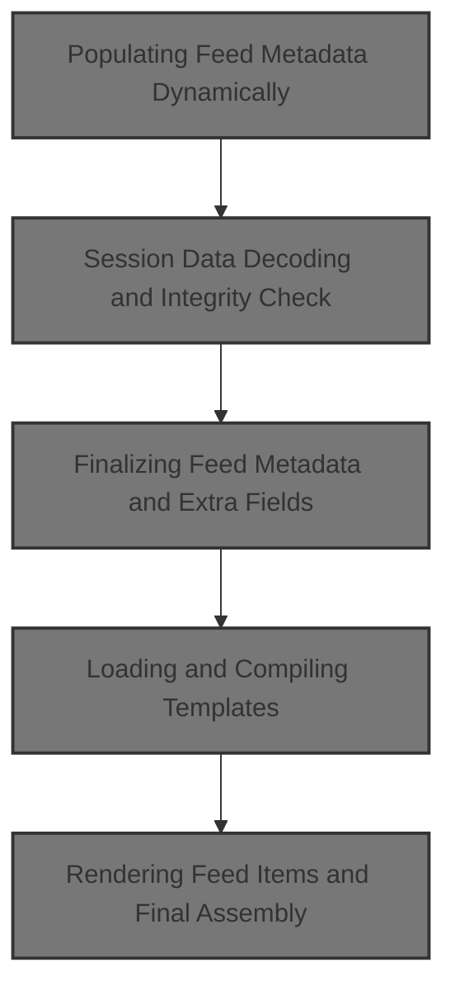
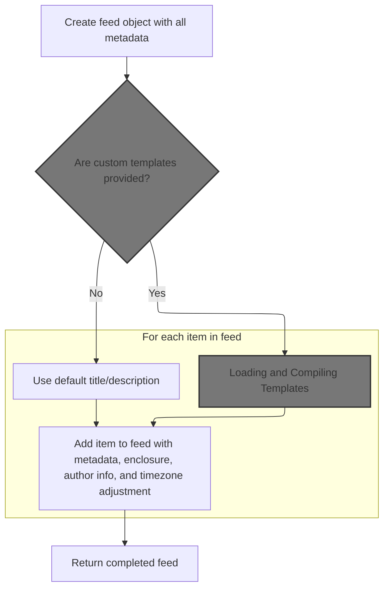
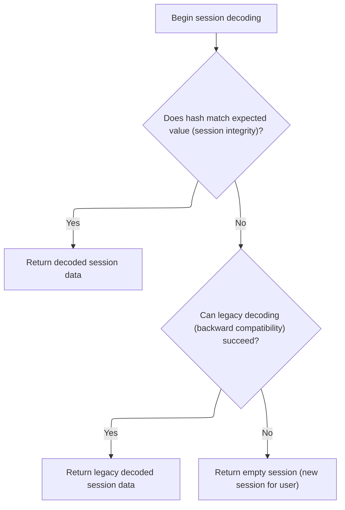
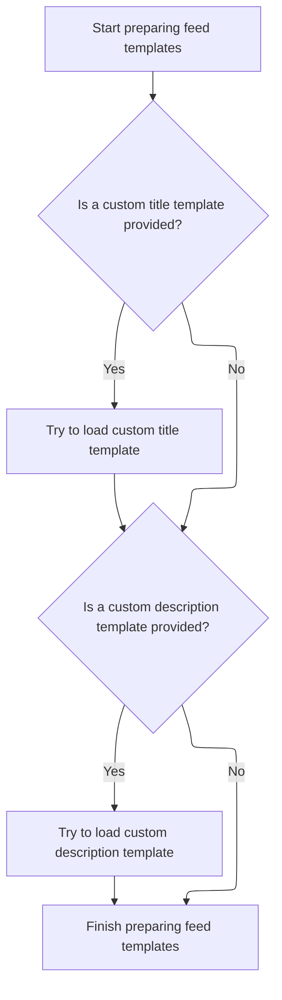
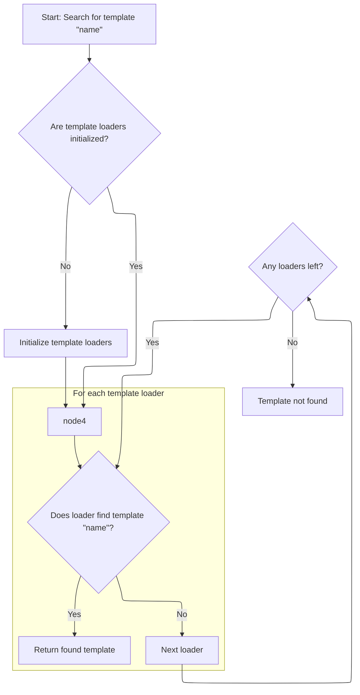

This document describes the process of generating a dynamic feed document with customizable metadata and item rendering. The flow supports flexible definitions for feed attributes, verifies session data for user-specific context, and allows for template-based customization of feed items. The input is an object and a request, and the output is a fully populated feed document containing all relevant metadata and rendered items.



# Where is this flow used?

This flow is used multiple times in the codebase as represented in the following diagram:

```mermaid
graph TD;
      a686a277e354f3ddb935d9e3ded493e5c2f160a84243d52790f0701967915694(django/…/syndication/views.py::feed) --> 7721039dc056688ec2742d360a9c5d87d9f38b1324f816e6bc14054669ade8be(django/…/syndication/views.py::get_feed):::mainFlowStyle

c254e3926b97b0fd7ffd62f8c30d73d7cd61667d4265501fff43775b922e7f7f(django/…/files/images.py::get_image_dimensions) --> a686a277e354f3ddb935d9e3ded493e5c2f160a84243d52790f0701967915694(django/…/syndication/views.py::feed)

2d2c37b8752cf9fa60c654998d82d33f9b8517991f14d10021e13c3ddb097327(django/…/files/images.py::_get_image_dimensions) --> c254e3926b97b0fd7ffd62f8c30d73d7cd61667d4265501fff43775b922e7f7f(django/…/files/images.py::get_image_dimensions)

5ab1c287073afb234d2ce52aa4fe7f967c6b7350c9cadd40c5fa489b1bffeb64(django/…/files/images.py::_get_width) --> 2d2c37b8752cf9fa60c654998d82d33f9b8517991f14d10021e13c3ddb097327(django/…/files/images.py::_get_image_dimensions)

1fcb464545dde030eb338a97ed95b1a7e63eb12a0300fa578b6078012700be28(django/…/files/images.py::_get_height) --> 2d2c37b8752cf9fa60c654998d82d33f9b8517991f14d10021e13c3ddb097327(django/…/files/images.py::_get_image_dimensions)

b5a6f98e0c4f3eee5a991d8cd8419791966ec3f783d392ad7cbdee6e82f4663e(django/…/syndication/views.py::__call__) --> 7721039dc056688ec2742d360a9c5d87d9f38b1324f816e6bc14054669ade8be(django/…/syndication/views.py::get_feed):::mainFlowStyle

15bbbc48e71c5dd8263688897a68bfd751e2032867ff24983e4080b545173a3f(django/…/auth/admin.py::__call__) --> b5a6f98e0c4f3eee5a991d8cd8419791966ec3f783d392ad7cbdee6e82f4663e(django/…/syndication/views.py::__call__)

0acab0b4fb2432b7476739e819039ec05e681edad43bf52959cc01e2623e8bc4(django/…/staticfiles/handlers.py::__call__) --> b5a6f98e0c4f3eee5a991d8cd8419791966ec3f783d392ad7cbdee6e82f4663e(django/…/syndication/views.py::__call__)


classDef mainFlowStyle color:#000000,fill:#7CB9F4
classDef rootsStyle color:#000000,fill:#00FFF4
classDef Style1 color:#000000,fill:#00FFAA
classDef Style2 color:#000000,fill:#FFFF00
classDef Style3 color:#000000,fill:#AA7CB9

%% Swimm:
%% graph TD;
%%       a686a277e354f3ddb935d9e3ded493e5c2f160a84243d52790f0701967915694(<SwmPath>[django/…/syndication/views.py](django/contrib/syndication/views.py)</SwmPath>::feed) --> 7721039dc056688ec2742d360a9c5d87d9f38b1324f816e6bc14054669ade8be(<SwmPath>[django/…/syndication/views.py](django/contrib/syndication/views.py)</SwmPath>::<SwmToken path="django/contrib/syndication/views.py" pos="92:3:3" line-data="    def get_feed(self, obj, request):">`get_feed`</SwmToken>):::mainFlowStyle
%% 
%% c254e3926b97b0fd7ffd62f8c30d73d7cd61667d4265501fff43775b922e7f7f(<SwmPath>[django/…/files/images.py](django/core/files/images.py)</SwmPath>::get_image_dimensions) --> a686a277e354f3ddb935d9e3ded493e5c2f160a84243d52790f0701967915694(<SwmPath>[django/…/syndication/views.py](django/contrib/syndication/views.py)</SwmPath>::feed)
%% 
%% 2d2c37b8752cf9fa60c654998d82d33f9b8517991f14d10021e13c3ddb097327(<SwmPath>[django/…/files/images.py](django/core/files/images.py)</SwmPath>::_get_image_dimensions) --> c254e3926b97b0fd7ffd62f8c30d73d7cd61667d4265501fff43775b922e7f7f(<SwmPath>[django/…/files/images.py](django/core/files/images.py)</SwmPath>::get_image_dimensions)
%% 
%% 5ab1c287073afb234d2ce52aa4fe7f967c6b7350c9cadd40c5fa489b1bffeb64(<SwmPath>[django/…/files/images.py](django/core/files/images.py)</SwmPath>::_get_width) --> 2d2c37b8752cf9fa60c654998d82d33f9b8517991f14d10021e13c3ddb097327(<SwmPath>[django/…/files/images.py](django/core/files/images.py)</SwmPath>::_get_image_dimensions)
%% 
%% 1fcb464545dde030eb338a97ed95b1a7e63eb12a0300fa578b6078012700be28(<SwmPath>[django/…/files/images.py](django/core/files/images.py)</SwmPath>::_get_height) --> 2d2c37b8752cf9fa60c654998d82d33f9b8517991f14d10021e13c3ddb097327(<SwmPath>[django/…/files/images.py](django/core/files/images.py)</SwmPath>::_get_image_dimensions)
%% 
%% b5a6f98e0c4f3eee5a991d8cd8419791966ec3f783d392ad7cbdee6e82f4663e(<SwmPath>[django/…/syndication/views.py](django/contrib/syndication/views.py)</SwmPath>::__call__) --> 7721039dc056688ec2742d360a9c5d87d9f38b1324f816e6bc14054669ade8be(<SwmPath>[django/…/syndication/views.py](django/contrib/syndication/views.py)</SwmPath>::<SwmToken path="django/contrib/syndication/views.py" pos="92:3:3" line-data="    def get_feed(self, obj, request):">`get_feed`</SwmToken>):::mainFlowStyle
%% 
%% 15bbbc48e71c5dd8263688897a68bfd751e2032867ff24983e4080b545173a3f(<SwmPath>[django/…/auth/admin.py](django/contrib/auth/admin.py)</SwmPath>::__call__) --> b5a6f98e0c4f3eee5a991d8cd8419791966ec3f783d392ad7cbdee6e82f4663e(<SwmPath>[django/…/syndication/views.py](django/contrib/syndication/views.py)</SwmPath>::__call__)
%% 
%% 0acab0b4fb2432b7476739e819039ec05e681edad43bf52959cc01e2623e8bc4(<SwmPath>[django/…/staticfiles/handlers.py](django/contrib/staticfiles/handlers.py)</SwmPath>::__call__) --> b5a6f98e0c4f3eee5a991d8cd8419791966ec3f783d392ad7cbdee6e82f4663e(<SwmPath>[django/…/syndication/views.py](django/contrib/syndication/views.py)</SwmPath>::__call__)
%% 
%% 
%% classDef mainFlowStyle color:#000000,fill:#7CB9F4
%% classDef rootsStyle color:#000000,fill:#00FFF4
%% classDef Style1 color:#000000,fill:#00FFAA
%% classDef Style2 color:#000000,fill:#FFFF00
%% classDef Style3 color:#000000,fill:#AA7CB9
```



# Populating Feed Metadata Dynamically



<SwmSnippet path="/django/contrib/syndication/views.py" line="92">

---

In <SwmToken path="django/contrib/syndication/views.py" pos="92:3:3" line-data="    def get_feed(self, obj, request):">`get_feed`</SwmToken>, we kick off by resolving the site and the feed's link, using <SwmToken path="django/contrib/syndication/views.py" pos="99:7:7" line-data="        link = self.__get_dynamic_attr(&#39;link&#39;, obj)">`__get_dynamic_attr`</SwmToken> to support both static and dynamic attribute definitions.

```python
    def get_feed(self, obj, request):
        """
        Returns a feedgenerator.DefaultFeed object, fully populated, for
        this feed. Raises FeedDoesNotExist for invalid parameters.
        """
        current_site = get_current_site(request)

        link = self.__get_dynamic_attr('link', obj)
        link = add_domain(current_site.domain, link, request.is_secure())

        feed = self.feed_type(
            title = self.__get_dynamic_attr('title', obj),
            subtitle = self.__get_dynamic_attr('subtitle', obj),
            link = link,
            description = self.__get_dynamic_attr('description', obj),
```

---

</SwmSnippet>

<SwmSnippet path="/django/contrib/syndication/views.py" line="55">

---

<SwmToken path="django/contrib/syndication/views.py" pos="55:3:3" line-data="    def __get_dynamic_attr(self, attname, obj, default=None):">`__get_dynamic_attr`</SwmToken> fetches an attribute from self, and if it's callable, it inspects the argument count to decide whether to call it with obj or not. This lets feed attributes be either static or dynamically computed per object, supporting flexible feed definitions.

```python
    def __get_dynamic_attr(self, attname, obj, default=None):
        try:
            attr = getattr(self, attname)
        except AttributeError:
            return default
        if callable(attr):
            # Check func_code.co_argcount rather than try/excepting the
            # function and catching the TypeError, because something inside
            # the function may raise the TypeError. This technique is more
            # accurate.
            if hasattr(attr, 'func_code'):
                argcount = attr.func_code.co_argcount
            else:
                argcount = attr.__call__.func_code.co_argcount
            if argcount == 2: # one argument is 'self'
                return attr(obj)
            else:
                return attr()
        return attr
```

---

</SwmSnippet>

<SwmSnippet path="/django/contrib/syndication/views.py" line="107">

---

Back in <SwmToken path="django/contrib/syndication/views.py" pos="92:3:3" line-data="    def get_feed(self, obj, request):">`get_feed`</SwmToken>, after resolving all the main feed attributes with <SwmToken path="django/contrib/syndication/views.py" pos="110:3:3" line-data="                self.__get_dynamic_attr(&#39;feed_url&#39;, obj) or request.path,">`__get_dynamic_attr`</SwmToken>, we move on to handling session-related data like language code. We need to call the session backend next to decode and verify session info before using it in the feed.

```python
            language = settings.LANGUAGE_CODE.decode(),
            feed_url = add_domain(
                current_site.domain,
                self.__get_dynamic_attr('feed_url', obj) or request.path,
                request.is_secure(),
            ),
            author_name = self.__get_dynamic_attr('author_name', obj),
            author_link = self.__get_dynamic_attr('author_link', obj),
            author_email = self.__get_dynamic_attr('author_email', obj),
            categories = self.__get_dynamic_attr('categories', obj),
            feed_copyright = self.__get_dynamic_attr('feed_copyright', obj),
            feed_guid = self.__get_dynamic_attr('feed_guid', obj),
```

---

</SwmSnippet>

## Session Data Decoding and Integrity Check



<SwmSnippet path="/django/contrib/sessions/backends/base.py" line="97">

---

In <SwmToken path="django/contrib/sessions/backends/base.py" pos="97:3:3" line-data="    def decode(self, session_data):">`decode`</SwmToken>, we start by decoding the <SwmToken path="django/contrib/sessions/backends/base.py" pos="97:8:8" line-data="    def decode(self, session_data):">`session_data`</SwmToken> from <SwmToken path="django/contrib/sessions/backends/base.py" pos="98:5:5" line-data="        encoded_data = base64.decodestring(session_data)">`base64`</SwmToken> and splitting it into hash and pickled data using ':'. We then need to verify the hash using <SwmToken path="django/contrib/sessions/backends/base.py" pos="103:5:5" line-data="            if not constant_time_compare(hash, expected_hash):">`constant_time_compare`</SwmToken> to make sure the session hasn't been tampered with before unpickling.

```python
    def decode(self, session_data):
        encoded_data = base64.decodestring(session_data)
        try:
            # could produce ValueError if there is no ':'
            hash, pickled = encoded_data.split(':', 1)
            expected_hash = self._hash(pickled)
```

---

</SwmSnippet>

<SwmSnippet path="/django/contrib/sessions/backends/base.py" line="87">

---

<SwmToken path="django/contrib/sessions/backends/base.py" pos="87:3:3" line-data="    def _hash(self, value):">`_hash`</SwmToken> uses a salted HMAC with a backend-specific salt to securely hash session data for integrity verification.

```python
    def _hash(self, value):
        key_salt = "django.contrib.sessions" + self.__class__.__name__
        return salted_hmac(key_salt, value).hexdigest()
```

---

</SwmSnippet>

<SwmSnippet path="/django/contrib/sessions/backends/base.py" line="103">

---

After verifying the hash in <SwmToken path="django/contrib/syndication/views.py" pos="107:9:9" line-data="            language = settings.LANGUAGE_CODE.decode(),">`decode`</SwmToken>, we unpickle the session data if it's valid. If anything goes wrong, we try the old decoding method for backward compatibility, and if that fails, we just return an empty session dictionary.

```python
            if not constant_time_compare(hash, expected_hash):
                raise SuspiciousOperation("Session data corrupted")
            else:
                return pickle.loads(pickled)
        except Exception:
            # ValueError, SuspiciousOperation, unpickling exceptions
            # Fall back to Django 1.2 method
            # PendingDeprecationWarning <- here to remind us to
            # remove this fallback in Django 1.5
            try:
                return self._decode_old(session_data)
            except Exception:
                # Unpickling can cause a variety of exceptions. If something happens,
                # just return an empty dictionary (an empty session).
                return {}
```

---

</SwmSnippet>

<SwmSnippet path="/django/contrib/sessions/backends/base.py" line="119">

---

<SwmToken path="django/contrib/sessions/backends/base.py" pos="119:3:3" line-data="    def _decode_old(self, session_data):">`_decode_old`</SwmToken> checks integrity with MD5 and <SwmToken path="django/contrib/sessions/backends/base.py" pos="122:15:15" line-data="        if not constant_time_compare(md5_constructor(pickled + settings.SECRET_KEY).hexdigest(),">`SECRET_KEY`</SwmToken>, then unpickles the session data if it's valid.

```python
    def _decode_old(self, session_data):
        encoded_data = base64.decodestring(session_data)
        pickled, tamper_check = encoded_data[:-32], encoded_data[-32:]
        if not constant_time_compare(md5_constructor(pickled + settings.SECRET_KEY).hexdigest(),
                                     tamper_check):
            raise SuspiciousOperation("User tampered with session cookie.")
        return pickle.loads(pickled)
```

---

</SwmSnippet>

## Finalizing Feed Metadata and Extra Fields



<SwmSnippet path="/django/contrib/syndication/views.py" line="119">

---

Back in <SwmToken path="django/contrib/syndication/views.py" pos="92:3:3" line-data="    def get_feed(self, obj, request):">`get_feed`</SwmToken>, after decoding session data, we resolve more dynamic attributes like 'ttl' and any extra kwargs for the feed. This keeps the feed metadata flexible and lets subclasses add custom fields.

```python
            ttl = self.__get_dynamic_attr('ttl', obj),
            **self.feed_extra_kwargs(obj)
        )

```

---

</SwmSnippet>

<SwmSnippet path="/django/contrib/syndication/views.py" line="123">

---

After resolving all feed metadata in <SwmToken path="django/contrib/syndication/views.py" pos="92:3:3" line-data="    def get_feed(self, obj, request):">`get_feed`</SwmToken>, we check if title and description templates are set. If so, we try to load them using <SwmToken path="django/contrib/syndication/views.py" pos="126:5:7" line-data="                title_tmp = loader.get_template(self.title_template)">`loader.get_template`</SwmToken>, letting us customize item rendering with templates.

```python
        title_tmp = None
        if self.title_template is not None:
            try:
                title_tmp = loader.get_template(self.title_template)
            except TemplateDoesNotExist:
                pass

        description_tmp = None
        if self.description_template is not None:
            try:
                description_tmp = loader.get_template(self.description_template)
            except TemplateDoesNotExist:
                pass

```

---

</SwmSnippet>

## Loading and Compiling Templates

<SwmSnippet path="/django/template/loader.py" line="152">

---

In <SwmToken path="django/template/loader.py" pos="152:2:2" line-data="def get_template(template_name):">`get_template`</SwmToken>, we start by finding the template source and its origin using <SwmToken path="django/template/loader.py" pos="157:8:8" line-data="    template, origin = find_template(template_name)">`find_template`</SwmToken>. This gives us the raw template data needed before compiling it for rendering.

```python
def get_template(template_name):
    """
    Returns a compiled Template object for the given template name,
    handling template inheritance recursively.
    """
    template, origin = find_template(template_name)
```

---

</SwmSnippet>

### Resolving Template Loaders and Finding Sources



<SwmSnippet path="/django/template/loader.py" line="120">

---

In <SwmToken path="django/template/loader.py" pos="120:2:2" line-data="def find_template(name, dirs=None):">`find_template`</SwmToken>, we lazily set up the template loaders from settings to avoid circular imports. We then iterate through them to find one that can load the requested template source.

```python
def find_template(name, dirs=None):
    # Calculate template_source_loaders the first time the function is executed
    # because putting this logic in the module-level namespace may cause
    # circular import errors. See Django ticket #1292.
    global template_source_loaders
    if template_source_loaders is None:
        loaders = []
        for loader_name in settings.TEMPLATE_LOADERS:
            loader = find_template_loader(loader_name)
            if loader is not None:
                loaders.append(loader)
```

---

</SwmSnippet>

<SwmSnippet path="/django/template/loader.py" line="87">

---

<SwmToken path="django/template/loader.py" pos="87:2:2" line-data="def find_template_loader(loader):">`find_template_loader`</SwmToken> handles both <SwmToken path="django/contrib/syndication/views.py" pos="210:15:17" line-data="    # Feeds can be updated to be class-based, but still be deployed">`class-based`</SwmToken> and <SwmToken path="django/template/loader.py" pos="108:31:33" line-data="                raise ImproperlyConfigured(&quot;Error importing template source loader %s - can&#39;t pass arguments to function-based loader.&quot; % loader)">`function-based`</SwmToken> loaders, importing them dynamically if given as strings. It checks if they're usable and instantiates them with arguments if needed, supporting flexible template loading setups.

```python
def find_template_loader(loader):
    if isinstance(loader, (tuple, list)):
        loader, args = loader[0], loader[1:]
    else:
        args = []
    if isinstance(loader, basestring):
        module, attr = loader.rsplit('.', 1)
        try:
            mod = import_module(module)
        except ImportError, e:
            raise ImproperlyConfigured('Error importing template source loader %s: "%s"' % (loader, e))
        try:
            TemplateLoader = getattr(mod, attr)
        except AttributeError, e:
            raise ImproperlyConfigured('Error importing template source loader %s: "%s"' % (loader, e))

        if hasattr(TemplateLoader, 'load_template_source'):
            func = TemplateLoader(*args)
        else:
            # Try loading module the old way - string is full path to callable
            if args:
                raise ImproperlyConfigured("Error importing template source loader %s - can't pass arguments to function-based loader." % loader)
            func = TemplateLoader

        if not func.is_usable:
            import warnings
            warnings.warn("Your TEMPLATE_LOADERS setting includes %r, but your Python installation doesn't support that type of template loading. Consider removing that line from TEMPLATE_LOADERS." % loader)
            return None
        else:
            return func
    else:
        raise ImproperlyConfigured('Loader does not define a "load_template" callable template source loader')
```

---

</SwmSnippet>

<SwmSnippet path="/django/template/loader.py" line="131">

---

After setting up the loaders in <SwmToken path="django/template/loader.py" pos="120:2:2" line-data="def find_template(name, dirs=None):">`find_template`</SwmToken>, we loop through each loader to try loading the template. If none succeed, we raise <SwmToken path="django/template/loader.py" pos="136:3:3" line-data="        except TemplateDoesNotExist:">`TemplateDoesNotExist`</SwmToken>, making sure missing templates are handled cleanly.

```python
        template_source_loaders = tuple(loaders)
    for loader in template_source_loaders:
        try:
            source, display_name = loader(name, dirs)
            return (source, make_origin(display_name, loader, name, dirs))
        except TemplateDoesNotExist:
            pass
```

---

</SwmSnippet>

<SwmSnippet path="/django/template/loader.py" line="138">

---

If a loader finds the template, we get back the source and origin metadata. If none do, we raise <SwmToken path="django/template/loader.py" pos="138:3:3" line-data="    raise TemplateDoesNotExist(name)">`TemplateDoesNotExist`</SwmToken> so the caller knows the template can't be loaded.

```python
    raise TemplateDoesNotExist(name)
```

---

</SwmSnippet>

### Compiling and Returning the Template Object

<SwmSnippet path="/django/template/loader.py" line="158">

---

After finding the template in <SwmToken path="django/contrib/syndication/views.py" pos="126:7:7" line-data="                title_tmp = loader.get_template(self.title_template)">`get_template`</SwmToken>, we check if it's compiled (has 'render'). If not, we compile it from the source and origin, then return the ready-to-render template object.

```python
    if not hasattr(template, 'render'):
        # template needs to be compiled
        template = get_template_from_string(template, origin, template_name)
    return template
```

---

</SwmSnippet>

## Rendering Feed Items and Final Assembly

```mermaid
%%{init: {"flowchart": {"defaultRenderer": "elk"}} }%%
flowchart TD
    node1["Start feed generation"]
    click node1 openCode "django/contrib/syndication/views.py:137:185"
    subgraph loop1["For each item in the feed"]
        node2{"Title template provided?"}
        click node2 openCode "django/contrib/syndication/views.py:138:141"
        node2 -->|"Yes"| node3["Set title using template"]
        click node3 openCode "django/contrib/syndication/views.py:139:139"
        node2 -->|"No"| node4["Set title from attribute"]
        click node4 openCode "django/contrib/syndication/views.py:141:141"
        node3 --> node5
        node4 --> node5
        node5{"Description template provided?"}
        click node5 openCode "django/contrib/syndication/views.py:142:145"
        node5 -->|"Yes"| node6["Set description using template"]
        click node6 openCode "django/contrib/syndication/views.py:143:143"
        node5 -->|"No"| node7["Set description from attribute"]
        click node7 openCode "django/contrib/syndication/views.py:145:145"
        node6 --> node8["Set link (with domain/security)"]
        node7 --> node8
        click node8 openCode "django/contrib/syndication/views.py:146:150"
        node8 --> node9{"Enclosure info present?"}
        click node9 openCode "django/contrib/syndication/views.py:152:153"
        node9 -->|"Yes"| node10["Add enclosure to item"]
        click node10 openCode "django/contrib/syndication/views.py:154:158"
        node9 -->|"No"| node11["No enclosure"]
        click node11 openCode "django/contrib/syndication/views.py:151:151"
        node10 --> node12
        node11 --> node12
        node12{"Author info present?"}
        click node12 openCode "django/contrib/syndication/views.py:159:163"
        node12 -->|"Yes"| node13["Add author info"]
        click node13 openCode "django/contrib/syndication/views.py:161:162"
        node12 -->|"No"| node14["No author info"]
        click node14 openCode "django/contrib/syndication/views.py:164:164"
        node13 --> node15
        node14 --> node15
        node15{"Pubdate needs timezone?"}
        click node15 openCode "django/contrib/syndication/views.py:167:169"
        node15 -->|"Yes"| node16["Adjust pubdate timezone"]
        click node16 openCode "django/contrib/syndication/views.py:168:169"
        node15 -->|"No"| node17["Use pubdate as is"]
        click node17 openCode "django/contrib/syndication/views.py:166:166"
        node16 --> node18["Add item to feed"]
        node17 --> node18
        click node18 openCode "django/contrib/syndication/views.py:171:184"
        node18 --> node2
    end
    loop1 --> node19["Return feed"]
    click node19 openCode "django/contrib/syndication/views.py:185:185"

classDef HeadingStyle fill:#777777,stroke:#333,stroke-width:2px;

%% Swimm:
%% %%{init: {"flowchart": {"defaultRenderer": "elk"}} }%%
%% flowchart TD
%%     node1["Start feed generation"]
%%     click node1 openCode "<SwmPath>[django/…/syndication/views.py](django/contrib/syndication/views.py)</SwmPath>:137:185"
%%     subgraph loop1["For each item in the feed"]
%%         node2{"Title template provided?"}
%%         click node2 openCode "<SwmPath>[django/…/syndication/views.py](django/contrib/syndication/views.py)</SwmPath>:138:141"
%%         node2 -->|"Yes"| node3["Set title using template"]
%%         click node3 openCode "<SwmPath>[django/…/syndication/views.py](django/contrib/syndication/views.py)</SwmPath>:139:139"
%%         node2 -->|"No"| node4["Set title from attribute"]
%%         click node4 openCode "<SwmPath>[django/…/syndication/views.py](django/contrib/syndication/views.py)</SwmPath>:141:141"
%%         node3 --> node5
%%         node4 --> node5
%%         node5{"Description template provided?"}
%%         click node5 openCode "<SwmPath>[django/…/syndication/views.py](django/contrib/syndication/views.py)</SwmPath>:142:145"
%%         node5 -->|"Yes"| node6["Set description using template"]
%%         click node6 openCode "<SwmPath>[django/…/syndication/views.py](django/contrib/syndication/views.py)</SwmPath>:143:143"
%%         node5 -->|"No"| node7["Set description from attribute"]
%%         click node7 openCode "<SwmPath>[django/…/syndication/views.py](django/contrib/syndication/views.py)</SwmPath>:145:145"
%%         node6 --> node8["Set link (with domain/security)"]
%%         node7 --> node8
%%         click node8 openCode "<SwmPath>[django/…/syndication/views.py](django/contrib/syndication/views.py)</SwmPath>:146:150"
%%         node8 --> node9{"Enclosure info present?"}
%%         click node9 openCode "<SwmPath>[django/…/syndication/views.py](django/contrib/syndication/views.py)</SwmPath>:152:153"
%%         node9 -->|"Yes"| node10["Add enclosure to item"]
%%         click node10 openCode "<SwmPath>[django/…/syndication/views.py](django/contrib/syndication/views.py)</SwmPath>:154:158"
%%         node9 -->|"No"| node11["No enclosure"]
%%         click node11 openCode "<SwmPath>[django/…/syndication/views.py](django/contrib/syndication/views.py)</SwmPath>:151:151"
%%         node10 --> node12
%%         node11 --> node12
%%         node12{"Author info present?"}
%%         click node12 openCode "<SwmPath>[django/…/syndication/views.py](django/contrib/syndication/views.py)</SwmPath>:159:163"
%%         node12 -->|"Yes"| node13["Add author info"]
%%         click node13 openCode "<SwmPath>[django/…/syndication/views.py](django/contrib/syndication/views.py)</SwmPath>:161:162"
%%         node12 -->|"No"| node14["No author info"]
%%         click node14 openCode "<SwmPath>[django/…/syndication/views.py](django/contrib/syndication/views.py)</SwmPath>:164:164"
%%         node13 --> node15
%%         node14 --> node15
%%         node15{"Pubdate needs timezone?"}
%%         click node15 openCode "<SwmPath>[django/…/syndication/views.py](django/contrib/syndication/views.py)</SwmPath>:167:169"
%%         node15 -->|"Yes"| node16["Adjust pubdate timezone"]
%%         click node16 openCode "<SwmPath>[django/…/syndication/views.py](django/contrib/syndication/views.py)</SwmPath>:168:169"
%%         node15 -->|"No"| node17["Use pubdate as is"]
%%         click node17 openCode "<SwmPath>[django/…/syndication/views.py](django/contrib/syndication/views.py)</SwmPath>:166:166"
%%         node16 --> node18["Add item to feed"]
%%         node17 --> node18
%%         click node18 openCode "<SwmPath>[django/…/syndication/views.py](django/contrib/syndication/views.py)</SwmPath>:171:184"
%%         node18 --> node2
%%     end
%%     loop1 --> node19["Return feed"]
%%     click node19 openCode "<SwmPath>[django/…/syndication/views.py](django/contrib/syndication/views.py)</SwmPath>:185:185"
%% 
%% classDef HeadingStyle fill:#777777,stroke:#333,stroke-width:2px;
```



<SwmSnippet path="/django/contrib/syndication/views.py" line="137">

---

After loading templates in <SwmToken path="django/contrib/syndication/views.py" pos="92:3:3" line-data="    def get_feed(self, obj, request):">`get_feed`</SwmToken>, we loop through each item, rendering title and description with templates if available, otherwise using <SwmToken path="django/contrib/syndication/views.py" pos="137:9:9" line-data="        for item in self.__get_dynamic_attr(&#39;items&#39;, obj):">`__get_dynamic_attr`</SwmToken>. We also resolve all other item fields dynamically, then add each item to the feed.

```python
        for item in self.__get_dynamic_attr('items', obj):
            if title_tmp is not None:
                title = title_tmp.render(RequestContext(request, {'obj': item, 'site': current_site}))
            else:
                title = self.__get_dynamic_attr('item_title', item)
            if description_tmp is not None:
                description = description_tmp.render(RequestContext(request, {'obj': item, 'site': current_site}))
            else:
                description = self.__get_dynamic_attr('item_description', item)
            link = add_domain(
                current_site.domain,
                self.__get_dynamic_attr('item_link', item),
                request.is_secure(),
            )
            enc = None
            enc_url = self.__get_dynamic_attr('item_enclosure_url', item)
            if enc_url:
                enc = feedgenerator.Enclosure(
                    url = smart_unicode(enc_url),
                    length = smart_unicode(self.__get_dynamic_attr('item_enclosure_length', item)),
                    mime_type = smart_unicode(self.__get_dynamic_attr('item_enclosure_mime_type', item))
                )
            author_name = self.__get_dynamic_attr('item_author_name', item)
            if author_name is not None:
                author_email = self.__get_dynamic_attr('item_author_email', item)
                author_link = self.__get_dynamic_attr('item_author_link', item)
            else:
                author_email = author_link = None

            pubdate = self.__get_dynamic_attr('item_pubdate', item)
            if pubdate and not pubdate.tzinfo:
                ltz = tzinfo.LocalTimezone(pubdate)
                pubdate = pubdate.replace(tzinfo=ltz)

            feed.add_item(
                title = title,
                link = link,
                description = description,
                unique_id = self.__get_dynamic_attr('item_guid', item, link),
                enclosure = enc,
                pubdate = pubdate,
                author_name = author_name,
                author_email = author_email,
                author_link = author_link,
                categories = self.__get_dynamic_attr('item_categories', item),
                item_copyright = self.__get_dynamic_attr('item_copyright', item),
                **self.item_extra_kwargs(item)
            )
        return feed
```

---

</SwmSnippet>

&nbsp;

*This is an auto-generated document by Swimm 🌊 and has not yet been verified by a human*

<SwmMeta version="3.0.0" repo-id="Z2l0aHViJTNBJTNBUHl0aG9uRGphbmdvJTNBJTNBR29waW5hdGhyZWRkeTY2" repo-name="PythonDjango"><sup>Powered by [Swimm](https://app.swimm.io/)</sup></SwmMeta>
