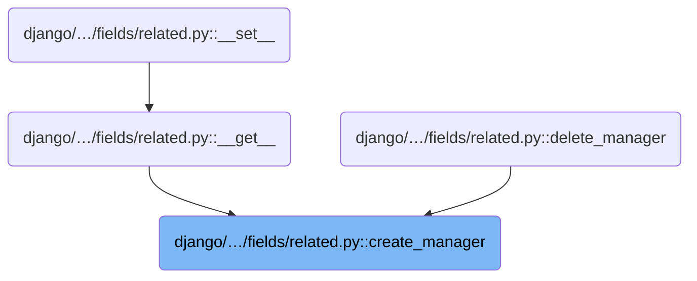
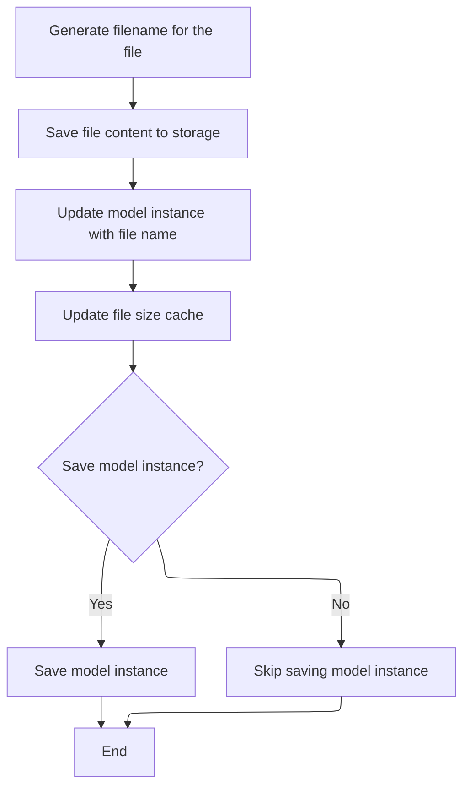

This document explains the flow of managing related objects linked to a model instance. It describes how related objects are linked, added, removed, and how file content is saved and updated. The flow ends by finalizing the manager setup to ensure correct database usage.

# Where is this flow used?

This flow is used multiple times in the codebase as represented in the following diagram:



# Setting up related object managers

This section defines a <SwmToken path="django/db/models/fields/related.py" pos="420:3:3" line-data="        class RelatedManager(superclass):">`RelatedManager`</SwmToken> to manage related objects in Django models, ensuring they are properly linked to the instance and use the correct database for queries and modifications.

| Category        | Rule Name                      | Description                                                                                                                          |
| --------------- | ------------------------------ | ------------------------------------------------------------------------------------------------------------------------------------ |
| Data validation | Type validation on add         | Only objects of the expected related model type can be added to the related manager to prevent data corruption.                      |
| Data validation | Conditional remove and clear   | Remove and clear operations are only allowed if the related field supports null values, ensuring safe detachment of related objects. |
| Business logic  | Link related objects           | Related objects must be linked to the parent instance when they are added, created, or retrieved to maintain data integrity.         |
| Business logic  | Persist changes on link/unlink | Related objects must be saved after linking or unlinking to persist changes in the database.                                         |

<SwmSnippet path="/django/db/models/fields/related.py" line="413">

---

Here we define <SwmToken path="django/db/models/fields/related.py" pos="420:3:3" line-data="        class RelatedManager(superclass):">`RelatedManager`</SwmToken> inside <SwmToken path="django/db/models/fields/related.py" pos="413:3:3" line-data="    def create_manager(self, instance, superclass):">`create_manager`</SwmToken>. This manager customizes how related objects are queried and added, making sure they are linked to the instance and use the right database. It starts the flow by setting up these methods.

```python
    def create_manager(self, instance, superclass):
        """
        Creates the managers used by other methods (__get__() and delete()).
        """
        rel_field = self.related.field
        rel_model = self.related.model

        class RelatedManager(superclass):
            def get_query_set(self):
                db = self._db or router.db_for_read(rel_model, instance=instance)
                return superclass.get_query_set(self).using(db).filter(**(self.core_filters))

            def add(self, *objs):
                for obj in objs:
                    if not isinstance(obj, self.model):
                        raise TypeError("'%s' instance expected" % self.model._meta.object_name)
                    setattr(obj, rel_field.name, instance)
                    obj.save()
```

---

</SwmSnippet>

<SwmSnippet path="/django/db/models/fields/related.py" line="430">

---

Next we add methods to add, create, and <SwmToken path="django/db/models/fields/related.py" pos="439:3:3" line-data="            def get_or_create(self, **kwargs):">`get_or_create`</SwmToken> related objects, automatically linking them to the instance. We also conditionally add remove and clear if the relation allows nulls, handling detachment safely.

```python
                    obj.save()
            add.alters_data = True

            def create(self, **kwargs):
                kwargs.update({rel_field.name: instance})
                db = router.db_for_write(rel_model, instance=instance)
                return super(RelatedManager, self.db_manager(db)).create(**kwargs)
            create.alters_data = True

            def get_or_create(self, **kwargs):
                # Update kwargs with the related object that this
                # ForeignRelatedObjectsDescriptor knows about.
                kwargs.update({rel_field.name: instance})
                db = router.db_for_write(rel_model, instance=instance)
                return super(RelatedManager, self.db_manager(db)).get_or_create(**kwargs)
            get_or_create.alters_data = True

            # remove() and clear() are only provided if the ForeignKey can have a value of null.
            if rel_field.null:
                def remove(self, *objs):
                    val = getattr(instance, rel_field.rel.get_related_field().attname)
                    for obj in objs:
                        # Is obj actually part of this descriptor set?
                        if getattr(obj, rel_field.attname) == val:
                            setattr(obj, rel_field.name, None)
                            obj.save()
                        else:
                            raise rel_field.rel.to.DoesNotExist("%r is not related to %r." % (obj, instance))
```

---

</SwmSnippet>

<SwmSnippet path="/django/db/models/fields/related.py" line="457">

---

Here we implement clear to detach all related objects by setting their related field to None and saving them. This prepares for file operations that follow.

```python
                            raise rel_field.rel.to.DoesNotExist("%r is not related to %r." % (obj, instance))
                remove.alters_data = True

                def clear(self):
                    for obj in self.all():
                        setattr(obj, rel_field.name, None)
                        obj.save()
```

---

</SwmSnippet>

## Saving file content and updating instance



This section describes the process of saving file content to storage and updating the associated model instance with the file's metadata.

| Category       | Rule Name                     | Description                                                                                                                  |
| -------------- | ----------------------------- | ---------------------------------------------------------------------------------------------------------------------------- |
| Business logic | Instance update with filename | After saving the file, the model instance must be updated with the new filename to reflect the stored file.                  |
| Business logic | File size caching             | The system must update the cached file size on the instance after saving the file content.                                   |
| Business logic | Conditional instance saving   | The model instance should be saved to the database only if the save flag is set to true after updating the file information. |

<SwmSnippet path="/django/db/models/fields/files.py" line="90">

---

In save we generate the filename and call <SwmToken path="django/db/models/fields/files.py" pos="92:9:11" line-data="        self.name = self.storage.save(name, content)">`storage.save`</SwmToken> to write the content. The returned filename is stored for the instance.

```python
    def save(self, name, content, save=True):
        name = self.field.generate_filename(self.instance, name)
        self.name = self.storage.save(name, content)
```

---

</SwmSnippet>

<SwmSnippet path="/django/core/files/storage.py" line="39">

---

In <SwmToken path="django/db/models/fields/files.py" pos="92:9:11" line-data="        self.name = self.storage.save(name, content)">`storage.save`</SwmToken> we handle None names by using content's name, get an available filename to avoid conflicts, save the content, then normalize path separators before returning.

```python
    def save(self, name, content):
        """
        Saves new content to the file specified by name. The content should be a
        proper File object, ready to be read from the beginning.
        """
        # Get the proper name for the file, as it will actually be saved.
        if name is None:
            name = content.name

        name = self.get_available_name(name)
        name = self._save(name, content)

        # Store filenames with forward slashes, even on Windows
        return force_unicode(name.replace('\\', '/'))
```

---

</SwmSnippet>

<SwmSnippet path="/django/db/models/fields/files.py" line="93">

---

After <SwmToken path="django/db/models/fields/files.py" pos="92:9:11" line-data="        self.name = self.storage.save(name, content)">`storage.save`</SwmToken> returns, we update the instance's filename and size, mark it committed, and save the instance if needed in save.

```python
        setattr(self.instance, self.field.name, self.name)

        # Update the filesize cache
        self._size = content.size
        self._committed = True

        # Save the object because it has changed, unless save is False
        if save:
            self.instance.save()
```

---

</SwmSnippet>

## Finalizing related manager setup

<SwmSnippet path="/django/db/models/fields/related.py" line="464">

---

After returning from save, we configure the <SwmToken path="django/db/models/fields/related.py" pos="466:5:5" line-data="        manager = RelatedManager()">`RelatedManager`</SwmToken> with filters tied to the instance and assign the related model before returning it in <SwmToken path="django/db/models/fields/related.py" pos="413:3:3" line-data="    def create_manager(self, instance, superclass):">`create_manager`</SwmToken>.

```python
                clear.alters_data = True

        manager = RelatedManager()
        attname = rel_field.rel.get_related_field().name
        manager.core_filters = {'%s__%s' % (rel_field.name, attname):
                getattr(instance, attname)}
        manager.model = self.related.model

        return manager
```

---

</SwmSnippet>

&nbsp;

*This is an auto-generated document by Swimm 🌊 and has not yet been verified by a human*

<SwmMeta version="3.0.0" repo-id="Z2l0aHViJTNBJTNBUHl0aG9uRGphbmdvJTNBJTNBR29waW5hdGhyZWRkeTY2" repo-name="PythonDjango"><sup>Powered by [Swimm](https://app.swimm.io/)</sup></SwmMeta>
