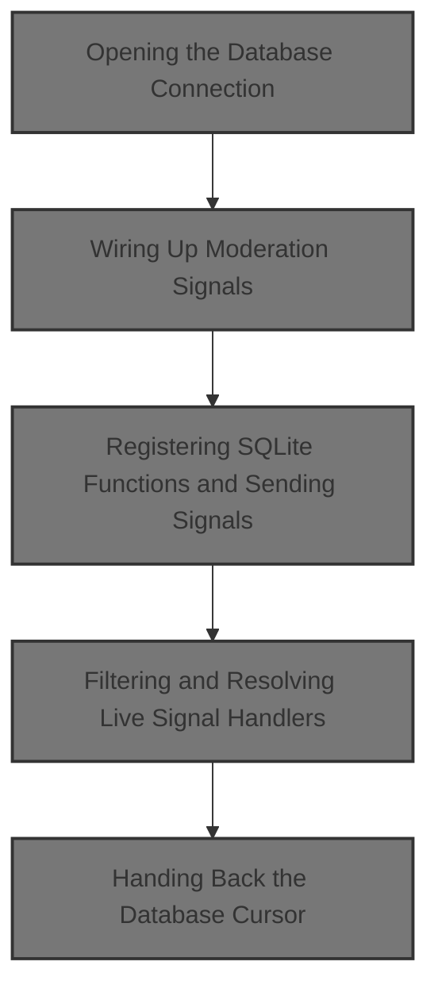
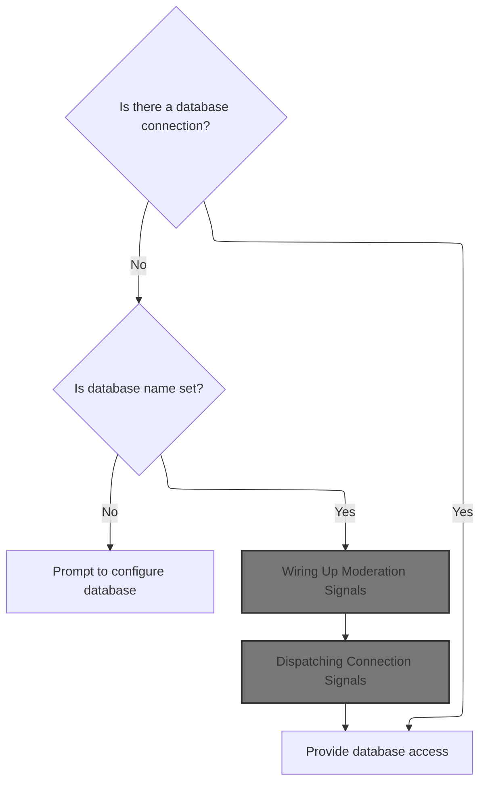
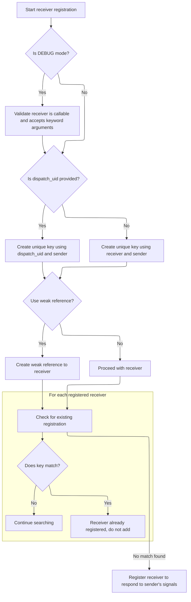
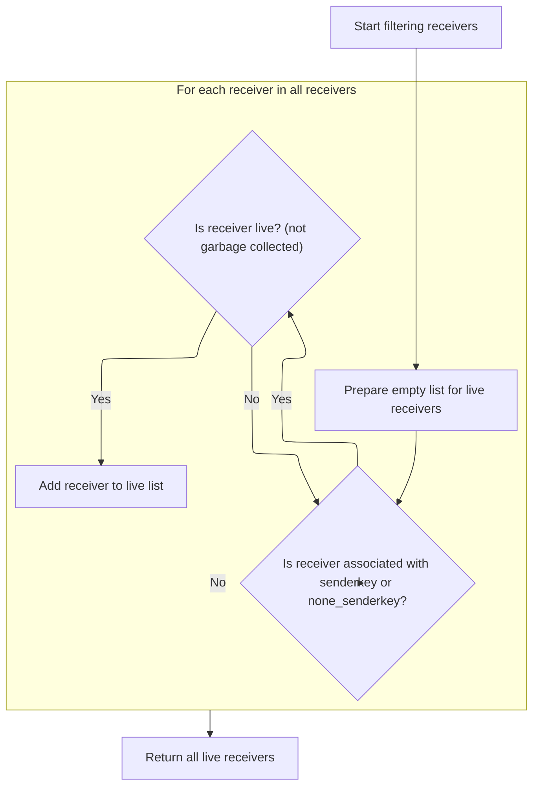

This document describes the process of preparing a database cursor for use in application operations. The flow ensures that the database connection is established, moderation signals are wired up for comment handling, and signal receivers are registered for key events. Custom SQLite functions are registered to support advanced ORM features, and connection signals are dispatched to notify relevant handlers. The final output is a database cursor, ready for queries and further operations.



# Opening the Database Connection



<SwmSnippet path="/django/db/backends/sqlite3/base.py" line="196">

---

In `_cursor`, we kick things off by checking if there's already a DB connection. If not, we pull the DB settings, make sure the DB name is set, and then create the connection with any extra options from settings. This setup is needed before we can register custom SQLite functions and send connection signals, which comes next in the flow.

```python
    def _cursor(self):
        if self.connection is None:
            settings_dict = self.settings_dict
            if not settings_dict['NAME']:
                from django.core.exceptions import ImproperlyConfigured
                raise ImproperlyConfigured("Please fill out the database NAME in the settings module before using the database.")
            kwargs = {
                'database': settings_dict['NAME'],
                'detect_types': Database.PARSE_DECLTYPES | Database.PARSE_COLNAMES,
            }
            kwargs.update(settings_dict['OPTIONS'])
            self.connection = Database.connect(**kwargs)
```

---

</SwmSnippet>

## Wiring Up Moderation Signals

<SwmSnippet path="/django/contrib/comments/moderation.py" line="282">

---

In `connect`, we set up the moderation hooks by connecting the pre-save moderation method to the comment_will_be_posted signal. We need to resolve which comment model to use, so we call into comments.get_model() next to figure out the right sender for the signal.

```python
    def connect(self):
        """
        Hook up the moderation methods to pre- and post-save signals
        from the comment models.

        """
        signals.comment_will_be_posted.connect(self.pre_save_moderation, sender=comments.get_model())
```

---

</SwmSnippet>

<SwmSnippet path="/django/contrib/comments/__init__.py" line="36">

---

`get_model` figures out which comment model class to use by checking if a custom comment app is configured and if it provides a get_model method. If so, it uses that; otherwise, it sticks with the default Comment model. This lets Django support pluggable comment apps.

```python
def get_model():
    """
    Returns the comment model class.
    """
    if get_comment_app_name() != DEFAULT_COMMENTS_APP and hasattr(get_comment_app(), "get_model"):
        return get_comment_app().get_model()
    else:
        return Comment
```

---

</SwmSnippet>

<SwmSnippet path="/django/contrib/comments/moderation.py" line="288">

---

Back in `connect`, we use the resolved comment model to connect the moderation method to the signal, so the dispatcher can handle moderation events for the right model.

```python
        signals.comment_will_be_posted.connect(self.pre_save_moderation, sender=comments.get_model())
```

---

</SwmSnippet>

### Registering Signal Receivers



<SwmSnippet path="/django/dispatch/dispatcher.py" line="36">

---

In `connect`, we validate the receiver, then build a lookup key using dispatch_uid or the ids of the receiver and sender. This key is used to manage unique signal connections. Next, we need to handle weak references for the receiver, so we call into saferef if needed.

```python
    def connect(self, receiver, sender=None, weak=True, dispatch_uid=None):
        """
        Connect receiver to sender for signal.
    
        Arguments:
        
            receiver
                A function or an instance method which is to receive signals.
                Receivers must be hashable objects.

                If weak is True, then receiver must be weak-referencable (more
                precisely saferef.safeRef() must be able to create a reference
                to the receiver).
        
                Receivers must be able to accept keyword arguments.

                If receivers have a dispatch_uid attribute, the receiver will
                not be added if another receiver already exists with that
                dispatch_uid.

            sender
                The sender to which the receiver should respond. Must either be
                of type Signal, or None to receive events from any sender.

            weak
                Whether to use weak references to the receiver. By default, the
                module will attempt to use weak references to the receiver
                objects. If this parameter is false, then strong references will
                be used.
        
            dispatch_uid
                An identifier used to uniquely identify a particular instance of
                a receiver. This will usually be a string, though it may be
                anything hashable.
        """
        from django.conf import settings
        
        # If DEBUG is on, check that we got a good receiver
        if settings.DEBUG:
            import inspect
            assert callable(receiver), "Signal receivers must be callable."
            
            # Check for **kwargs
            # Not all callables are inspectable with getargspec, so we'll
            # try a couple different ways but in the end fall back on assuming
            # it is -- we don't want to prevent registration of valid but weird
            # callables.
            try:
                argspec = inspect.getargspec(receiver)
            except TypeError:
                try:
                    argspec = inspect.getargspec(receiver.__call__)
                except (TypeError, AttributeError):
                    argspec = None
            if argspec:
                assert argspec[2] is not None, \
                    "Signal receivers must accept keyword arguments (**kwargs)."
        
        if dispatch_uid:
            lookup_key = (dispatch_uid, _make_id(sender))
        else:
            lookup_key = (_make_id(receiver), _make_id(sender))

```

---

</SwmSnippet>

<SwmSnippet path="/django/dispatch/dispatcher.py" line="8">

---

`_make_id` checks if the target is a bound method (Python 2 style) and, if so, returns a tuple of the instance and function ids. Otherwise, it just returns the object's id. This helps uniquely identify receivers for signal connections.

```python
def _make_id(target):
    if hasattr(target, 'im_func'):
        return (id(target.im_self), id(target.im_func))
    return id(target)
```

---

</SwmSnippet>

<SwmSnippet path="/django/dispatch/dispatcher.py" line="99">

---

Back in `connect`, if weak referencing is enabled, we wrap the receiver with saferef.safeRef. This lets the signal system avoid holding strong references to receivers, so they can be garbage collected if needed. Next, we call into saferef to handle this wrapping.

```python
        if weak:
            receiver = saferef.safeRef(receiver, onDelete=self._remove_receiver)

```

---

</SwmSnippet>

<SwmSnippet path="/django/dispatch/saferef.py" line="10">

---

`safeRef` checks if the target is a bound method and, if so, uses a custom BoundMethodWeakref to safely weakly reference it. For everything else, it falls back to a normal weakref, optionally with an onDelete callback. This avoids issues with standard weakrefs and bound methods.

```python
def safeRef(target, onDelete = None):
    """Return a *safe* weak reference to a callable target

    target -- the object to be weakly referenced, if it's a
        bound method reference, will create a BoundMethodWeakref,
        otherwise creates a simple weakref.
    onDelete -- if provided, will have a hard reference stored
        to the callable to be called after the safe reference
        goes out of scope with the reference object, (either a
        weakref or a BoundMethodWeakref) as argument.
    """
    if hasattr(target, 'im_self'):
        if target.im_self is not None:
            # Turn a bound method into a BoundMethodWeakref instance.
            # Keep track of these instances for lookup by disconnect().
            assert hasattr(target, 'im_func'), """safeRef target %r has im_self, but no im_func, don't know how to create reference"""%( target,)
            reference = get_bound_method_weakref(
                target=target,
                onDelete=onDelete
            )
            return reference
    if callable(onDelete):
        return weakref.ref(target, onDelete)
    else:
        return weakref.ref( target )
```

---

</SwmSnippet>

<SwmSnippet path="/django/dispatch/dispatcher.py" line="102">

---

Back in `connect`, after wrapping the receiver with saferef, we check for duplicates and append the (lookup_key, receiver) pair to self.receivers if it's not already there. This keeps the signal system from registering the same receiver twice.

```python
        self.lock.acquire()
        try:
            for r_key, _ in self.receivers:
                if r_key == lookup_key:
                    break
            else:
                self.receivers.append((lookup_key, receiver))
```

---

</SwmSnippet>

<SwmSnippet path="/django/dispatch/dispatcher.py" line="108">

---

After adding the receiver, `connect` just releases the lock and exits. There's no return value—registration is silent unless something goes wrong.

```python
                self.receivers.append((lookup_key, receiver))
        finally:
            self.lock.release()
```

---

</SwmSnippet>

### Hooking Up Post-Save Moderation

<SwmSnippet path="/django/contrib/comments/moderation.py" line="289">

---

Back in `connect` ([moderation.py](http://moderation.py)), after wiring up pre-save moderation, we do the same for post-save moderation. We need to resolve the comment model again to make sure the signal is connected to the right sender, so we call comments.get_model() once more.

```python
        signals.comment_was_posted.connect(self.post_save_moderation, sender=comments.get_model())
```

---

</SwmSnippet>

<SwmSnippet path="/django/contrib/comments/moderation.py" line="289">

---

After resolving the comment model again, we connect the post-save moderation method to its signal using dispatcher.connect. This step is just like the pre-save hookup, making sure both moderation hooks are active.

```python
        signals.comment_was_posted.connect(self.post_save_moderation, sender=comments.get_model())
```

---

</SwmSnippet>

## Registering SQLite Functions and Sending Signals

<SwmSnippet path="/django/db/backends/sqlite3/base.py" line="208">

---

Back in `_cursor`, after setting up the connection, we register Django-specific SQLite functions to enable ORM features like date extraction and regex matching. Then we send a signal to notify that the connection is ready, which is handled by the dispatcher next.

```python
            # Register extract, date_trunc, and regexp functions.
            self.connection.create_function("django_extract", 2, _sqlite_extract)
            self.connection.create_function("django_date_trunc", 2, _sqlite_date_trunc)
            self.connection.create_function("regexp", 2, _sqlite_regexp)
            self.connection.create_function("django_format_dtdelta", 5, _sqlite_format_dtdelta)
            connection_created.send(sender=self.__class__, connection=self)
```

---

</SwmSnippet>

## Dispatching Connection Signals

<SwmSnippet path="/django/dispatch/dispatcher.py" line="149">

---

In `send`, we start dispatching the signal by looking up all receivers registered for the sender. If there are any, we loop through them and call each one. Next, we need to resolve the actual live receivers for this sender.

```python
    def send(self, sender, **named):
        """
        Send signal from sender to all connected receivers.

        If any receiver raises an error, the error propagates back through send,
        terminating the dispatch loop, so it is quite possible to not have all
        receivers called if a raises an error.

        Arguments:
        
            sender
                The sender of the signal Either a specific object or None.
    
            named
                Named arguments which will be passed to receivers.

        Returns a list of tuple pairs [(receiver, response), ... ].
        """
        responses = []
        if not self.receivers:
            return responses

        for receiver in self._live_receivers(_make_id(sender)):
```

---

</SwmSnippet>

<SwmSnippet path="/django/dispatch/dispatcher.py" line="171">

---

Back in `send`, we call \_live_receivers to get only the receivers that are still alive for this sender. This step is needed to avoid calling dead or garbage-collected handlers.

```python
        for receiver in self._live_receivers(_make_id(sender)):
```

---

</SwmSnippet>

### Filtering and Resolving Live Signal Handlers



<SwmSnippet path="/django/dispatch/dispatcher.py" line="214">

---

In `_live_receivers`, we build a list of receivers that match the sender key or are registered for any sender. We skip dead weak references, so only live handlers are returned. Next, we need to actually call these receivers during signal dispatch.

```python
    def _live_receivers(self, senderkey):
        """
        Filter sequence of receivers to get resolved, live receivers.

        This checks for weak references and resolves them, then returning only
        live receivers.
        """
        none_senderkey = _make_id(None)
```

---

</SwmSnippet>

<SwmSnippet path="/django/dispatch/dispatcher.py" line="222">

---

After filtering, `_live_receivers` returns the list of live handlers. The structure of self.receivers is key here—each entry is a tuple of keys and the receiver object, so the filtering logic works as expected. Next, we use this list to actually call the handlers.

```python
        receivers = []

        for (receiverkey, r_senderkey), receiver in self.receivers:
            if r_senderkey == none_senderkey or r_senderkey == senderkey:
                if isinstance(receiver, WEAKREF_TYPES):
                    # Dereference the weak reference.
                    receiver = receiver()
                    if receiver is not None:
                        receivers.append(receiver)
                else:
                    receivers.append(receiver)
        return receivers
```

---

</SwmSnippet>

<SwmSnippet path="/django/dispatch/dispatcher.py" line="257">

---

`receiver` is a decorator factory that lets you register a function as a signal handler just by decorating it. It calls signal.connect with the function and any extra kwargs, then returns the function. This keeps signal registration close to the handler code.

```python
def receiver(signal, **kwargs):
    """
    A decorator for connecting receivers to signals. Used by passing in the
    signal and keyword arguments to connect::

        @receiver(post_save, sender=MyModel)
        def signal_receiver(sender, **kwargs):
            ...

    """
    def _decorator(func):
        signal.connect(func, **kwargs)
        return func
    return _decorator
```

---

</SwmSnippet>

### Calling Signal Handlers and Collecting Responses

<SwmSnippet path="/django/dispatch/dispatcher.py" line="172">

---

After resolving the live receivers, `send` loops through each one, calls it with the signal and sender, and collects the response. If any receiver throws an error, the loop stops immediately. The final output is a list of (receiver, response) pairs.

```python
            response = receiver(signal=self, sender=sender, **named)
            responses.append((receiver, response))
        return responses
```

---

</SwmSnippet>

## Handing Back the Database Cursor

<SwmSnippet path="/django/db/backends/sqlite3/base.py" line="214">

---

Finally in `_cursor`, after all the setup and signal dispatch, we return the database cursor wrapped in SQLiteCursorWrapper. This wrapper adds Django-specific behavior to the cursor before it's used for queries.

```python
        return self.connection.cursor(factory=SQLiteCursorWrapper)
```

---

</SwmSnippet>

&nbsp;

*This is an auto-generated document by Swimm 🌊 and has not yet been verified by a human*

<SwmMeta version="3.0.0" repo-id="Z2l0aHViJTNBJTNBUHl0aG9uRGphbmdvJTNBJTNBR29waW5hdGhyZWRkeTY2" repo-name="PythonDjango"><sup>Powered by [Swimm](https://app.swimm.io/)</sup></SwmMeta>
