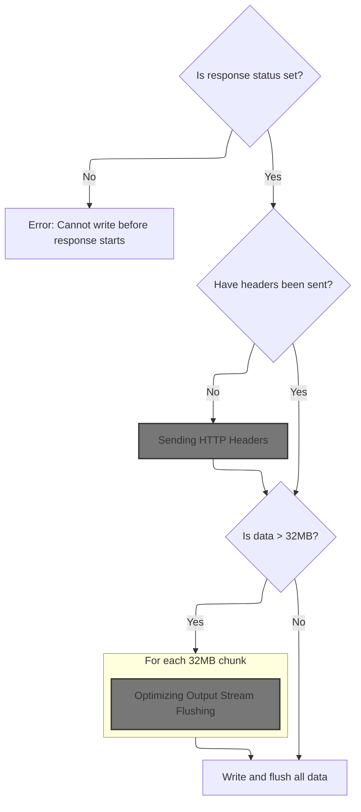
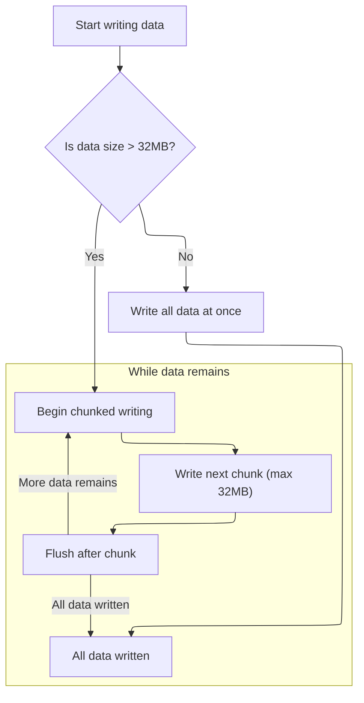

This document outlines how a user request for a management subcommand is processed. The system receives the subcommand name, validates and locates the appropriate command, prepares the response if necessary, and loads the command class for execution.

# Locating and Validating Management Commands

<SwmSnippet path="/django/core/management/__init__.py" line="245">

---

In `fetch_command`, we start by looking up the subcommand in the command mapping returned by get_commands. This is needed to check if the subcommand exists and to figure out which app provides it, so we know what to load next.

```python
    def fetch_command(self, subcommand):
        """
        Tries to fetch the given subcommand, printing a message with the
        appropriate command called from the command line (usually
        "django-admin.py" or "manage.py") if it can't be found.
        """
        try:
            app_name = get_commands()[subcommand]
```

---

</SwmSnippet>

<SwmSnippet path="/django/core/management/__init__.py" line="253">

---

After checking the command mapping, if the subcommand doesn't exist, we print an error and exit to stop processing invalid commands.

```python
        except KeyError:
            sys.stderr.write("Unknown command: %r\nType '%s help' for usage.\n" % \
                (subcommand, self.prog_name))
            sys.exit(1)
```

---

</SwmSnippet>

## Preparing HTTP Response for Output



<SwmSnippet path="/django/core/servers/basehttp.py" line="392">

---

In `write`, we check if the HTTP response status is set and if headers have been sent. If not, we send headers and start tracking the number of bytes sent. The function also makes sure the data is a string, matching WSGI requirements.

```python
    def write(self, data):
        """'write()' callable as specified by PEP 333"""

        assert isinstance(data, str), "write() argument must be string"

        if not self.status:
            raise AssertionError("write() before start_response()")

        elif not self.headers_sent:
            # Before the first output, send the stored headers
            self.bytes_sent = len(data)    # make sure we know content-length
            self.send_headers()
        else:
            self.bytes_sent += len(data)

```

---

</SwmSnippet>

### Sending HTTP Headers

See <SwmLink doc-title="Transmitting HTTP Response Headers">[Transmitting HTTP Response Headers](\.swm\transmitting-http-response-headers.dpnifhjg.sw.md)</SwmLink>

### Chunking Large HTTP Response Data



<SwmSnippet path="/django/core/servers/basehttp.py" line="407">

---

After sending headers in `write`, we check the size of the data. If it's bigger than 32MB, we split it into chunks and write each chunk separately, flushing after each one to keep the network stable.

```python
        # XXX check Content-Length and truncate if too many bytes written?

        # If data is too large, socket will choke, so write chunks no larger
        # than 32MB at a time.
        length = len(data)
        if length > 33554432:
            offset = 0
            while offset < length:
                chunk_size = min(33554432, length)
                self._write(data[offset:offset+chunk_size])
```

---

</SwmSnippet>

<SwmSnippet path="/django/core/servers/basehttp.py" line="417">

---

After writing each chunk in `write`, we flush the output to make sure the data gets sent right away before moving to the next chunk.

```python
                self._flush()
                offset += chunk_size
        else:
```

---

</SwmSnippet>

### Optimizing Output Stream Flushing

<SwmSnippet path="/django/core/servers/basehttp.py" line="514">

---

In `_flush`, we flush the output stream and then swap out the method so future flushes go straight to self.stdout.flush, skipping the wrapper for speed.

```python
    def _flush(self):
        self.stdout.flush()
```

---

</SwmSnippet>

<SwmSnippet path="/django/http/__init__.py" line="642">

---

`flush` here is just a no-op placeholder. It doesn't do anything, probably just exists to match an expected interface.

```python
    def flush(self):
        pass
```

---

</SwmSnippet>

<SwmSnippet path="/django/core/servers/basehttp.py" line="516">

---

After calling the dummy `flush`, `_flush` is set to self.stdout.flush, so future flushes just call whatever flush method is on stdout, even if it's a no-op.

```python
        self._flush = self.stdout.flush
```

---

</SwmSnippet>

### Writing Remaining HTTP Response Data

<SwmSnippet path="/django/core/servers/basehttp.py" line="420">

---

After handling big chunks, if there's any remaining data (or if it's all small), we write it out in one go using `_write`. No need to split it up.

```python
            self._write(data)
```

---

</SwmSnippet>

<SwmSnippet path="/django/core/servers/basehttp.py" line="421">

---

After writing the last bit of data in `write`, we flush to make sure everything gets sent out right away, even for small responses.

```python
            self._flush()
```

---

</SwmSnippet>

## Loading and Returning the Command Class

<SwmSnippet path="/django/core/management/__init__.py" line="257">

---

Back in `fetch_command`, if the command is already loaded, we use it directly; otherwise, we load it. Finally, we return the command class so it can be executed.

```python
        if isinstance(app_name, BaseCommand):
            # If the command is already loaded, use it directly.
            klass = app_name
        else:
            klass = load_command_class(app_name, subcommand)
        return klass
```

---

</SwmSnippet>

&nbsp;

*This is an auto-generated document by Swimm 🌊 and has not yet been verified by a human*

<SwmMeta version="3.0.0" repo-id="Z2l0aHViJTNBJTNBUHl0aG9uRGphbmdvJTNBJTNBR29waW5hdGhyZWRkeTY2" repo-name="PythonDjango"><sup>Powered by [Swimm](https://app.swimm.io/)</sup></SwmMeta>
