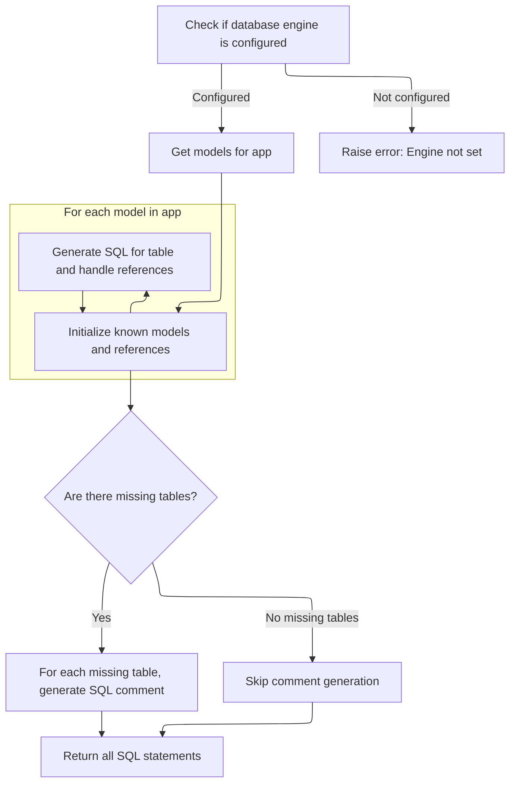

This document describes how the system resets and rebuilds all database tables for an app. Developers can use this flow to restore the database schema, indexes, and initial data to their original state. The process receives the app as input and returns a list of SQL statements to perform the reset and rebuild.

# Resetting and Rebuilding Database Tables

<SwmSnippet path="/django/core/management/sql.py" line="99">

---

<SwmToken path="django/core/management/sql.py" pos="99:2:2" line-data="def sql_reset(app, style, connection):">`sql_reset`</SwmToken> starts the flow by generating SQL to drop all tables for an app, then immediately follows up by generating SQL to recreate those tables, indexes, and initial data. We call <SwmToken path="django/core/management/sql.py" pos="107:16:16" line-data="    return sql_delete(app, style, connection) + sql_all(app, style, connection)">`sql_all`</SwmToken> next to get the full set of SQL needed to rebuild everything after deletion.

```python
def sql_reset(app, style, connection):
    "Returns a list of the DROP TABLE SQL, then the CREATE TABLE SQL, for the given module."
    # This command breaks a lot and should be deprecated
    import warnings
    warnings.warn(
        'This command has been deprecated. The command ``sqlflush`` can be used to delete everything. You can also use ALTER TABLE or DROP TABLE statements manually.',
        PendingDeprecationWarning
    )
    return sql_delete(app, style, connection) + sql_all(app, style, connection)
```

---

</SwmSnippet>

# Generating All SQL for App Setup

<SwmSnippet path="/django/core/management/sql.py" line="144">

---

<SwmToken path="django/core/management/sql.py" pos="144:2:2" line-data="def sql_all(app, style, connection):">`sql_all`</SwmToken> collects SQL for creating tables, applying custom SQL, and building indexes for an app. It starts with <SwmToken path="django/core/management/sql.py" pos="146:3:3" line-data="    return sql_create(app, style, connection) + sql_custom(app, style, connection) + sql_indexes(app, style, connection)">`sql_create`</SwmToken> because you need the tables before you can add custom SQL or indexes.

```python
def sql_all(app, style, connection):
    "Returns a list of CREATE TABLE SQL, initial-data inserts, and CREATE INDEX SQL for the given module."
    return sql_create(app, style, connection) + sql_custom(app, style, connection) + sql_indexes(app, style, connection)
```

---

</SwmSnippet>

# Creating Tables and Handling Model Dependencies



<SwmSnippet path="/django/core/management/sql.py" line="9">

---

In <SwmToken path="django/core/management/sql.py" pos="9:2:2" line-data="def sql_create(app, style, connection):">`sql_create`</SwmToken>, we loop through each model in the app, generate SQL for table creation, and handle references to other models. Known models are tracked so references are only created when their tables exist, and anything not installed gets deferred or commented out.

```python
def sql_create(app, style, connection):
    "Returns a list of the CREATE TABLE SQL statements for the given app."

    if connection.settings_dict['ENGINE'] == 'django.db.backends.dummy':
        # This must be the "dummy" database backend, which means the user
        # hasn't set ENGINE for the databse.
        raise CommandError("Django doesn't know which syntax to use for your SQL statements,\n" +
            "because you haven't specified the ENGINE setting for the database.\n" +
            "Edit your settings file and change DATBASES['default']['ENGINE'] to something like\n" +
            "'django.db.backends.postgresql' or 'django.db.backends.mysql'.")

    # Get installed models, so we generate REFERENCES right.
    # We trim models from the current app so that the sqlreset command does not
    # generate invalid SQL (leaving models out of known_models is harmless, so
    # we can be conservative).
    app_models = models.get_models(app, include_auto_created=True)
    final_output = []
    tables = connection.introspection.table_names()
    known_models = set([model for model in connection.introspection.installed_models(tables) if model not in app_models])
    pending_references = {}

    for model in app_models:
        output, references = connection.creation.sql_create_model(model, style, known_models)
        final_output.extend(output)
        for refto, refs in references.items():
            pending_references.setdefault(refto, []).extend(refs)
            if refto in known_models:
                final_output.extend(connection.creation.sql_for_pending_references(refto, style, pending_references))
        final_output.extend(connection.creation.sql_for_pending_references(model, style, pending_references))
        # Keep track of the fact that we've created the table for this model.
        known_models.add(model)
```

---

</SwmSnippet>

<SwmSnippet path="/django/core/management/sql.py" line="39">

---

Here we comment out SQL for references to missing tables so they don't run but are easy to spot.

```python
        known_models.add(model)

    # Handle references to tables that are from other apps
    # but don't exist physically.
    not_installed_models = set(pending_references.keys())
    if not_installed_models:
        alter_sql = []
        for model in not_installed_models:
            alter_sql.extend(['-- ' + sql for sql in
                connection.creation.sql_for_pending_references(model, style, pending_references)])
```

---

</SwmSnippet>

<SwmSnippet path="/django/core/management/sql.py" line="49">

---

Finally, <SwmToken path="django/core/management/sql.py" pos="9:2:2" line-data="def sql_create(app, style, connection):">`sql_create`</SwmToken> returns a list of SQL statements for table creation, plus any references—if a reference can't be resolved, it's commented out so you can see what needs fixing.

```python
        if alter_sql:
            final_output.append('-- The following references should be added but depend on non-existent tables:')
            final_output.extend(alter_sql)

    return final_output
```

---

</SwmSnippet>

&nbsp;

*This is an auto-generated document by Swimm 🌊 and has not yet been verified by a human*

<SwmMeta version="3.0.0" repo-id="Z2l0aHViJTNBJTNBUHl0aG9uRGphbmdvJTNBJTNBR29waW5hdGhyZWRkeTY2" repo-name="PythonDjango"><sup>Powered by [Swimm](https://app.swimm.io/)</sup></SwmMeta>
