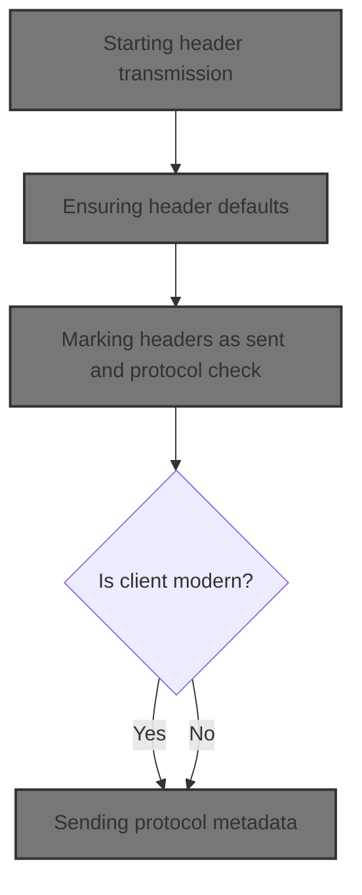
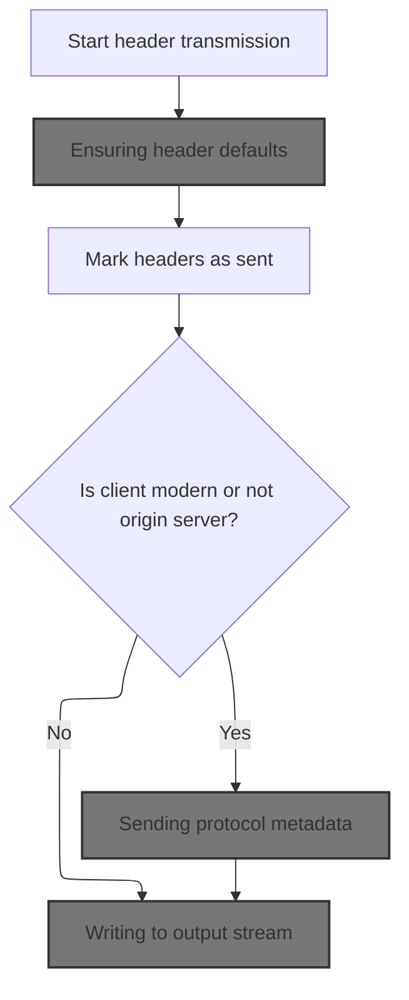
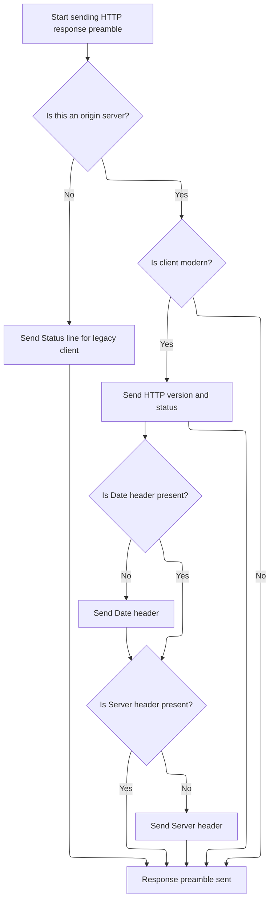

This document describes how HTTP response headers are transmitted to clients. The flow ensures all necessary defaults are set, adapts the transmission to the client's protocol capabilities, and delivers the headers in a format that meets HTTP standards.



# Starting header transmission



<SwmSnippet path="/django/core/servers/basehttp.py" line="462">

---

In `send_headers` we kick off the header transmission by first calling cleanup_headers. This step makes sure headers are in order and any missing defaults (like Content-Length) are set, so what gets sent out is complete and valid. We need to call cleanup_headers next because it patches up the headers before anything is actually written out.

```python
    def send_headers(self):
        """Transmit headers to the client, via self._write()"""
        self.cleanup_headers()
```

---

</SwmSnippet>

## Ensuring header defaults

<SwmSnippet path="/django/core/servers/basehttp.py" line="344">

---

`cleanup_headers` checks if 'Content-Length' is present in the headers. If it's missing, it calls set_content_length to compute and add it, so the client gets a proper indication of response size.

```python
    def cleanup_headers(self):
        """Make any necessary header changes or defaults

        Subclasses can extend this to add other defaults.
        """
        if 'Content-Length' not in self.headers:
            self.set_content_length()
```

---

</SwmSnippet>

<SwmSnippet path="/django/core/servers/basehttp.py" line="332">

---

`set_content_length` tries to measure self.result. If it's a single block, it sets the Content-Length header using self.bytes_sent. If not, it leaves a placeholder for chunked encoding, which isn't implemented in this snippet.

```python
    def set_content_length(self):
        """Compute Content-Length or switch to chunked encoding if possible"""
        try:
            blocks = len(self.result)
        except (TypeError, AttributeError, NotImplementedError):
            pass
        else:
            if blocks==1:
                self.headers['Content-Length'] = str(self.bytes_sent)
                return
        # XXX Try for chunked encoding if origin server and client is 1.1
```

---

</SwmSnippet>

## Marking headers as sent and protocol check

<SwmSnippet path="/django/core/servers/basehttp.py" line="465">

---

Back in send_headers, after cleanup_headers, we mark headers as sent and check if the client is modern or if we're not acting as an origin server. This determines if we need to send extra preamble info for newer clients.

```python
        self.headers_sent = True
        if not self.origin_server or self.client_is_modern():
```

---

</SwmSnippet>

<SwmSnippet path="/django/core/servers/basehttp.py" line="475">

---

`client_is_modern` checks the SERVER_PROTOCOL in self.environ. If it's not 'HTTP/0.9', the client can handle status and headers, so we treat it as modern.

```python
    def client_is_modern(self):
        """True if client can accept status and headers"""
        return self.environ['SERVER_PROTOCOL'].upper() != 'HTTP/0.9'
```

---

</SwmSnippet>

<SwmSnippet path="/django/core/servers/basehttp.py" line="467">

---

Back in send_headers, after confirming the client is modern, we call send_preamble to push out the status line and other protocol-required headers.

```python
            self.send_preamble()
```

---

</SwmSnippet>

## Sending protocol metadata



<SwmSnippet path="/django/core/servers/basehttp.py" line="378">

---

In send_preamble, we check if we're acting as the origin server and if the client is modern. This decides if we send the full HTTP status/version line and extra headers, or just a minimal status line.

```python
    def send_preamble(self):
        """Transmit version/status/date/server, via self._write()"""
        if self.origin_server:
            if self.client_is_modern():
```

---

</SwmSnippet>

<SwmSnippet path="/django/core/servers/basehttp.py" line="382">

---

Just back from client_is_modern, send_preamble writes out the HTTP status/version, date, and server headers if needed, using \_write. If we're not the origin server, it just writes a minimal status line.

```python
                self._write('HTTP/%s %s\r\n' % (self.http_version,self.status))
                if 'Date' not in self.headers:
                    self._write(
                        'Date: %s\r\n' % http_date()
                    )
                if self.server_software and 'Server' not in self.headers:
                    self._write('Server: %s\r\n' % self.server_software)
        else:
            self._write('Status: %s\r\n' % self.status)
```

---

</SwmSnippet>

## Writing to output stream

<SwmSnippet path="/django/core/servers/basehttp.py" line="510">

---

In \_write, we send data to self.stdout.write and then reassign self.\_write to point directly to self.stdout.write for faster future writes.

```python
    def _write(self,data):
        self.stdout.write(data)
```

---

</SwmSnippet>

<SwmSnippet path="/django/core/servers/basehttp.py" line="512">

---

Just after writing, \_write now points directly to self.stdout.write, so all future writes skip the extra method call for speed.

```python
        self._write = self.stdout.write
```

---

</SwmSnippet>

## Sending header block

<SwmSnippet path="/django/core/servers/basehttp.py" line="468">

---

Just back from send_preamble, send_headers finishes by writing out the headers as a string to the client using \_write.

```python
            self._write(str(self.headers))
```

---

</SwmSnippet>

&nbsp;

*This is an auto-generated document by Swimm 🌊 and has not yet been verified by a human*

<SwmMeta version="3.0.0" repo-id="Z2l0aHViJTNBJTNBUHl0aG9uRGphbmdvJTNBJTNBR29waW5hdGhyZWRkeTY2" repo-name="PythonDjango"><sup>Powered by [Swimm](https://app.swimm.io/)</sup></SwmMeta>
